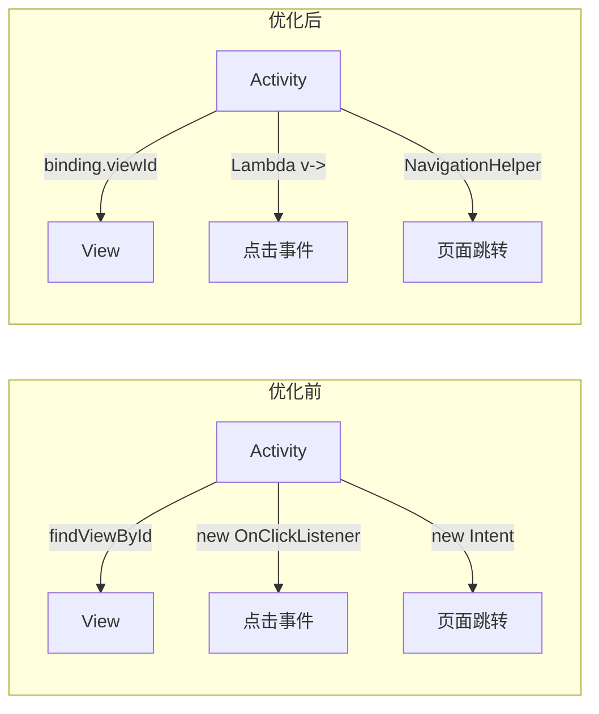

# Design Document: High Priority Optimization

## Overview

本设计文档描述了英语学习助手 Android 应用的高优先级代码优化方案。优化目标是通过 ViewBinding 迁移、Lambda 表达式简化、统一导航逻辑和代码结构整理，提升代码质量和可维护性。

## Architecture

### 优化前架构

```
com.example.mybighomework/
├── MainActivity.java          # 使用 findViewById，匿名内部类
├── VocabularyActivity.java    # 散落在根包
├── ExamListActivity.java      # 散落在根包
├── ...其他 Activity           # 散落在根包
└── utils/                     # 工具类
```

### 优化后架构

```
com.example.mybighomework/
├── ui/
│   └── activity/
│       ├── MainActivity.java      # 使用 ViewBinding + Lambda
│       ├── VocabularyActivity.java
│       ├── ExamListActivity.java
│       └── ...其他 Activity
├── utils/
│   └── NavigationHelper.java      # 统一导航工具类
└── ...其他包
```

### 数据流变化



## Components and Interfaces

### 1. ViewBinding 组件

#### ActivityMainBinding (自动生成)

```java
// 由 Android 构建系统自动生成
public final class ActivityMainBinding implements ViewBinding {
    public final CoordinatorLayout main;
    public final LinearLayout navReport;
    public final LinearLayout navProfile;
    public final LinearLayout navMore;
    public final LinearLayout llVocabulary;
    public final LinearLayout llRealExam;
    public final LinearLayout llMockExam;
    public final LinearLayout llErrorBook;
    public final LinearLayout llStudyPlan;
    public final LinearLayout llDailySentence;
    public final LinearLayout llDailyTask;
    public final LinearLayout llCameraTranslation;
    public final LinearLayout llAiAssistant;
    public final LinearLayout llTextTranslation;
    public final TextView tvTaskProgress;
    public final TextView tvStudyDays;
    public final TextView tvVocabularyCount;
    public final TextView tvExamScore;
    // ... 其他视图
    
    public static ActivityMainBinding inflate(LayoutInflater inflater);
    public View getRoot();
}
```

### 2. NavigationHelper 工具类

```java
/**
 * 统一导航工具类
 * 集中管理所有页面跳转逻辑
 */
public final class NavigationHelper {
    
    private NavigationHelper() {} // 私有构造函数，防止实例化
    
    // ===== 核心功能页面 =====
    
    /**
     * 跳转到词汇训练页面
     */
    public static void toVocabulary(Context context);
    
    /**
     * 跳转到真题练习列表页面
     */
    public static void toExamList(Context context);
    
    /**
     * 跳转到模拟考试页面
     */
    public static void toMockExam(Context context);
    
    /**
     * 跳转到错题本页面
     */
    public static void toWrongQuestion(Context context);
    
    /**
     * 跳转到学习计划页面
     */
    public static void toStudyPlan(Context context);
    
    /**
     * 跳转到每日一句页面
     */
    public static void toDailySentence(Context context);
    
    /**
     * 跳转到今日任务页面
     */
    public static void toDailyTask(Context context);
    
    /**
     * 跳转到拍照翻译页面
     */
    public static void toCameraTranslation(Context context);
    
    /**
     * 跳转到AI助手页面
     */
    public static void toDeepSeekChat(Context context);
    
    /**
     * 跳转到文本翻译页面
     */
    public static void toTextTranslation(Context context);
    
    // ===== 导航栏页面 =====
    
    /**
     * 跳转到学习报告页面
     */
    public static void toReport(Context context);
    
    /**
     * 跳转到个人中心页面
     */
    public static void toProfile(Context context);
    
    /**
     * 跳转到更多功能页面
     */
    public static void toMore(Context context);
    
    // ===== 通用方法 =====
    
    /**
     * 通用跳转方法（带参数）
     */
    public static void navigateTo(Context context, Class<?> targetActivity, Bundle extras);
    
    /**
     * 带返回结果的跳转
     */
    public static void navigateForResult(Activity activity, Class<?> targetActivity, int requestCode);
}
```

### 3. 优化后的 MainActivity 结构

```java
public class MainActivity extends AppCompatActivity {
    
    // ViewBinding 替代多个 View 变量
    private ActivityMainBinding binding;
    
    // ViewModel（保持不变）
    private MainViewModel viewModel;
    
    // Repository（保持不变）
    private UserSettingsRepository userSettingsRepository;
    private VocabularyRecordRepository vocabularyRecordRepository;
    private ExamRecordRepository examRecordRepository;
    
    @Override
    protected void onCreate(Bundle savedInstanceState) {
        super.onCreate(savedInstanceState);
        EdgeToEdge.enable(this);
        
        // ViewBinding 初始化
        binding = ActivityMainBinding.inflate(getLayoutInflater());
        setContentView(binding.getRoot());
        
        // ... 其他初始化代码
        setupClickListeners();
    }
    
    private void setupClickListeners() {
        // Lambda + NavigationHelper
        binding.llVocabulary.setOnClickListener(v -> NavigationHelper.toVocabulary(this));
        binding.llRealExam.setOnClickListener(v -> NavigationHelper.toExamList(this));
        binding.llMockExam.setOnClickListener(v -> NavigationHelper.toMockExam(this));
        // ... 其他点击事件
    }
    
    @Override
    protected void onDestroy() {
        super.onDestroy();
        binding = null; // 避免内存泄漏
    }
}
```

## Data Models

本优化不涉及数据模型变更，保持现有的 Entity、DAO、Repository 结构不变。

## Correctness Properties

*A property is a characteristic or behavior that should hold true across all valid executions of a system-essentially, a formal statement about what the system should do. Properties serve as the bridge between human-readable specifications and machine-verifiable correctness guarantees.*

### Property 1: NavigationHelper 参数传递正确性

*For any* Intent extras 参数，通过 NavigationHelper.navigateTo() 方法传递后，目标 Activity 应能正确接收到相同的参数值。

**Validates: Requirements 3.2**

### Property 2: 编译验证

*For any* 代码修改，项目应能成功编译且无错误。

**Validates: Requirements 4.4**

## Error Handling

### ViewBinding 空指针处理

```java
// 在 onDestroy 后访问 binding 可能为 null
// 使用前应检查 Activity 是否已销毁
private void updateUI() {
    if (binding != null && !isFinishing()) {
        binding.tvStudyDays.setText("...");
    }
}
```

### NavigationHelper 异常处理

```java
public static void navigateTo(Context context, Class<?> targetActivity, Bundle extras) {
    if (context == null || targetActivity == null) {
        Log.e(TAG, "Invalid navigation parameters");
        return;
    }
    try {
        Intent intent = new Intent(context, targetActivity);
        if (extras != null) {
            intent.putExtras(extras);
        }
        context.startActivity(intent);
    } catch (Exception e) {
        Log.e(TAG, "Navigation failed", e);
    }
}
```

## Testing Strategy

### 单元测试

使用 JUnit + Mockito 进行单元测试：

1. **NavigationHelper 测试**
   - 测试各跳转方法是否正确创建 Intent
   - 测试参数传递是否正确
   - 测试异常情况处理

### 属性测试

使用 JUnit 进行属性测试：

1. **参数传递属性测试**
   - 验证任意 Bundle 参数通过 NavigationHelper 传递后保持不变

### 集成测试

使用 Espresso 进行 UI 测试：

1. **点击事件测试**
   - 验证各功能按钮点击后正确跳转到目标页面

2. **功能回归测试**
   - 验证优化后所有原有功能正常运行

### 测试框架

- **单元测试**: JUnit 4 + Mockito
- **属性测试**: JUnit 4 (使用参数化测试)
- **UI 测试**: Espresso

### 测试覆盖目标

- NavigationHelper: 100% 方法覆盖
- MainActivity 点击事件: 100% 覆盖
