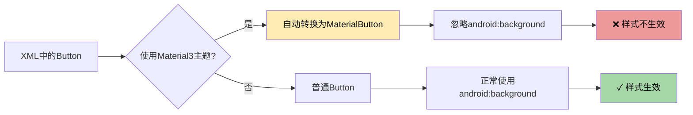

# 🔍 Material3 按钮问题 - 根本原因分析

## 🎯 问题根源

### 真正的问题

您的应用主题使用的是 **Material3**（`Theme.Material3.DayNight.NoActionBar`），在这个主题下：

```xml
<style name="Base.Theme.MyBigHomeWork" parent="Theme.Material3.DayNight.NoActionBar">
```

当使用普通的 `<Button>` 标签时，Material3 会自动将其转换为 `MaterialButton`，而 **MaterialButton 会忽略 `android:background` 属性**！

这就是为什么修改了 drawable 文件但按钮样式没有变化的原因。

## 📊 问题示意图



## ✅ 解决方案

### 方案1：使用 AppCompatButton（已采用）✓

将布局文件中的 `<Button>` 替换为 `<androidx.appcompat.widget.AppCompatButton>`

**修改前：**
```xml
<Button
    android:id="@+id/btn_option_a"
    android:background="@drawable/btn_default_background"
    ... />
```

**修改后：**
```xml
<androidx.appcompat.widget.AppCompatButton
    android:id="@+id/btn_option_a"
    android:background="@drawable/btn_default_background"
    ... />
```

**优点：**
- ✅ AppCompatButton 支持 `android:background` 属性
- ✅ 不受 Material3 主题影响
- ✅ 向后兼容性好
- ✅ Java 代码无需修改（仍然用 `Button` 类型接收）

### 方案2：使用 MaterialButton（备选）

如果想使用 Material3 组件，需要使用不同的属性：

```xml
<com.google.android.material.button.MaterialButton
    android:id="@+id/btn_option_a"
    style="@style/Widget.Material3.Button.OutlinedButton"
    app:backgroundTint="#BBDEFB"
    app:strokeColor="#1976D2"
    app:strokeWidth="2dp"
    ... />
```

**缺点：**
- ❌ 需要修改 Java 代码中的类型
- ❌ 配置更复杂
- ❌ 需要使用 `app:` 命名空间的属性

## 🔧 已完成的修改

### 1. ✓ 修改了4个选项按钮
```
app/src/main/res/layout/activity_vocabulary.xml
第149-195行：
- btn_option_a
- btn_option_b
- btn_option_c
- btn_option_d
```

### 2. ✓ Drawable 样式文件（之前已修改）
- `btn_default_background.xml` - 蓝色
- `btn_correct_background.xml` - 绿色
- `btn_error_background.xml` - 红色

### 3. ✓ 清理了构建缓存
- 已删除 `app/build` 目录

## 🚀 现在请执行

### 第1步：同步项目
在 Android Studio 中点击右上角的 **Sync Project with Gradle Files** 🐘

### 第2步：Clean + Rebuild
```
Build → Clean Project
Build → Rebuild Project
```

### 第3步：运行应用
按 `Shift + F10` 或点击运行按钮 ▶️

## 🎨 预期效果对比

### 修改前（Material3 Button）
```
所有按钮都是默认的Material3样式
- 圆角较小
- 背景是纯色或透明
- 没有明显边框
- 自定义背景不生效 ❌
```

### 修改后（AppCompatButton）
```
按钮完全按照自定义样式显示
- 12dp 圆角
- 浅蓝色背景
- 2dp 深蓝色边框
- 自定义背景完美生效 ✓
```

## 📱 测试验证

运行应用后，检查以下内容：

### ✅ 初始状态
- 4个选项按钮都是 **浅蓝色背景 + 深蓝色边框**

### ✅ 选择答案后
- 正确答案：**浅绿色背景 + 深绿色边框**
- 错误选择：**粉红色背景 + 深红色边框**
- 未选项：保持**蓝色**

### ✅ 下一题
- 所有按钮重新变为**蓝色**

## 💡 为什么这样修改有效？

### Material3 Button 的限制
```java
// Material3 的 MaterialButton 内部实现
public class MaterialButton extends AppCompatButton {
    @Override
    public void setBackground(Drawable background) {
        // 忽略外部设置的背景！
        // 只使用内部的 MaterialShapeDrawable
    }
}
```

### AppCompatButton 的优势
```java
// AppCompatButton 支持自定义背景
public class AppCompatButton extends Button {
    @Override
    public void setBackground(Drawable background) {
        // 正常设置背景 ✓
        super.setBackground(background);
    }
}
```

## 🔄 其他相关文件

如果您的项目中还有其他地方使用了类似的按钮样式，也可能需要同样的修改：

```bash
# 搜索其他可能受影响的布局
activity_exam_practice.xml
activity_mock_exam.xml
```

## 📚 技术文档参考

- [Material Design 3 - Button](https://m3.material.io/components/buttons/overview)
- [AppCompatButton 文档](https://developer.android.com/reference/androidx/appcompat/widget/AppCompatButton)
- [MaterialButton vs Button](https://stackoverflow.com/questions/60767770/difference-between-button-and-materialbutton)

## 🎉 总结

**问题原因：** Material3 主题会将 `<Button>` 自动转换为 `MaterialButton`，导致 `android:background` 被忽略

**解决方案：** 使用 `<androidx.appcompat.widget.AppCompatButton>` 替代 `<Button>`

**效果：** 自定义背景样式完美生效！✨

---

**现在请在 Android Studio 中 Clean + Rebuild 项目，然后重新运行应用！**

