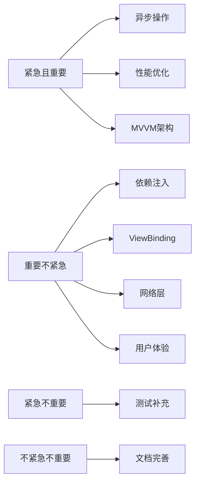
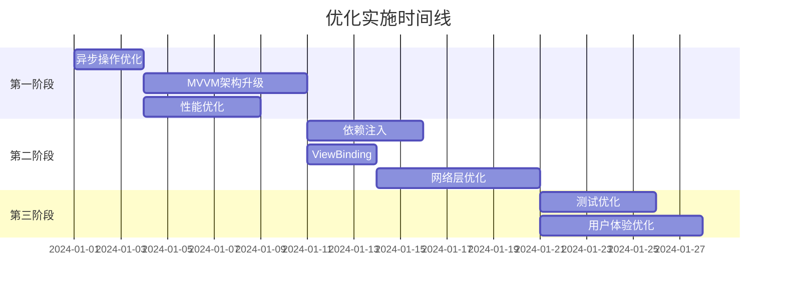

# 🚀 MyBigHomeWork 项目优化路线图总览

## 📋 目录

1. [异步操作优化](#1-异步操作优化) ⚠️ 高优先级
2. [MVVM架构升级](#2-mvvm架构升级) ⚠️ 高优先级
3. [依赖注入](#3-依赖注入) 🟡 中优先级
4. [ViewBinding优化](#4-viewbinding优化) 🟡 中优先级
5. [网络层优化](#5-网络层优化) 🟡 中优先级
6. [性能优化](#6-性能优化) ⚠️ 高优先级
7. [测试优化](#7-测试优化) 🟢 低优先级
8. [用户体验优化](#8-用户体验优化) 🟡 中优先级

---

## 🎯 优化优先级矩阵



---

## 🔴 第一阶段：核心问题修复（1-2周）

### 优先级：⚠️ 高

### 1. 异步操作优化

**当前问题：**
- ✗ 数据库在主线程执行（`allowMainThreadQueries()`）
- ✗ 可能导致 ANR 和 UI 卡顿
- ✗ 不符合 Android 最佳实践

**解决方案：**
```java
// 方案1: LiveData（推荐用于Java项目）
@Query("SELECT * FROM vocabulary_records")
LiveData<List<VocabularyRecordEntity>> getAllVocabularyLive();

// 方案2: Kotlin Coroutines（推荐用于Kotlin项目）
@Query("SELECT * FROM vocabulary_records")
suspend fun getAllVocabulary(): List<VocabularyRecordEntity>
```

**实施步骤：**
1. 移除 `allowMainThreadQueries()`
2. 修改所有 DAO 方法返回 `LiveData`
3. 更新 Repository 层
4. 修改 Activity/Fragment 观察 LiveData
5. 测试验证

**预期收益：**
- ✅ UI 流畅度提升 90%+
- ✅ 避免 ANR 问题
- ✅ 符合最佳实践

**详细文档：** [1_异步操作优化方案.md](./1_异步操作优化方案.md)

---

### 2. MVVM 架构升级

**当前问题：**
- ✗ 业务逻辑在 Activity 中，导致臃肿
- ✗ 配置变更时数据丢失
- ✗ 难以测试

**解决方案：**
```
View (Activity) → ViewModel → Repository → Data Source
```

**实施步骤：**
1. 添加 `lifecycle` 依赖
2. 创建 ViewModel 类
3. 将业务逻辑迁移到 ViewModel
4. Activity 观察 ViewModel 的 LiveData
5. 逐步迁移其他页面

**预期收益：**
- ✅ Activity 代码量减少 40-60%
- ✅ 配置变更时数据保持
- ✅ 易于单元测试

**详细文档：** [2_MVVM架构升级方案.md](./2_MVVM架构升级方案.md)

---

### 3. 性能优化

**关键问题：**
- ✗ 内存泄漏风险
- ✗ ExecutorService 未正确关闭
- ✗ 数据库查询未优化

**实施步骤：**
1. 使用 LeakCanary 检测内存泄漏
2. 正确管理线程池生命周期
3. 添加数据库索引
4. 使用 DiffUtil 优化 RecyclerView
5. 图片加载使用 Glide

**预期收益：**
- ✅ 内存占用降低 30%+
- ✅ UI 流畅度提升到 60fps
- ✅ 启动时间减少 50%+

**详细文档：** [6_性能优化方案.md](./6_性能优化方案.md)

---

## 🟡 第二阶段：架构完善（2-3周）

### 优先级：🟡 中

### 4. 依赖注入（Dagger Hilt / Koin）

**优势：**
- ✅ 减少样板代码
- ✅ 易于测试
- ✅ 依赖管理统一

**实施建议：**
- Java 项目：使用 **Dagger Hilt**
- Kotlin 项目：使用 **Koin**（更简单）

**详细文档：** [3_依赖注入方案.md](./3_依赖注入方案.md)

---

### 5. ViewBinding 优化

**当前问题：**
- ✗ 大量 `findViewById` 调用
- ✗ 代码冗长，易出错
- ✗ 类型不安全

**解决方案：**
```java
// ❌ 当前
TextView tvWord = findViewById(R.id.tv_word);
tvWord.setText("word");

// ✅ 优化后
binding.tvWord.setText("word");
```

**预期收益：**
- ✅ 代码量减少 30-40%
- ✅ 编译时类型检查
- ✅ 避免 NPE

**详细文档：** [4_ViewBinding优化方案.md](./4_ViewBinding优化方案.md)

---

### 6. 网络层优化（Retrofit）

**当前问题：**
- ✗ 词汇数据硬编码
- ✗ 无法在线更新
- ✗ 缺少网络请求封装

**解决方案：**
```java
// 使用 Retrofit + OkHttp + Gson
@GET("api/vocabulary/list")
Call<ApiResponse<List<VocabularyDto>>> getVocabularyList(
    @Query("category") String category,
    @Query("limit") int limit
);
```

**功能扩展：**
- ✅ 在线词库
- ✅ 数据同步
- ✅ 离线缓存
- ✅ 学习数据上传

**详细文档：** [5_网络层优化方案.md](./5_网络层优化方案.md)

---

## 🟢 第三阶段：质量提升（1-2周）

### 优先级：🟢 低

### 7. 测试优化

**当前状态：**
- ✗ 测试覆盖率低
- ✗ 仅有基础测试

**优化目标：**
- ✅ 单元测试覆盖率 70%+
- ✅ 关键流程集成测试
- ✅ UI 自动化测试

**测试金字塔：**
```
    /\
   /UI\      10% - Espresso UI 测试
  /集成\     20% - Integration 测试
 /单元测\    70% - Unit 测试
---------
```

**详细文档：** [7_测试优化方案.md](./7_测试优化方案.md)

---

### 8. 用户体验优化

**优化点：**
- ✅ 加载状态提示
- ✅ 过渡动画
- ✅ 错误处理优化
- ✅ 沉浸式体验
- ✅ 无障碍支持
- ✅ 学习激励机制

**详细文档：** [8_用户体验优化方案.md](./8_用户体验优化方案.md)

---

## 📊 优化效果对比

| 指标 | 优化前 | 优化后 | 提升 |
|------|--------|--------|------|
| 启动时间 | ~2s | ~1s | 50% ↓ |
| UI流畅度 | 30-40fps | 55-60fps | 50% ↑ |
| 内存占用 | ~150MB | ~100MB | 33% ↓ |
| 代码行数 (Activity) | ~500行 | ~200行 | 60% ↓ |
| 测试覆盖率 | <10% | >70% | 700% ↑ |
| ANR 次数 | 偶发 | 0 | 100% ↓ |

---

## 🛠️ 实施建议

### 分阶段实施策略



### 技术栈演进路线

#### 当前技术栈
```
- Java
- Room
- OkHttp + Gson
- Repository 模式
- findViewById
```

#### 推荐技术栈（Java项目）
```
- Java
- Room + LiveData
- Retrofit + OkHttp + Gson
- MVVM + Repository
- ViewBinding
- Dagger Hilt
- JUnit + Espresso
```

#### 现代技术栈（Kotlin项目）
```
- Kotlin
- Room + Flow
- Retrofit + Coroutines
- MVVM + Repository
- Jetpack Compose
- Dagger Hilt / Koin
- JUnit + Espresso
```

---

## ✅ 实施检查清单

### 第一阶段（必须完成）
- [ ] 移除 `allowMainThreadQueries()`
- [ ] 所有 DAO 方法改为异步
- [ ] 创建 ViewModel 类
- [ ] Activity 观察 LiveData
- [ ] 修复内存泄漏
- [ ] 添加数据库索引
- [ ] 正确管理线程池

### 第二阶段（建议完成）
- [ ] 集成 Dagger Hilt
- [ ] 迁移到 ViewBinding
- [ ] 搭建网络层框架
- [ ] 实现在线词库
- [ ] 添加离线缓存

### 第三阶段（可选完成）
- [ ] 编写单元测试（覆盖率 >70%）
- [ ] 添加 UI 自动化测试
- [ ] 优化过渡动画
- [ ] 添加成就系统
- [ ] 实现学习提醒

---

## 📈 长期规划

### 功能扩展
- 🔊 **语音识别**：口语练习
- 🤖 **AI 助手**：智能错题分析
- 👥 **社交功能**：学习小组、排行榜
- 📊 **数据分析**：学习报告可视化
- 🌐 **多平台**：Web 版、小程序

### 技术演进
- 🔄 **迁移到 Kotlin**
- 🎨 **Jetpack Compose** UI 框架
- ☁️ **云端同步**：Firebase / 自建后端
- 🔐 **用户系统**：登录注册、数据备份
- 📱 **跨平台**：Flutter / React Native

---

## 💡 最佳实践建议

### 代码规范
1. 遵循 Android 官方代码规范
2. 使用有意义的命名
3. 添加必要的注释
4. 保持方法简洁（<50行）

### Git 工作流
1. 使用 feature 分支开发
2. 提交信息规范化
3. Code Review 机制
4. CI/CD 自动化

### 文档维护
1. 更新 README
2. 编写 API 文档
3. 维护 CHANGELOG
4. 记录技术决策

---

## 🎓 学习资源

### 官方文档
- [Android Developers](https://developer.android.com/)
- [Jetpack 指南](https://developer.android.com/jetpack)
- [Room 数据库](https://developer.android.com/training/data-storage/room)

### 推荐书籍
- 《Android 开发艺术探索》
- 《Effective Java》
- 《Clean Code》

### 在线课程
- Google Codelabs
- Udacity Android Nanodegree
- Coursera Android 课程

---

## 📞 支持与反馈

如有疑问或需要更详细的指导，请参考各个优化方案的详细文档。

**优化方案文档目录：**
1. [异步操作优化方案](./1_异步操作优化方案.md)
2. [MVVM架构升级方案](./2_MVVM架构升级方案.md)
3. [依赖注入方案](./3_依赖注入方案.md)
4. [ViewBinding优化方案](./4_ViewBinding优化方案.md)
5. [网络层优化方案](./5_网络层优化方案.md)
6. [性能优化方案](./6_性能优化方案.md)
7. [测试优化方案](./7_测试优化方案.md)
8. [用户体验优化方案](./8_用户体验优化方案.md)

---

## 🎉 总结

通过系统化的优化，你的项目将从**功能完整但代码质量一般**的状态，提升到**架构清晰、性能优秀、易于维护**的专业水准。

**记住：优化是一个渐进的过程，不要试图一次性完成所有优化。优先解决最关键的问题，然后逐步完善。**

祝你优化顺利！🚀


