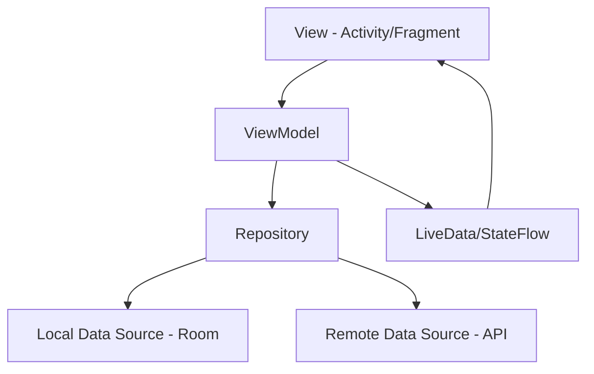

# MVVM 架构升级方案

## 当前问题

1. **业务逻辑在Activity中**：导致Activity臃肿，难以测试
2. **数据和UI耦合**：配置变更时数据丢失
3. **缺少数据状态管理**：加载/成功/失败状态处理不统一

## MVVM 架构设计



## 实现方案

### 1. 添加依赖

```kotlin
// app/build.gradle.kts
dependencies {
    // ViewModel
    implementation("androidx.lifecycle:lifecycle-viewmodel:2.7.0")
    implementation("androidx.lifecycle:lifecycle-livedata:2.7.0")
    implementation("androidx.lifecycle:lifecycle-runtime:2.7.0")
    
    // Activity KTX (提供 viewModels() 委托)
    implementation("androidx.activity:activity-ktx:1.8.2")
    implementation("androidx.fragment:fragment-ktx:1.6.2")
}
```

### 2. 创建 ViewModel

```java
// VocabularyViewModel.java
public class VocabularyViewModel extends ViewModel {
    private final VocabularyRecordRepository repository;
    private final MutableLiveData<List<VocabularyItem>> vocabularyList;
    private final MutableLiveData<Integer> currentScore;
    private final MutableLiveData<Boolean> isLoading;
    private final MutableLiveData<String> errorMessage;
    
    public VocabularyViewModel(VocabularyRecordRepository repository) {
        this.repository = repository;
        this.vocabularyList = new MutableLiveData<>();
        this.currentScore = new MutableLiveData<>(0);
        this.isLoading = new MutableLiveData<>(false);
        this.errorMessage = new MutableLiveData<>();
    }
    
    // 暴露不可变的LiveData给View层
    public LiveData<List<VocabularyItem>> getVocabularyList() {
        return vocabularyList;
    }
    
    public LiveData<Integer> getCurrentScore() {
        return currentScore;
    }
    
    public LiveData<Boolean> getIsLoading() {
        return isLoading;
    }
    
    public LiveData<String> getErrorMessage() {
        return errorMessage;
    }
    
    // 业务逻辑方法
    public void loadVocabularyData() {
        isLoading.setValue(true);
        
        // 在后台线程执行
        new Thread(() -> {
            try {
                List<VocabularyRecordEntity> entities = repository.getRandomVocabulary(10);
                List<VocabularyItem> items = convertToVocabularyItems(entities);
                vocabularyList.postValue(items);
                isLoading.postValue(false);
            } catch (Exception e) {
                errorMessage.postValue("加载词汇数据失败: " + e.getMessage());
                isLoading.postValue(false);
            }
        }).start();
    }
    
    public void saveVocabularyRecord(VocabularyItem item, boolean isCorrect) {
        new Thread(() -> {
            try {
                VocabularyRecordEntity entity = new VocabularyRecordEntity();
                entity.setWord(item.word);
                entity.setPronunciation(item.phonetic);
                entity.setMeaning(item.meaning);
                
                // 更新统计信息
                if (isCorrect) {
                    entity.setCorrectCount(entity.getCorrectCount() + 1);
                    updateScore(currentScore.getValue() + 10);
                } else {
                    entity.setWrongCount(entity.getWrongCount() + 1);
                }
                
                repository.addVocabularyRecord(entity);
            } catch (Exception e) {
                errorMessage.postValue("保存失败: " + e.getMessage());
            }
        }).start();
    }
    
    private void updateScore(int newScore) {
        currentScore.postValue(newScore);
    }
    
    private List<VocabularyItem> convertToVocabularyItems(
            List<VocabularyRecordEntity> entities) {
        // 转换逻辑
        return new ArrayList<>();
    }
}
```

### 3. 创建 ViewModelFactory

```java
// VocabularyViewModelFactory.java
public class VocabularyViewModelFactory implements ViewModelProvider.Factory {
    private final VocabularyRecordRepository repository;
    
    public VocabularyViewModelFactory(VocabularyRecordRepository repository) {
        this.repository = repository;
    }
    
    @NonNull
    @Override
    public <T extends ViewModel> T create(@NonNull Class<T> modelClass) {
        if (modelClass.isAssignableFrom(VocabularyViewModel.class)) {
            return (T) new VocabularyViewModel(repository);
        }
        throw new IllegalArgumentException("Unknown ViewModel class");
    }
}
```

### 4. 在 Activity 中使用 ViewModel

```java
// VocabularyActivity.java
public class VocabularyActivity extends AppCompatActivity {
    private VocabularyViewModel viewModel;
    private ActivityVocabularyBinding binding; // 使用 ViewBinding
    
    @Override
    protected void onCreate(Bundle savedInstanceState) {
        super.onCreate(savedInstanceState);
        binding = ActivityVocabularyBinding.inflate(getLayoutInflater());
        setContentView(binding.getRoot());
        
        // 初始化 ViewModel
        VocabularyRecordRepository repository = new VocabularyRecordRepository(
            AppDatabase.getInstance(this).vocabularyDao()
        );
        VocabularyViewModelFactory factory = new VocabularyViewModelFactory(repository);
        viewModel = new ViewModelProvider(this, factory).get(VocabularyViewModel.class);
        
        // 观察数据变化
        observeViewModel();
        
        // 加载数据
        viewModel.loadVocabularyData();
    }
    
    private void observeViewModel() {
        // 观察词汇列表
        viewModel.getVocabularyList().observe(this, vocabularyList -> {
            if (vocabularyList != null && !vocabularyList.isEmpty()) {
                updateVocabularyUI(vocabularyList);
            }
        });
        
        // 观察分数
        viewModel.getCurrentScore().observe(this, score -> {
            binding.tvScore.setText("得分: " + score);
        });
        
        // 观察加载状态
        viewModel.getIsLoading().observe(this, isLoading -> {
            binding.progressBar.setVisibility(isLoading ? View.VISIBLE : View.GONE);
            binding.contentLayout.setVisibility(isLoading ? View.GONE : View.VISIBLE);
        });
        
        // 观察错误信息
        viewModel.getErrorMessage().observe(this, errorMsg -> {
            if (errorMsg != null && !errorMsg.isEmpty()) {
                Toast.makeText(this, errorMsg, Toast.LENGTH_SHORT).show();
            }
        });
    }
    
    private void selectOption(int selectedOption) {
        if (isAnswered) return;
        isAnswered = true;
        
        VocabularyItem currentItem = getCurrentVocabularyItem();
        boolean isCorrect = selectedOption == currentItem.correctAnswer;
        
        // 通过ViewModel保存数据
        viewModel.saveVocabularyRecord(currentItem, isCorrect);
        
        // 更新UI
        highlightAnswers(selectedOption, currentItem.correctAnswer);
    }
}
```

## 优势

### 1. **生命周期感知**
- 配置变更（旋转屏幕）时数据不丢失
- 自动处理内存泄漏

### 2. **可测试性**
```java
// VocabularyViewModelTest.java
@Test
public void testLoadVocabularyData() {
    // 创建 mock repository
    VocabularyRecordRepository mockRepo = mock(VocabularyRecordRepository.class);
    when(mockRepo.getRandomVocabulary(10)).thenReturn(createTestData());
    
    // 创建 ViewModel
    VocabularyViewModel viewModel = new VocabularyViewModel(mockRepo);
    
    // 创建 observer
    Observer<List<VocabularyItem>> observer = mock(Observer.class);
    viewModel.getVocabularyList().observeForever(observer);
    
    // 执行测试
    viewModel.loadVocabularyData();
    
    // 验证
    verify(observer).onChanged(any());
}
```

### 3. **代码清晰**
- Activity/Fragment 只负责UI
- ViewModel 负责业务逻辑
- Repository 负责数据操作

### 4. **状态管理**
```java
// 使用密封类管理UI状态（Kotlin）
sealed class UiState<out T> {
    object Loading : UiState<Nothing>()
    data class Success<T>(val data: T) : UiState<T>()
    data class Error(val message: String) : UiState<Nothing>()
}

// 在ViewModel中
private val _uiState = MutableLiveData<UiState<List<VocabularyItem>>>()
val uiState: LiveData<UiState<List<VocabularyItem>>> = _uiState

fun loadData() {
    _uiState.value = UiState.Loading
    viewModelScope.launch {
        try {
            val data = repository.getData()
            _uiState.value = UiState.Success(data)
        } catch (e: Exception) {
            _uiState.value = UiState.Error(e.message ?: "Unknown error")
        }
    }
}
```

## 迁移步骤

1. ✅ 添加 lifecycle 依赖
2. ✅ 创建 ViewModel 类
3. ✅ 将业务逻辑从 Activity 迁移到 ViewModel
4. ✅ 使用 LiveData 替代直接的数据操作
5. ✅ 更新 Activity，使用 ViewModel
6. ✅ 添加单元测试
7. ✅ 逐步迁移其他 Activity

## 预期效果

- 📉 Activity 代码量减少 40-60%
- 🧪 单元测试覆盖率提升到 70%+
- 🔄 配置变更时数据保持
- 🎯 代码职责清晰，易于维护


