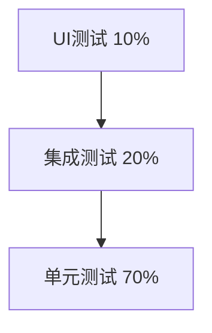

# 测试优化方案

## 当前测试覆盖率问题

从项目结构来看，测试文件很少：
- `app/src/test/java` - 仅2个测试文件
- `app/src/androidTest/java` - 仅1个测试文件

**问题：**
- 测试覆盖率低
- 缺少单元测试
- 缺少集成测试
- 缺少 UI 测试

## 测试金字塔策略



## 1. 单元测试（Unit Tests）

### 测试框架配置

```kotlin
// app/build.gradle.kts
dependencies {
    // JUnit 4
    testImplementation("junit:junit:4.13.2")
    
    // JUnit 5 (Jupiter)
    testImplementation("org.junit.jupiter:junit-jupiter-api:5.10.1")
    testRuntimeOnly("org.junit.jupiter:junit-jupiter-engine:5.10.1")
    
    // Mockito
    testImplementation("org.mockito:mockito-core:5.8.0")
    testImplementation("org.mockito:mockito-inline:5.2.0")
    
    // MockK (Kotlin)
    testImplementation("io.mockk:mockk:1.13.8")
    
    // Truth (断言库)
    testImplementation("com.google.truth:truth:1.1.5")
    
    // Robolectric (Android 单元测试)
    testImplementation("org.robolectric:robolectric:4.11.1")
    
    // Coroutines Test
    testImplementation("org.jetbrains.kotlinx:kotlinx-coroutines-test:1.7.3")
    
    // Room Testing
    testImplementation("androidx.room:room-testing:2.6.1")
    
    // Arch Core Testing (LiveData)
    testImplementation("androidx.arch.core:core-testing:2.2.0")
}
```

### 1.1 Repository 单元测试

```java
// VocabularyRecordRepositoryTest.java
@RunWith(RobolectricTestRunner.class)
public class VocabularyRecordRepositoryTest {
    
    private VocabularyRecordRepository repository;
    private VocabularyDao mockDao;
    
    @Before
    public void setup() {
        mockDao = mock(VocabularyDao.class);
        repository = new VocabularyRecordRepository(mockDao);
    }
    
    @Test
    public void getMasteredVocabularyCount_returnsCorrectCount() {
        // Arrange
        when(mockDao.getMasteredVocabularyCount()).thenReturn(50);
        
        // Act
        int count = repository.getMasteredVocabularyCount();
        
        // Assert
        assertEquals(50, count);
        verify(mockDao, times(1)).getMasteredVocabularyCount();
    }
    
    @Test
    public void addVocabularyRecord_insertsSuccessfully() {
        // Arrange
        VocabularyRecordEntity entity = createTestVocabulary();
        when(mockDao.insert(any(VocabularyRecordEntity.class))).thenReturn(1L);
        
        // Act
        long id = repository.addVocabularyRecord(entity);
        
        // Assert
        assertEquals(1L, id);
        verify(mockDao).insert(entity);
    }
    
    @Test
    public void searchVocabulary_returnsMatchingResults() {
        // Arrange
        List<VocabularyRecordEntity> expectedList = Arrays.asList(
            createTestVocabulary("abandon"),
            createTestVocabulary("ability")
        );
        when(mockDao.searchVocabulary("ab")).thenReturn(expectedList);
        
        // Act
        List<VocabularyRecordEntity> result = repository.searchVocabulary("ab");
        
        // Assert
        assertNotNull(result);
        assertEquals(2, result.size());
        assertTrue(result.get(0).getWord().startsWith("ab"));
    }
    
    private VocabularyRecordEntity createTestVocabulary() {
        return createTestVocabulary("test");
    }
    
    private VocabularyRecordEntity createTestVocabulary(String word) {
        VocabularyRecordEntity entity = new VocabularyRecordEntity();
        entity.setWord(word);
        entity.setMeaning("test meaning");
        entity.setPronunciation("/test/");
        return entity;
    }
    
    @After
    public void tearDown() {
        // 清理资源
    }
}
```

### 1.2 ViewModel 单元测试

```java
// VocabularyViewModelTest.java
@RunWith(JUnit4.class)
public class VocabularyViewModelTest {
    
    @Rule
    public InstantTaskExecutorRule instantTaskExecutorRule = 
        new InstantTaskExecutorRule(); // LiveData 同步执行
    
    private VocabularyViewModel viewModel;
    private VocabularyRecordRepository mockRepository;
    
    @Before
    public void setup() {
        mockRepository = mock(VocabularyRecordRepository.class);
        viewModel = new VocabularyViewModel(mockRepository);
    }
    
    @Test
    public void loadVocabularyData_updatesLiveData() throws InterruptedException {
        // Arrange
        List<VocabularyRecordEntity> testData = createTestData();
        when(mockRepository.getRandomVocabulary(10)).thenReturn(testData);
        
        // 创建 Observer
        Observer<List<VocabularyItem>> observer = mock(Observer.class);
        viewModel.getVocabularyList().observeForever(observer);
        
        // Act
        viewModel.loadVocabularyData();
        
        // Wait for async operation
        Thread.sleep(500);
        
        // Assert
        verify(observer, atLeastOnce()).onChanged(any());
        assertNotNull(viewModel.getVocabularyList().getValue());
    }
    
    @Test
    public void saveVocabularyRecord_correct_updatesScore() {
        // Arrange
        VocabularyItem item = createTestItem();
        Observer<Integer> scoreObserver = mock(Observer.class);
        viewModel.getCurrentScore().observeForever(scoreObserver);
        
        // Act
        viewModel.saveVocabularyRecord(item, true);
        
        // Assert
        verify(scoreObserver, timeout(1000)).onChanged(10);
    }
    
    @Test
    public void loadVocabularyData_failure_setsErrorMessage() {
        // Arrange
        when(mockRepository.getRandomVocabulary(10))
            .thenThrow(new RuntimeException("Database error"));
        
        Observer<String> errorObserver = mock(Observer.class);
        viewModel.getErrorMessage().observeForever(errorObserver);
        
        // Act
        viewModel.loadVocabularyData();
        
        // Assert
        verify(errorObserver, timeout(1000)).onChanged(anyString());
    }
}
```

### 1.3 数据库 DAO 测试

```java
// VocabularyDaoTest.java
@RunWith(AndroidJUnit4.class)
public class VocabularyDaoTest {
    
    private AppDatabase database;
    private VocabularyDao vocabularyDao;
    
    @Before
    public void createDb() {
        Context context = ApplicationProvider.getApplicationContext();
        // 使用内存数据库
        database = Room.inMemoryDatabaseBuilder(context, AppDatabase.class)
            .allowMainThreadQueries()
            .build();
        vocabularyDao = database.vocabularyDao();
    }
    
    @After
    public void closeDb() {
        database.close();
    }
    
    @Test
    public void insertAndGetVocabulary() {
        // Arrange
        VocabularyRecordEntity entity = createTestEntity("abandon");
        
        // Act
        long id = vocabularyDao.insert(entity);
        VocabularyRecordEntity retrieved = vocabularyDao.getVocabularyById((int) id);
        
        // Assert
        assertNotNull(retrieved);
        assertEquals("abandon", retrieved.getWord());
    }
    
    @Test
    public void getMasteredVocabularyCount_returnsCorrectCount() {
        // Arrange
        insertMasteredVocabulary(3);
        insertUnmasteredVocabulary(2);
        
        // Act
        int count = vocabularyDao.getMasteredVocabularyCount();
        
        // Assert
        assertEquals(3, count);
    }
    
    @Test
    public void searchVocabulary_findsMatchingWords() {
        // Arrange
        vocabularyDao.insert(createTestEntity("abandon"));
        vocabularyDao.insert(createTestEntity("ability"));
        vocabularyDao.insert(createTestEntity("about"));
        vocabularyDao.insert(createTestEntity("zebra"));
        
        // Act
        List<VocabularyRecordEntity> results = vocabularyDao.searchVocabulary("ab");
        
        // Assert
        assertEquals(3, results.size());
        for (VocabularyRecordEntity entity : results) {
            assertTrue(entity.getWord().contains("ab") || 
                      entity.getMeaning().contains("ab"));
        }
    }
    
    @Test
    public void updateMasteryStatus_updatesCorrectly() {
        // Arrange
        VocabularyRecordEntity entity = createTestEntity("test");
        entity.setMastered(false);
        long id = vocabularyDao.insert(entity);
        
        // Act
        vocabularyDao.updateMasteryStatus((int) id, true, System.currentTimeMillis());
        VocabularyRecordEntity updated = vocabularyDao.getVocabularyById((int) id);
        
        // Assert
        assertTrue(updated.isMastered());
    }
    
    private VocabularyRecordEntity createTestEntity(String word) {
        VocabularyRecordEntity entity = new VocabularyRecordEntity();
        entity.setWord(word);
        entity.setMeaning("meaning of " + word);
        entity.setPronunciation("/" + word + "/");
        return entity;
    }
}
```

## 2. 集成测试（Integration Tests）

```java
// VocabularyFlowIntegrationTest.java
@RunWith(AndroidJUnit4.class)
public class VocabularyFlowIntegrationTest {
    
    @Rule
    public ActivityScenarioRule<VocabularyActivity> activityRule =
        new ActivityScenarioRule<>(VocabularyActivity.class);
    
    private AppDatabase database;
    
    @Before
    public void setup() {
        Context context = ApplicationProvider.getApplicationContext();
        database = AppDatabase.getInstance(context);
        // 清空测试数据
        database.clearAllTables();
    }
    
    @Test
    public void completeVocabularyTraining_savesRecordsCorrectly() {
        activityRule.getScenario().onActivity(activity -> {
            // 模拟完成训练
            for (int i = 0; i < 10; i++) {
                activity.selectOption(0); // 选择答案
                activity.nextQuestion();
            }
            
            // 验证数据已保存
            int recordCount = database.vocabularyDao().getTotalVocabularyCount();
            assertTrue(recordCount > 0);
        });
    }
}
```

## 3. UI 测试（Espresso）

```java
// VocabularyActivityUITest.java
@RunWith(AndroidJUnit4.class)
@LargeTest
public class VocabularyActivityUITest {
    
    @Rule
    public ActivityScenarioRule<VocabularyActivity> activityRule =
        new ActivityScenarioRule<>(VocabularyActivity.class);
    
    @Test
    public void selectCorrectAnswer_showsSuccessMessage() {
        // 点击第一个选项
        onView(withId(R.id.btn_option_a)).perform(click());
        
        // 验证结果显示
        onView(withId(R.id.layout_result))
            .check(matches(isDisplayed()));
        
        // 验证结果文本
        onView(withId(R.id.tv_result))
            .check(matches(withText(containsString("正确"))));
    }
    
    @Test
    public void clickBackButton_finishesActivity() {
        // 点击返回按钮
        onView(withId(R.id.btn_back)).perform(click());
        
        // 验证 Activity 已关闭
        assertTrue(activityRule.getScenario().getState() == State.DESTROYED);
    }
    
    @Test
    public void completeAllQuestions_showsFinalResult() {
        // 完成所有题目
        for (int i = 0; i < 10; i++) {
            onView(withId(R.id.btn_option_a)).perform(click());
            onView(withId(R.id.btn_next)).perform(click());
        }
        
        // 验证显示最终结果
        onView(withId(R.id.btn_finish))
            .check(matches(isDisplayed()));
    }
    
    @Test
    public void navigationBar_navigatesToCorrectActivity() {
        // 点击报告导航
        onView(withId(R.id.nav_report)).perform(click());
        
        // 验证跳转到报告页面
        intended(hasComponent(ReportActivity.class.getName()));
    }
}
```

## 4. 测试覆盖率报告

### 启用覆盖率报告

```kotlin
// app/build.gradle.kts
android {
    buildTypes {
        debug {
            enableUnitTestCoverage = true
            enableAndroidTestCoverage = true
        }
    }
}
```

### 生成覆盖率报告

```bash
# 单元测试覆盖率
./gradlew testDebugUnitTestCoverage

# Android 测试覆盖率
./gradlew createDebugCoverageReport

# 查看报告
# app/build/reports/coverage/test/debug/index.html
```

## 5. 持续集成（CI）测试

### GitHub Actions 配置

```yaml
# .github/workflows/android-ci.yml
name: Android CI

on:
  push:
    branches: [ main, develop ]
  pull_request:
    branches: [ main, develop ]

jobs:
  test:
    runs-on: ubuntu-latest
    steps:
    - uses: actions/checkout@v3
    
    - name: Set up JDK 11
      uses: actions/setup-java@v3
      with:
        java-version: '11'
        distribution: 'temurin'
        
    - name: Grant execute permission for gradlew
      run: chmod +x gradlew
      
    - name: Run Unit Tests
      run: ./gradlew test
      
    - name: Run Instrumentation Tests
      uses: reactivecircus/android-emulator-runner@v2
      with:
        api-level: 29
        script: ./gradlew connectedAndroidTest
        
    - name: Generate Coverage Report
      run: ./gradlew jacocoTestReport
      
    - name: Upload Coverage to Codecov
      uses: codecov/codecov-action@v3
      with:
        files: ./app/build/reports/jacoco/jacocoTestReport/jacocoTestReport.xml
```

## 测试最佳实践

### 1. 遵循 AAA 模式
```java
@Test
public void testMethod() {
    // Arrange - 准备测试数据
    VocabularyItem item = createTestItem();
    
    // Act - 执行被测试的方法
    boolean result = viewModel.isCorrect(item, 0);
    
    // Assert - 验证结果
    assertTrue(result);
}
```

### 2. 使用有意义的测试名称
```java
// ❌ 不好
@Test
public void test1() { }

// ✅ 好
@Test
public void selectCorrectOption_updatesScoreByTenPoints() { }
```

### 3. 测试边界条件
```java
@Test
public void searchVocabulary_emptyKeyword_returnsAllVocabularies() { }

@Test
public void searchVocabulary_nullKeyword_throwsException() { }

@Test
public void addVocabulary_duplicateWord_throwsException() { }
```

## 预期目标

- ✅ 单元测试覆盖率达到 70%+
- ✅ 集成测试覆盖关键流程
- ✅ UI 测试覆盖主要功能
- ✅ 每次提交自动运行测试
- ✅ PR 合并前必须通过所有测试
- ✅ 持续监控测试覆盖率


