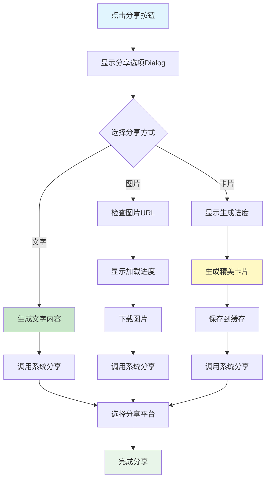

# 分享功能实现总结

## 📋 项目概述

**实施日期**: 2025年10月9日  
**功能模块**: 每日一句 - 社交分享功能  
**支持平台**: 微信、QQ、朋友圈、微博等所有支持分享的应用

---

## ✅ 完成的功能

### 1. 创建分享工具类

**文件**: `app/src/main/java/com/example/mybighomework/utils/ShareUtils.java`

核心功能：
- ✅ 纯文字分享
- ✅ 图片分享
- ✅ 图文分享
- ✅ 生成精美分享卡片
- ✅ 文件保存和URI管理

### 2. 分享选项Dialog

**文件**: `app/src/main/res/layout/dialog_share_options.xml`

三种分享方式：
- ✅ **文字分享**: 分享英文+中文+作者
- ✅ **图片分享**: 分享API提供的配图
- ✅ **卡片分享**: 生成精美分享卡片

### 3. FileProvider配置

配置文件：
- ✅ AndroidManifest.xml - Provider声明
- ✅ file_paths.xml - 文件路径配置

### 4. 集成到Activity

**文件**: `DailySentenceActivity.java`

新增方法：
- ✅ `shareSentence()` - 显示分享选项
- ✅ `shareText()` - 文字分享
- ✅ `shareOriginalImage()` - 图片分享
- ✅ `shareCard()` - 卡片分享

---

## 🎯 功能特性

### 1. 三种分享方式

#### 方式1: 纯文字分享

```
Life is like riding a bicycle. To keep your balance you must keep moving.

生活就像骑自行车，想保持平衡就得往前走。

—— Albert Einstein

📚 来自 英语学习助手
```

#### 方式2: 原始图片分享

- 分享金山词霸提供的配图
- 附带英文和中文文字

#### 方式3: 精美卡片分享

生成1080x1920的精美卡片：
- 渐变色背景（蓝色到紫色）
- 白色圆角卡片
- 大标题"每日一句"
- 英文句子（粗体，大字号）
- 中文翻译（中等字号）
- 作者署名（斜体，右对齐）
- 日期显示
- 底部水印

### 2. 分享选项Dialog

```
┌──────────────────────┐
│      分享到          │
├──────────────────────┤
│  [文字]  [图片]  [卡片] │
│                      │
│      [取消]          │
└──────────────────────┘
```

### 3. 智能适配

- ✅ 自动检测可用的分享应用
- ✅ 系统分享面板
- ✅ 无应用时友好提示

---

## 🔄 工作流程



---

## 💻 核心代码

### 1. ShareUtils工具类

```java
// 分享纯文字
public static void shareText(Context context, String title, String content) {
    Intent shareIntent = new Intent(Intent.ACTION_SEND);
    shareIntent.setType("text/plain");
    shareIntent.putExtra(Intent.EXTRA_SUBJECT, title);
    shareIntent.putExtra(Intent.EXTRA_TEXT, content);
    
    Intent chooser = Intent.createChooser(shareIntent, "分享到");
    context.startActivity(chooser);
}

// 生成分享卡片
public static Bitmap generateShareImage(...) {
    // 创建1080x1920的Bitmap
    Bitmap bitmap = Bitmap.createBitmap(1080, 1920, Config.ARGB_8888);
    Canvas canvas = new Canvas(bitmap);
    
    // 绘制渐变背景
    LinearGradient gradient = new LinearGradient(...);
    paint.setShader(gradient);
    canvas.drawRect(...);
    
    // 绘制白色卡片
    canvas.drawRoundRect(...);
    
    // 绘制文字内容
    canvas.drawText("每日一句", ...);
    canvas.drawText(englishText, ...);
    canvas.drawText(chineseText, ...);
    
    return bitmap;
}

// 保存并获取URI
public static Uri saveBitmapToFile(...) {
    File file = new File(cacheDir, fileName);
    FileOutputStream fos = new FileOutputStream(file);
    bitmap.compress(Bitmap.CompressFormat.JPEG, 90, fos);
    
    return FileProvider.getUriForFile(context, authority, file);
}
```

### 2. Activity集成

```java
// 显示分享选项
private void shareSentence() {
    AlertDialog.Builder builder = new AlertDialog.Builder(this);
    View dialogView = getLayoutInflater().inflate(R.layout.dialog_share_options, null);
    builder.setView(dialogView);
    AlertDialog dialog = builder.create();
    
    // 文字分享
    dialogView.findViewById(R.id.ll_share_text).setOnClickListener(v -> {
        dialog.dismiss();
        shareText();
    });
    
    // 图片分享
    dialogView.findViewById(R.id.ll_share_image).setOnClickListener(v -> {
        dialog.dismiss();
        shareOriginalImage();
    });
    
    // 卡片分享
    dialogView.findViewById(R.id.ll_share_card).setOnClickListener(v -> {
        dialog.dismiss();
        shareCard();
    });
    
    dialog.show();
}

// 生成并分享卡片
private void shareCard() {
    ProgressDialog progressDialog = new ProgressDialog(this);
    progressDialog.setMessage("正在生成分享卡片...");
    progressDialog.show();
    
    new Thread(() -> {
        Bitmap shareBitmap = ShareUtils.generateShareImage(...);
        Uri imageUri = ShareUtils.saveBitmapToFile(...);
        
        runOnUiThread(() -> {
            progressDialog.dismiss();
            ShareUtils.shareImage(this, imageUri, "每日一句");
        });
    }).start();
}
```

### 3. FileProvider配置

```xml
<!-- AndroidManifest.xml -->
<provider
    android:name="androidx.core.content.FileProvider"
    android:authorities="${applicationId}.fileprovider"
    android:exported="false"
    android:grantUriPermissions="true">
    <meta-data
        android:name="android.support.FILE_PROVIDER_PATHS"
        android:resource="@xml/file_paths" />
</provider>

<!-- file_paths.xml -->
<paths>
    <cache-path name="share_cache" path="share/" />
    <external-path name="external_files" path="." />
    <files-path name="files" path="." />
</paths>
```

---

## 🎨 分享卡片设计

### 卡片布局

```
┌─────────────────────────────┐
│    [渐变背景 蓝→紫]          │
│                             │
│      每日一句                │
│    2025年10月9日             │
│                             │
│  ┌───────────────────────┐  │
│  │                       │  │
│  │  Life is like riding  │  │
│  │  a bicycle...         │  │
│  │                       │  │
│  │  生活就像骑自行车...   │  │
│  │                       │  │
│  │         —— Einstein   │  │
│  │                       │  │
│  └───────────────────────┘  │
│                             │
│   来自 英语学习助手          │
│                             │
└─────────────────────────────┘
```

### 设计元素

| 元素 | 样式 | 说明 |
|------|------|------|
| 背景 | 渐变色 | #4A90E2 → #9013FE |
| 卡片 | 白色圆角 | 阴影效果 |
| 标题 | 80sp粗体 | 白色居中 |
| 日期 | 40sp | 灰白色 |
| 英文 | 60sp粗体 | 深灰色 |
| 中文 | 50sp | 中灰色 |
| 作者 | 45sp斜体 | 蓝色右对齐 |
| 水印 | 40sp | 浅灰色 |

---

## 🧪 测试验证

### 测试场景

#### 场景1: 文字分享

**步骤**:
1. 点击分享按钮
2. 选择"文字"
3. 选择分享平台（如微信）
4. 确认分享

**预期**:
- [ ] 显示分享选项Dialog
- [ ] 点击文字后Dialog关闭
- [ ] 调起系统分享面板
- [ ] 显示英文+中文+作者
- [ ] 成功分享到目标平台

#### 场景2: 图片分享

**步骤**:
1. 点击分享按钮
2. 选择"图片"
3. 等待图片准备
4. 选择分享平台

**预期**:
- [ ] 显示"正在准备图片..."
- [ ] 调起系统分享面板
- [ ] 可以分享图片
- [ ] 有句子文字说明

#### 场景3: 卡片分享

**步骤**:
1. 点击分享按钮
2. 选择"卡片"
3. 等待卡片生成
4. 选择分享平台

**预期**:
- [ ] 显示"正在生成分享卡片..."
- [ ] 1-2秒后生成完成
- [ ] 调起系统分享面板
- [ ] 显示精美卡片图片
- [ ] 卡片内容完整清晰

#### 场景4: 无图片情况

**步骤**:
1. 选择没有图片的句子
2. 点击分享 → 图片

**预期**:
- [ ] Toast提示"该句子没有配图"
- [ ] 不调起分享面板

#### 场景5: 多次分享

**步骤**:
1. 分享卡片
2. 再次分享卡片
3. 检查缓存

**预期**:
- [ ] 每次生成新文件
- [ ] 文件名不重复
- [ ] 缓存文件可清理

---

## 📱 支持的平台

### 常见应用

| 平台 | 文字 | 图片 | 卡片 |
|------|------|------|------|
| 微信好友 | ✅ | ✅ | ✅ |
| 微信朋友圈 | ✅ | ✅ | ✅ |
| QQ好友 | ✅ | ✅ | ✅ |
| QQ空间 | ✅ | ✅ | ✅ |
| 微博 | ✅ | ✅ | ✅ |
| 钉钉 | ✅ | ✅ | ✅ |
| 邮件 | ✅ | ✅ | ✅ |
| 短信 | ✅ | ❌ | ❌ |

### 系统集成

- ✅ 使用Android原生分享面板
- ✅ 自动检测已安装应用
- ✅ 无需第三方SDK
- ✅ 兼容Android 7.0+

---

## ⚠️ 注意事项

### 1. FileProvider配置

必须配置：
```xml
<provider
    android:authorities="${applicationId}.fileprovider"
    android:exported="false"
    android:grantUriPermissions="true">
```

### 2. 文件权限

- ✅ 使用应用缓存目录
- ✅ 通过FileProvider授权
- ✅ 不需要存储权限

### 3. 内存管理

```java
// 使用后清理缓存
ShareUtils.clearShareCache(context);

// Bitmap使用后回收
if (bitmap != null && !bitmap.isRecycled()) {
    bitmap.recycle();
}
```

### 4. 线程处理

- ✅ 图片生成在后台线程
- ✅ UI更新在主线程
- ✅ 显示进度对话框

---

## 🚀 后续优化建议

### 1. 添加更多分享模板

```java
// 不同风格的卡片
public enum ShareTemplate {
    CLASSIC,    // 经典风格
    MODERN,     // 现代风格
    MINIMAL,    // 极简风格
    COLORFUL    // 多彩风格
}
```

### 2. 支持自定义文字

```java
// 让用户编辑分享文案
showEditDialog(shareText, (edited) -> {
    ShareUtils.shareText(context, title, edited);
});
```

### 3. 添加分享统计

```java
// 记录分享次数
private void trackShare(String type) {
    SharedPreferences prefs = getSharedPreferences("stats", MODE_PRIVATE);
    int count = prefs.getInt("share_" + type, 0);
    prefs.edit().putInt("share_" + type, count + 1).apply();
}
```

### 4. 二维码分享

```java
// 生成包含二维码的分享卡片
Bitmap qrCode = generateQRCode(shareUrl);
canvas.drawBitmap(qrCode, ...);
```

### 5. 视频分享

```java
// 生成动画视频
VideoGenerator.create()
    .addSlide(bitmap1)
    .addSlide(bitmap2)
    .generate()
    .share();
```

---

## 📁 文件清单

### 新增文件

| 文件路径 | 说明 |
|---------|------|
| `utils/ShareUtils.java` | 分享工具类 |
| `res/layout/dialog_share_options.xml` | 分享选项Dialog |
| `res/xml/file_paths.xml` | FileProvider路径配置 |
| `res/drawable/ic_text_fields.xml` | 文字图标 |
| `res/drawable/ic_card.xml` | 卡片图标 |
| `分享功能实现总结.md` | 本文档 |

### 修改文件

| 文件路径 | 修改内容 |
|---------|---------|
| `AndroidManifest.xml` | 添加FileProvider |
| `DailySentenceActivity.java` | 集成分享功能 |

---

## 🎯 功能对比

| 功能 | 实现前 | 实现后 |
|------|-------|-------|
| 分享方式 | 仅文字 | 文字+图片+卡片 |
| 分享选项 | 直接分享 | Dialog选择 |
| 卡片生成 | ❌ | ✅ 精美卡片 |
| 图片分享 | ❌ | ✅ 支持 |
| 进度提示 | ❌ | ✅ ProgressDialog |
| 错误处理 | ❌ | ✅ Toast提示 |

---

## ✨ 总结

### 已实现功能

✅ 分享工具类（ShareUtils）  
✅ 三种分享方式（文字/图片/卡片）  
✅ 精美卡片生成  
✅ 分享选项Dialog  
✅ FileProvider配置  
✅ 进度提示和错误处理  
✅ 系统分享面板集成  

### 技术亮点

- 🎯 **多样化分享**: 文字、图片、精美卡片三选一
- 🎨 **精美卡片**: 渐变背景、圆角卡片、专业排版
- 🔄 **后台处理**: 生成图片不阻塞UI
- 🛡️ **完善容错**: 无图片、无应用都有提示
- 📱 **系统集成**: 使用原生分享面板
- 🔧 **易于扩展**: 支持添加更多模板

### 用户体验提升

- **操作简单**: 一键分享，三种方式自由选择
- **视觉精美**: 生成的卡片专业美观
- **反馈及时**: 加载进度、成功/失败提示
- **平台广泛**: 支持所有主流社交平台

---

**🎉 分享功能集成完成！**

现在用户可以：
- ✅ 将每日一句分享到微信、QQ、朋友圈
- ✅ 选择文字、图片或精美卡片分享
- ✅ 生成专业的分享卡片图片
- ✅ 与好友一起学习英语

**让学习成果触手可及，让分享变得简单美好！** 🚀

