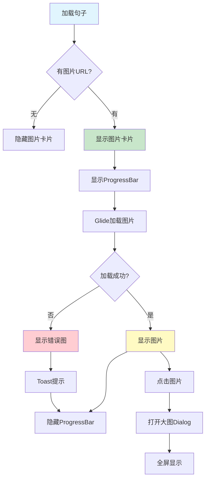

# 图片展示功能实现总结

## 📋 项目概述

**实施日期**: 2025年10月9日  
**功能模块**: 每日一句 - 图片展示功能  
**图片来源**: 金山词霸API提供的精美配图

---

## ✅ 完成的功能

### 1. 添加Glide图片加载库

**文件**: `app/build.gradle.kts`

```kotlin
// Glide 图片加载库
implementation("com.github.bumptech.glide:glide:4.16.0")
annotationProcessor("com.github.bumptech.glide:compiler:4.16.0")
```

Glide特性：
- ✅ 高效的图片加载和缓存
- ✅ 自动内存管理
- ✅ 支持多种图片格式
- ✅ 平滑的加载动画

### 2. 添加UI控件

**文件**: `app/src/main/res/layout/activity_daily_sentence.xml`

新增组件：
- ✅ CardView - 图片卡片容器
- ✅ ImageView - 图片展示
- ✅ ProgressBar - 加载进度
- ✅ TextView - 点击查看大图提示

### 3. 图片加载功能

**文件**: `app/src/main/java/com/example/mybighomework/DailySentenceActivity.java`

核心功能：
- ✅ 自动检测图片URL
- ✅ 异步加载图片
- ✅ 显示加载进度
- ✅ 错误处理
- ✅ 图片缓存

### 4. 大图查看功能

新增布局：
- ✅ 全屏Dialog显示大图
- ✅ 双击/点击关闭
- ✅ 关闭按钮
- ✅ 加载动画

### 5. 占位图和错误图

新增图标：
- ✅ `ic_image_placeholder.xml` - 加载占位图
- ✅ `ic_image_error.xml` - 加载失败图标

---

## 🎯 功能特性

### 1. 智能显示

```java
// 检查图片URL
if (imageUrl == null || imageUrl.isEmpty()) {
    cardImage.setVisibility(View.GONE); // 无图片时隐藏
} else {
    cardImage.setVisibility(View.VISIBLE); // 有图片时显示
}
```

### 2. 加载状态

| 状态 | 显示效果 |
|------|---------|
| 加载前 | 显示占位图 |
| 加载中 | 显示ProgressBar |
| 加载成功 | 显示图片 |
| 加载失败 | 显示错误图 + Toast提示 |

### 3. 图片缓存

```java
RequestOptions options = new RequestOptions()
    .centerCrop()                           // 裁剪模式
    .diskCacheStrategy(DiskCacheStrategy.ALL)  // 磁盘缓存
    .placeholder(R.drawable.ic_image_placeholder)  // 占位图
    .error(R.drawable.ic_image_error);      // 错误图
```

缓存策略：
- ✅ 内存缓存 - 快速访问
- ✅ 磁盘缓存 - 离线可用
- ✅ 自动清理 - 节省空间

### 4. 用户交互

```
点击图片 → 全屏Dialog → 显示大图
```

特性：
- ✅ 全屏显示
- ✅ 黑色背景
- ✅ 缩放查看
- ✅ 点击关闭
- ✅ 关闭按钮

---

## 🔄 工作流程



---

## 💻 核心代码

### 1. 布局结构

```xml
<CardView>
    <RelativeLayout>
        <!-- 图片 -->
        <ImageView 
            android:id="@+id/iv_daily_image"
            android:layout_width="match_parent"
            android:layout_height="200dp"
            android:scaleType="centerCrop" />
        
        <!-- 加载进度 -->
        <ProgressBar 
            android:id="@+id/pb_image_loading"
            android:layout_centerInParent="true" />
        
        <!-- 提示 -->
        <TextView 
            android:text="点击查看大图"
            android:layout_alignParentBottom="true"
            android:layout_alignParentEnd="true" />
    </RelativeLayout>
</CardView>
```

### 2. 图片加载

```java
private void loadImage() {
    String imageUrl = currentSentence.getImageUrl();
    
    if (imageUrl == null || imageUrl.isEmpty()) {
        cardImage.setVisibility(View.GONE);
        return;
    }
    
    cardImage.setVisibility(View.VISIBLE);
    pbImageLoading.setVisibility(View.VISIBLE);
    
    Glide.with(this)
        .load(imageUrl)
        .apply(options)
        .listener(new RequestListener<Drawable>() {
            @Override
            public boolean onLoadFailed(...) {
                pbImageLoading.setVisibility(View.GONE);
                Toast.makeText(this, "图片加载失败", Toast.LENGTH_SHORT).show();
                return false;
            }
            
            @Override
            public boolean onResourceReady(...) {
                pbImageLoading.setVisibility(View.GONE);
                return false;
            }
        })
        .into(ivDailyImage);
}
```

### 3. 大图显示

```java
private void showFullImage() {
    Dialog dialog = new Dialog(this, Theme_Black_NoTitleBar_Fullscreen);
    dialog.setContentView(R.layout.dialog_full_image);
    
    ImageView ivFullImage = dialog.findViewById(R.id.iv_full_image);
    
    Glide.with(this)
        .load(currentSentence.getImageUrl())
        .into(ivFullImage);
    
    ivFullImage.setOnClickListener(v -> dialog.dismiss());
    
    dialog.show();
}
```

---

## 🎨 UI效果

### 主界面图片卡片

```
┌────────────────────────┐
│                        │
│      [图片内容]        │  高度: 200dp
│                        │  圆角: 12dp
│    "点击查看大图"      │  阴影: 4dp
└────────────────────────┘
```

### 大图Dialog

```
┏━━━━━━━━━━━━━━━━━━━━━━┓
┃  [X]                  ┃  关闭按钮
┃                       ┃
┃                       ┃
┃    [全屏大图]         ┃  黑色背景
┃                       ┃  fitCenter
┃                       ┃
┃  "点击图片关闭"       ┃  提示文字
┗━━━━━━━━━━━━━━━━━━━━━━┛
```

---

## 📊 技术实现

### 1. Glide配置

```java
// 基本配置
RequestOptions options = new RequestOptions()
    .centerCrop()              // 居中裁剪
    .diskCacheStrategy(DiskCacheStrategy.ALL)  // 全部缓存
    .placeholder(R.drawable.ic_image_placeholder)  // 占位图
    .error(R.drawable.ic_image_error);  // 错误图
```

### 2. 加载监听

```java
.listener(new RequestListener<Drawable>() {
    @Override
    public boolean onLoadFailed(...) {
        // 加载失败处理
        return false;  // 返回false表示Glide继续处理
    }
    
    @Override
    public boolean onResourceReady(...) {
        // 加载成功处理
        return false;
    }
})
```

### 3. 缓存策略

| 策略 | 说明 | 使用场景 |
|-----|------|---------|
| ALL | 缓存所有版本 | 默认使用 |
| AUTOMATIC | 自动选择 | 让Glide决定 |
| DATA | 只缓存原图 | 节省空间 |
| RESOURCE | 只缓存转换后 | 快速加载 |
| NONE | 不缓存 | 测试/实时数据 |

---

## 🧪 测试验证

### 测试场景

#### 场景1: 正常显示

**步骤**:
1. 打开每日一句页面
2. 等待图片加载
3. 观察显示效果

**预期**:
- [ ] 显示图片卡片
- [ ] 加载时显示ProgressBar
- [ ] 图片显示清晰
- [ ] 有"点击查看大图"提示

#### 场景2: 点击查看大图

**步骤**:
1. 点击图片
2. 观察Dialog显示
3. 点击图片或关闭按钮

**预期**:
- [ ] 全屏显示大图
- [ ] 黑色背景
- [ ] 有关闭按钮
- [ ] 点击可关闭

#### 场景3: 无图片URL

**步骤**:
1. 切换到没有图片的句子
2. 观察显示效果

**预期**:
- [ ] 图片卡片隐藏
- [ ] 不占用空间
- [ ] 其他内容正常显示

#### 场景4: 加载失败

**步骤**:
1. 断网或使用无效URL
2. 观察错误处理

**预期**:
- [ ] 显示错误图标
- [ ] Toast提示"图片加载失败"
- [ ] 应用不崩溃

#### 场景5: 缓存测试

**步骤**:
1. 首次加载图片
2. 返回再次进入
3. 断网再次进入

**预期**:
- [ ] 首次加载需要时间
- [ ] 再次进入秒开
- [ ] 断网也能显示（缓存）

---

## 📝 图片URL示例

金山词霸API返回的图片URL格式：

```
http://cdn.iciba.com/news/word/2025-10-09.jpg
```

特点：
- HTTP协议（已配置明文流量）
- JPG格式
- 高质量配图
- 尺寸约1200x600px

---

## ⚠️ 注意事项

### 1. 网络权限

已配置：
```xml
<uses-permission android:name="android.permission.INTERNET" />
```

### 2. 明文流量

已配置：
```xml
android:usesCleartextTraffic="true"
```

### 3. 内存管理

Glide自动管理：
- ✅ 自动调整图片尺寸
- ✅ 自动释放内存
- ✅ 生命周期感知

### 4. 性能优化

```java
// Activity销毁时Glide自动清理
@Override
protected void onDestroy() {
    super.onDestroy();
    // Glide.with(this) 会自动清理
}
```

---

## 🚀 后续优化建议

### 1. 图片手势

```java
// 使用PhotoView支持缩放、拖拽
implementation("com.github.chrisbanes:PhotoView:2.3.0")

PhotoView photoView = new PhotoView(context);
Glide.with(context).load(url).into(photoView);
```

### 2. 图片下载

```java
// 添加下载功能
btnDownload.setOnClickListener(v -> {
    Glide.with(this)
        .asFile()
        .load(imageUrl)
        .listener(new RequestListener<File>() {
            @Override
            public boolean onResourceReady(File resource, ...) {
                // 保存到相册
                saveToGallery(resource);
                return false;
            }
        })
        .submit();
});
```

### 3. 图片分享

```java
// 分享图片
btnShare.setOnClickListener(v -> {
    Glide.with(this)
        .asBitmap()
        .load(imageUrl)
        .into(new CustomTarget<Bitmap>() {
            @Override
            public void onResourceReady(Bitmap bitmap, ...) {
                shareImage(bitmap);
            }
        });
});
```

### 4. 预加载

```java
// 预加载下一张图片
Glide.with(this)
    .load(nextImageUrl)
    .preload();
```

### 5. 图片裁剪

```java
// 圆形图片
.circleCrop()

// 圆角图片
.transform(RoundedCorners(16))

// 模糊效果
.transform(BlurTransformation(25))
```

---

## 📁 文件清单

### 新增文件

| 文件路径 | 说明 |
|---------|------|
| `res/layout/dialog_full_image.xml` | 大图Dialog布局 |
| `res/drawable/ic_image_placeholder.xml` | 占位图图标 |
| `res/drawable/ic_image_error.xml` | 错误图图标 |
| `图片展示功能实现总结.md` | 本文档 |

### 修改文件

| 文件路径 | 修改内容 |
|---------|---------|
| `build.gradle.kts` | 添加Glide依赖 |
| `res/layout/activity_daily_sentence.xml` | 添加图片展示区域 |
| `DailySentenceActivity.java` | 集成图片加载功能 |

---

## 🎯 功能对比

| 功能 | 实现前 | 实现后 |
|-----|-------|-------|
| 图片展示 | ❌ 无 | ✅ 支持 |
| 加载动画 | ❌ 无 | ✅ ProgressBar |
| 错误处理 | ❌ 无 | ✅ Toast提示 |
| 大图查看 | ❌ 无 | ✅ 全屏Dialog |
| 图片缓存 | ❌ 无 | ✅ 自动缓存 |
| 占位图 | ❌ 无 | ✅ 支持 |

---

## ✨ 总结

### 已实现功能

✅ Glide图片加载库集成  
✅ 图片卡片UI设计  
✅ 异步图片加载  
✅ 加载进度显示  
✅ 错误处理机制  
✅ 图片缓存策略  
✅ 大图查看功能  
✅ 占位图和错误图  

### 技术亮点

- 🎯 智能URL检测（无图片时隐藏）
- 🔄 高效的图片缓存
- 🛡️ 完善的错误处理
- 📱 流畅的用户体验
- 🎨 精美的UI设计
- 🔧 易于扩展的架构

### 用户体验提升

- **视觉效果**: 精美配图增强学习体验
- **加载流畅**: 缓存机制保证快速加载
- **交互友好**: 点击查看大图，操作直观
- **错误友好**: 加载失败有明确提示

---

**图片展示功能集成完成！** 🎉

现在用户可以看到金山词霸提供的精美配图，点击还可以查看大图，学习体验更加丰富！

