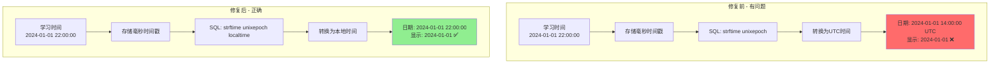
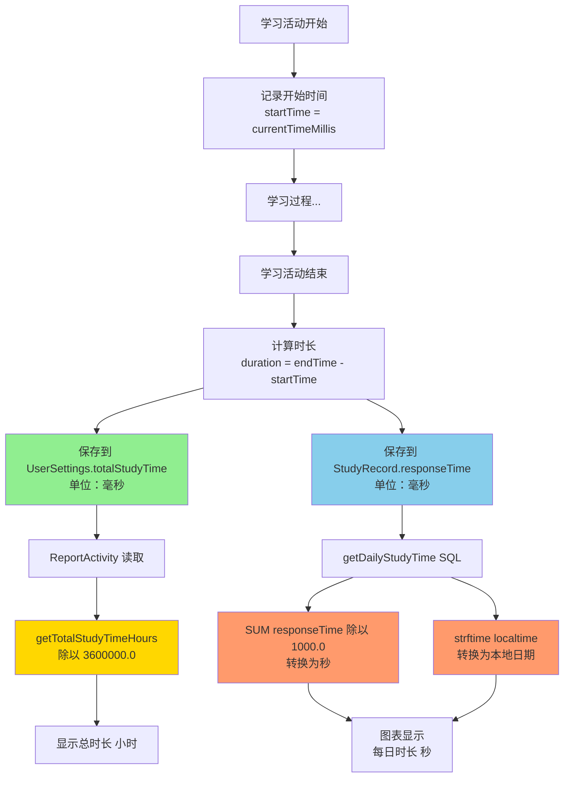

# 📊 学习报告时间计算修复说明

## 🔍 问题分析

### 发现的问题

在学习报告中，学习进度图表使用SQL查询时存在**时区转换问题**，导致日期计算可能不准确。

### 问题原因

在 `StudyRecordDao.java` 中，两个SQL查询使用了 `strftime` 函数但没有指定本地时区：

```java
// ❌ 问题代码 - 使用UTC时间
strftime('%Y-%m-%d', studyDate / 1000, 'unixepoch')
```

这会导致：
- **时区偏差**：UTC时间与本地时间相差8小时（中国时区UTC+8）
- **日期错误**：例如晚上8点以后的学习记录可能被计算到第二天
- **数据不一致**：图表显示的日期与实际学习日期不符

---

## ✅ 修复方案

### 数据流程对比



### 修复内容

#### 1. getDailyStudyTime() 方法

**文件位置**：`app/src/main/java/com/example/mybighomework/database/dao/StudyRecordDao.java:100`

**修复前**：
```java
@Query("SELECT strftime('%Y-%m-%d', studyDate / 1000, 'unixepoch') as date, " +
       "SUM(responseTime) / 1000.0 as totalSeconds " +
       "FROM study_records " +
       "WHERE studyDate >= :startTime " +
       "GROUP BY date " +
       "ORDER BY date ASC")
List<DailyStudyTime> getDailyStudyTime(long startTime);
```

**修复后**：
```java
@Query("SELECT strftime('%Y-%m-%d', studyDate / 1000, 'unixepoch', 'localtime') as date, " +
       "SUM(responseTime) / 1000.0 as totalSeconds " +
       "FROM study_records " +
       "WHERE studyDate >= :startTime " +
       "GROUP BY date " +
       "ORDER BY date ASC")
List<DailyStudyTime> getDailyStudyTime(long startTime);
```

**变更**：添加 `'localtime'` 修饰符，使用本地时区转换日期。

---

#### 2. getDistinctStudyDays() 方法

**文件位置**：`app/src/main/java/com/example/mybighomework/database/dao/StudyRecordDao.java:49`

**修复前**：
```java
@Query("SELECT DISTINCT strftime('%Y-%m-%d', studyDate / 1000, 'unixepoch') as studyDay FROM study_records ORDER BY studyDay DESC")
List<String> getDistinctStudyDays();
```

**修复后**：
```java
@Query("SELECT DISTINCT strftime('%Y-%m-%d', studyDate / 1000, 'unixepoch', 'localtime') as studyDay FROM study_records ORDER BY studyDay DESC")
List<String> getDistinctStudyDays();
```

**变更**：添加 `'localtime'` 修饰符，使用本地时区转换日期。

---

## 📐 完整数据流程

### 学习时间记录流程



### 时间单位转换表

| 位置 | 存储单位 | 显示单位 | 转换方式 |
|------|---------|---------|---------|
| UserSettings.totalStudyTime | 毫秒 | 小时 | ÷ 3,600,000 |
| StudyRecord.responseTime | 毫秒 | 秒 | ÷ 1,000 |
| StudyRecord.studyDate | 毫秒时间戳 | 本地日期 | strftime(..., 'localtime') |

---

## 🎯 修复效果

### 修复前后对比

| 场景 | 修复前 | 修复后 |
|------|--------|--------|
| **北京时间 2024-01-01 22:00** | 可能显示为 2024-01-01 或 2024-01-02（取决于UTC转换） | 正确显示为 2024-01-01 ✅ |
| **跨日期学习** | 日期边界可能偏移8小时 | 日期边界准确 ✅ |
| **学习连续天数** | 可能因日期偏差导致计算错误 | 计算准确 ✅ |
| **图表数据** | 可能日期标签错位 | 日期标签正确 ✅ |

### 验证方法

1. **测试步骤**：
   ```
   1. 在晚上8点后（例如22:00）完成一次学习活动
   2. 打开学习报告页面
   3. 查看学习进度图表
   4. 确认"今日"的数据是否正确显示
   ```

2. **预期结果**：
   - 学习总时长应该与实际学习时间一致
   - 图表的"今日"数据应该包含当天的所有学习记录
   - 日期标签应该使用本地日期（而非UTC日期）

---

## 📝 技术说明

### SQLite strftime() 函数

```sql
strftime(format, timestring, modifier1, modifier2, ...)
```

**参数说明**：
- `format`: 日期格式，如 `'%Y-%m-%d'`
- `timestring`: 时间值（秒级Unix时间戳）
- `'unixepoch'`: 表示输入是Unix时间戳（1970-01-01 00:00:00 UTC）
- `'localtime'`: **将UTC时间转换为本地时区时间** ⭐

### 为什么需要 'localtime'

- **Room数据库存储**：`Date` 类型自动转换为毫秒级时间戳（基于UTC）
- **SQL读取**：需要除以1000转换为秒级时间戳
- **strftime转换**：默认使用UTC时间，需要添加 `'localtime'` 转换为本地时区

### 时区差异示例

```
存储时间：1704117600000 毫秒
         = 1704117600 秒
         = 2024-01-01 14:00:00 UTC

不加 'localtime':
  strftime('%Y-%m-%d', 1704117600, 'unixepoch')
  = '2024-01-01'

加 'localtime' (UTC+8):
  strftime('%Y-%m-%d', 1704117600, 'unixepoch', 'localtime')
  = '2024-01-01' + 8小时
  = '2024-01-01 22:00:00'
  = '2024-01-01'
```

---

## ✅ 测试确认

修复完成后，请进行以下测试：

### 1. 功能测试
- [ ] 完成一次词汇训练（记录时长）
- [ ] 完成一次模拟考试（记录时长）
- [ ] 完成一次真题练习（记录时长）
- [ ] 打开学习报告页面
- [ ] 确认总时长显示正确
- [ ] 确认图表数据显示正确

### 2. 边界测试
- [ ] 在晚上8点后学习（测试跨UTC日期）
- [ ] 在凌晨0点前后学习（测试跨本地日期）
- [ ] 连续多天学习（测试连续天数统计）

### 3. 数据一致性
- [ ] 学习概览的总时长 = Sum(每日时长)
- [ ] 图表显示的日期与实际学习日期一致
- [ ] 学习连续天数计算正确

---

## 🎉 总结

### 修复内容
✅ 修复了学习进度图表的时区转换问题  
✅ 添加 'localtime' 修饰符使用本地时区  
✅ 确保日期计算与本地时间一致  

### 涉及文件
- `app/src/main/java/com/example/mybighomework/database/dao/StudyRecordDao.java`

### 改动行数
- getDailyStudyTime(): 第100行
- getDistinctStudyDays(): 第49行

### 修复类型
🐛 Bug Fix - 时区转换错误

---

**修复日期**：2025-01-09  
**修复人员**：AI Assistant  
**优先级**：高 - 影响数据准确性

