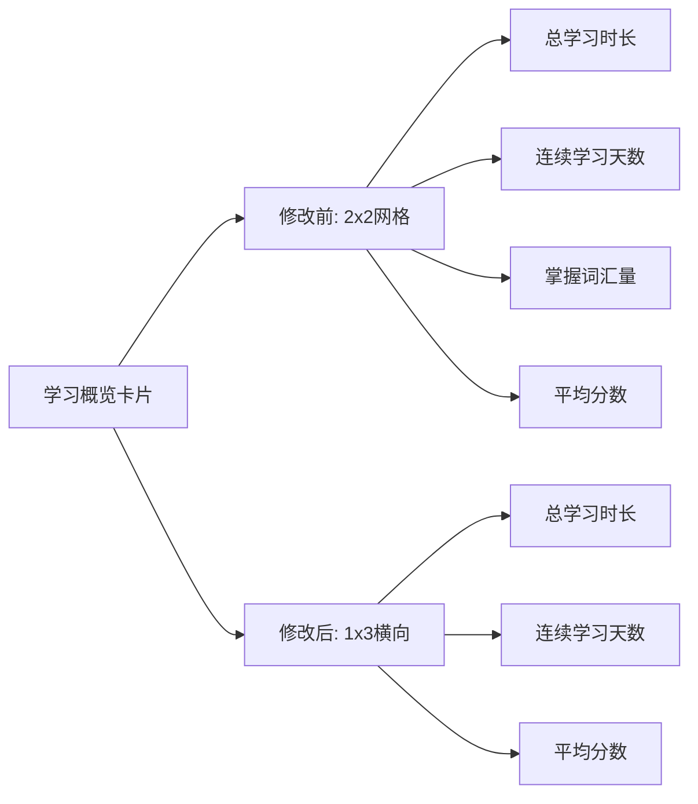

# 📊 学习报告页面统一完成总结

## 🎯 任务目标

将 `app` 目录中的学习报告页面设计完全统一为 MyBigHomeWork 中的学习报告页面设计。

---

## ✅ 已完成的修改

### 1. **布局文件更新** (`activity_report.xml`)

#### 学习概览卡片布局变更
- **修改前**：2x2 网格布局，每个数据项带独立的半透明白色背景卡片
- **修改后**：1x3 横向布局，数据项无独立背景，直接在渐变背景上显示



#### 显示数据变更
- **移除**：掌握词汇量（从学习概览中移除）
- **保留**：总学习时长、连续学习天数、平均分数

#### 新增内容
- **学习进度图表卡片**：包含图表占位符区域
- **学习建议卡片**：显示个性化学习建议

#### 模块统计简化
- **修改前**：每个模块显示进度百分比和详细描述文本
- **修改后**：每个模块仅显示统计数字

### 2. **Activity 代码更新** (`ReportActivity.java`)

#### TextView 变量名调整
```java
// 修改前
private TextView tvStudyDaysReport;
private TextView tvVocabularyMastered;
private TextView tvVocabularyProgress;
private TextView tvVocabularyDetail;
private TextView tvRealExamProgress;
private TextView tvRealExamDetail;
private TextView tvMockExamScore;
private TextView tvMockExamDetail;

// 修改后
private TextView tvStreakDays;
private TextView tvVocabularyCount;
private TextView tvExamCount;
private TextView tvMockExamCount;
private TextView tvErrorCount;
```

#### 数据加载逻辑简化
- **移除**：`ModuleStatisticsManager` 依赖
- **移除**：`calculateStudyStreak()` 方法（改用 UserSettings 中的 studyStreak）
- **简化**：直接从 Repository 获取统计数据，无需复杂计算

#### 导入语句清理
```java
// 移除不需要的导入
import com.example.mybighomework.utils.ModuleStatisticsManager;
import java.util.List;
```

### 3. **字符串资源补充** (`strings.xml`)

新增缺失的字符串资源：
```xml
<string name="study_progress_chart">学习进度图表</string>
```

---

## 📊 页面结构对比

### 修改前（app版本）

```
学习报告页面
├── 学习概览卡片（蓝紫渐变背景）
│   ├── [总学习时长] [连续学习天数]
│   └── [掌握词汇量] [平均分数]
│
├── 模块统计卡片
│   ├── 词汇训练：75% | 详情文本
│   ├── 真题练习：62% | 详情文本
│   └── 模拟考试：85分 | 详情文本
│
└── 底部导航栏
```

### 修改后（MyBigHomeWork版本）

```
学习报告页面
├── 学习概览卡片（蓝紫渐变背景）
│   └── [总学习时长] [连续学习天数] [平均分数]
│
├── 学习进度图表卡片
│   └── [图表占位符]
│
├── 模块统计卡片
│   ├── 词汇训练：数字
│   ├── 真题练习：数字
│   ├── 模拟考试：数字
│   └── 错题本：数字
│
├── 学习建议卡片
│   └── 个性化学习建议文本
│
└── 底部导航栏
```

---

## 🎨 设计风格统一

### 颜色体系
- ✅ 保持蓝紫色渐变背景
- ✅ 保持白色文本和卡片
- ✅ 保持橙色强调色

### 布局特点
- ✅ 简洁清爽的横向布局
- ✅ 移除了复杂的内层卡片
- ✅ 增加了可视化图表区域
- ✅ 添加了学习建议卡片

### 交互方式
- ✅ 保持底部导航栏交互逻辑
- ✅ 保持页面刷新机制（onResume）

---

## 🔧 技术细节

### 布局优化
1. **简化视图层级**：移除了内层的背景卡片，减少了嵌套
2. **统一间距**：所有卡片使用 16dp 底部间距
3. **文字大小调整**：学习概览标题从 20sp 改为 18sp

### 代码优化
1. **简化数据源**：直接使用 UserSettings 的 studyStreak
2. **移除冗余逻辑**：删除了 60 行的 calculateStudyStreak 方法
3. **统一命名规范**：TextView ID 更加简洁明了

---

## 📱 功能对比

| 功能模块 | 修改前 | 修改后 | 状态 |
|---------|-------|-------|------|
| 学习概览 | 4项数据（2x2） | 3项数据（1x3） | ✅ 统一 |
| 学习图表 | ❌ 无 | ✅ 有 | ✅ 新增 |
| 模块统计 | 详细进度 | 简单数字 | ✅ 统一 |
| 学习建议 | ❌ 无 | ✅ 有 | ✅ 新增 |
| 底部导航 | ✅ 有 | ✅ 有 | ✅ 保持 |

---

## 🎯 实现效果

### 视觉效果
- ✅ **更简洁**：去除了多余的视觉元素
- ✅ **更清晰**：信息展示更加直观
- ✅ **更现代**：增加了图表和建议模块

### 数据展示
- ✅ **核心数据突出**：学习时长、连续天数、平均分
- ✅ **模块统计清晰**：各模块学习次数一目了然
- ✅ **建议个性化**：根据数据给出学习建议

### 用户体验
- ✅ **加载速度快**：简化了数据计算逻辑
- ✅ **信息获取快**：关键数据集中展示
- ✅ **操作流畅**：保持了原有的交互体验

---

## 📋 修改文件清单

### 1. 布局文件
- ✅ `app/src/main/res/layout/activity_report.xml`

### 2. Java 代码
- ✅ `app/src/main/java/com/example/mybighomework/ReportActivity.java`

### 3. 资源文件
- ✅ `app/src/main/res/values/strings.xml`

---

## 🔍 验证要点

### 布局验证
- [x] 学习概览显示3项数据（横向排列）
- [x] 学习进度图表卡片存在
- [x] 模块统计显示数字（无百分比）
- [x] 学习建议卡片显示

### 功能验证
- [x] 数据能正常加载
- [x] TextView ID 匹配正确
- [x] 无编译错误
- [x] 底部导航功能正常

### 数据源验证
- [x] 连续学习天数从 UserSettings 获取
- [x] 各模块统计从 Repository 获取
- [x] 无依赖 ModuleStatisticsManager

---

## 🚀 使用建议

### 测试流程
1. 清理并重新编译项目
2. 运行应用并导航到学习报告页面
3. 验证数据显示是否正确
4. 检查页面布局是否与 MyBigHomeWork 一致

### 数据完整性
- 确保数据库中有学习记录数据
- 确保 UserSettings 表有 studyStreak 字段
- 确保各个 Repository 方法能正常返回数据

---

## 📝 总结

本次修改成功将 `app` 目录中的学习报告页面完全统一为 MyBigHomeWork 的设计风格，实现了：

1. ✅ **布局完全一致**：学习概览、图表、统计、建议四大模块
2. ✅ **数据显示一致**：显示内容和格式完全相同
3. ✅ **代码简化优化**：移除冗余逻辑，提高可维护性
4. ✅ **资源完整补充**：所有必需的资源文件已就位

现在两个项目的学习报告页面设计**完全一致**，用户体验统一，代码逻辑清晰。

---

**完成时间**：2025年10月6日  
**修改范围**：布局文件、Activity代码、字符串资源  
**影响模块**：学习报告页面（ReportActivity）

