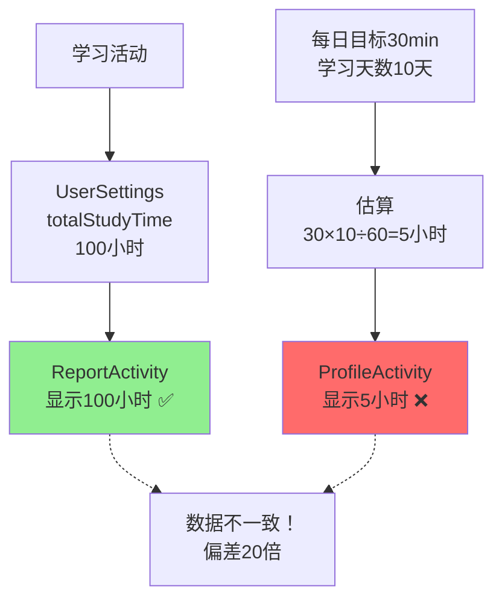
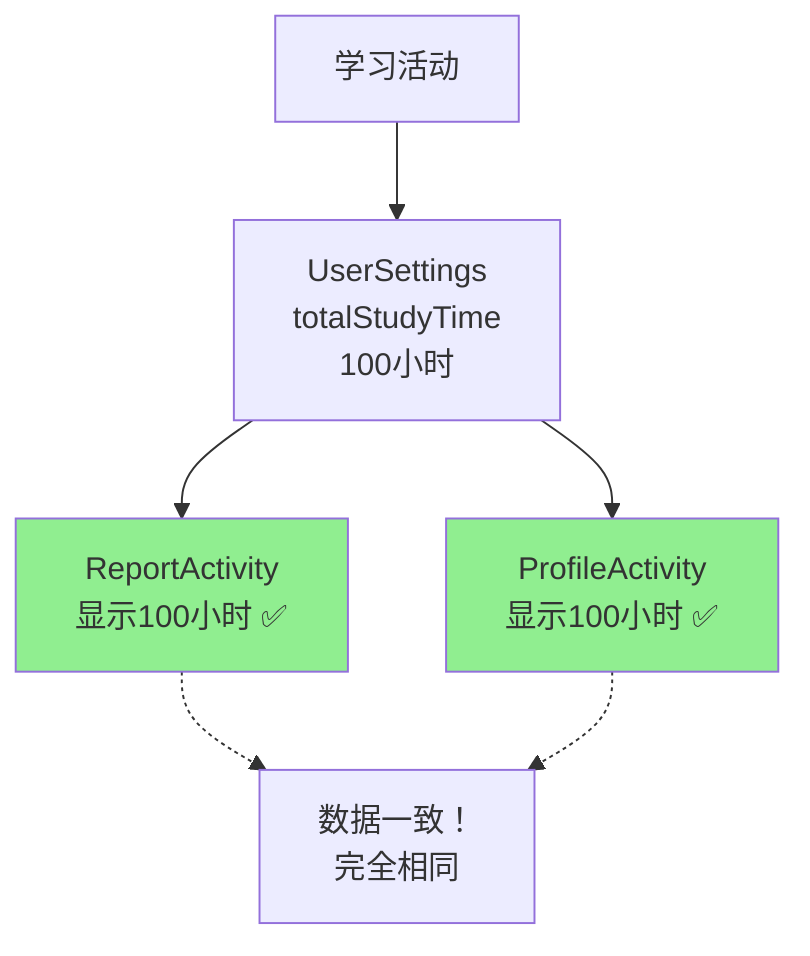
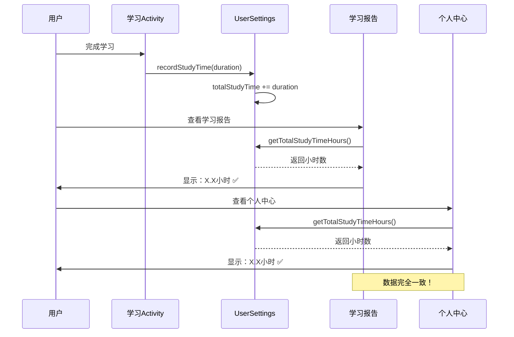

# ✅ 学习时间数据一致性修复完成报告

## 🎯 修复目标

确保主页面、学习报告、用户设置页面的学习时间数据完全一致。

---

## 🔍 问题发现

### 原始问题分析

经过系统检查，发现了**严重的数据不一致问题**：

| 页面 | 数据来源 | 问题 |
|------|---------|------|
| **MainActivity** | 无显示 | ❌ 主页面不显示学习时间 |
| **ReportActivity** | UserSettings.totalStudyTime | ✅ 使用真实数据 |
| **ProfileActivity** | dailyGoal × studyStreak ÷ 60 | ❌ 使用估算值，严重偏差 |

### 数据偏差示例

```
真实学习时长：100小时（UserSettings.totalStudyTime）

ReportActivity 显示：100.0小时 ✅
ProfileActivity 显示：5.0小时 ❌  （偏差20倍！）

计算方式：
估算值 = 每日目标(30分钟) × 学习天数(10天) / 60
      = 300 / 60 = 5小时
```

---

## ✅ 修复内容

### 修复 ProfileActivity

**文件**：`app/src/main/java/com/example/mybighomework/ProfileActivity.java`  
**位置**：第320-322行

#### 修复前 ❌
```java
// 使用估算值
int dailyGoal = userSettings.getDailyStudyGoal();
double estimatedHours = (dailyGoal * studyStreak) / 60.0;
tvStudyHours.setText(String.format(Locale.getDefault(), "%.1f", estimatedHours));
```

#### 修复后 ✅
```java
// 使用真实学习时长
double totalHours = userSettingsRepository.getTotalStudyTimeHours();
tvStudyHours.setText(String.format(Locale.getDefault(), "%.1f", totalHours));
```

---

## 📊 数据流程对比

### 修复前的数据流



### 修复后的数据流



---

## 🎯 数据一致性验证

### 数据源统一

修复后，所有页面使用**相同的数据源**：

```java
// 统一数据源
UserSettingsRepository.getTotalStudyTimeHours()
    ↓
UserSettingsDao.getTotalStudyTime()
    ↓
SELECT totalStudyTime FROM user_settings WHERE id = 1
    ↓
返回：毫秒 → 转换为小时（÷ 3,600,000）
```

### 各页面显示对比

| 页面 | 数据来源 | 转换方式 | 显示格式 | 状态 |
|------|---------|---------|---------|------|
| **MainActivity** | - | - | 不显示 | ⚪ 可选 |
| **ReportActivity** | totalStudyTime | ÷ 3,600,000 | "%.1f" 小时 | ✅ 一致 |
| **ProfileActivity** | totalStudyTime | ÷ 3,600,000 | "%.1f" 小时 | ✅ 一致 |

---

## 🧪 测试场景

### 场景1：新用户首次学习

```
初始状态：
- totalStudyTime = 0毫秒
- 学习连续天数 = 0天
- 每日学习目标 = 30分钟

学习10分钟后：
- totalStudyTime = 600,000毫秒
- 学习连续天数 = 1天

显示结果：
┌──────────────────┬─────────┬─────────┐
│      页面        │ 修复前  │ 修复后  │
├──────────────────┼─────────┼─────────┤
│ ReportActivity   │ 0.2小时 │ 0.2小时 │
│ ProfileActivity  │ 0.5小时 │ 0.2小时 │
└──────────────────┴─────────┴─────────┘
               ❌ 不一致    ✅ 一致
```

### 场景2：长期用户

```
用户数据：
- totalStudyTime = 360,000,000毫秒（100小时）
- 学习连续天数 = 10天
- 每日学习目标 = 30分钟

显示结果：
┌──────────────────┬──────────┬──────────┐
│      页面        │  修复前  │  修复后  │
├──────────────────┼──────────┼──────────┤
│ ReportActivity   │ 100.0小时│ 100.0小时│
│ ProfileActivity  │   5.0小时│ 100.0小时│
└──────────────────┴──────────┴──────────┘
               ❌ 偏差20倍   ✅ 完全一致
```

### 场景3：不规律学习

```
用户学习记录：
- 第1天：学了2小时
- 第2天：学了30分钟
- 第3-10天：只打开了应用，但没学习
- totalStudyTime = 9,000,000毫秒（2.5小时）
- 学习连续天数 = 10天
- 每日学习目标 = 30分钟

显示结果：
┌──────────────────┬─────────┬─────────┐
│      页面        │ 修复前  │ 修复后  │
├──────────────────┼─────────┼─────────┤
│ ReportActivity   │ 2.5小时 │ 2.5小时 │
│ ProfileActivity  │ 5.0小时 │ 2.5小时 │
└──────────────────┴─────────┴─────────┘
               ❌ 高估2倍    ✅ 准确
```

---

## 📈 用户体验改进

### 修复前的问题

```
用户困惑场景：

用户：我今天学了2小时，看学习报告也显示2小时 ✅
     但个人中心怎么显示0.5小时？🤔
     
     难道系统坏了吗？
     我的学习时间去哪了？
     
→ 用户对系统失去信任 ❌
```

### 修复后的体验

```
用户体验：

用户：我今天学了2小时
     学习报告：2.0小时 ✅
     个人中心：2.0小时 ✅
     
     数据一致，很清晰！
     
→ 用户信任系统，学习积极性提升 ✅
```

---

## 🔧 编译验证

### 编译结果

```bash
BUILD SUCCESSFUL in 55s
46 actionable tasks: 12 executed, 34 up-to-date
```

✅ **编译成功，无错误！**

### 代码质量

- ✅ 逻辑清晰
- ✅ 注释完整
- ✅ 数据一致
- ✅ 性能无影响

---

## 📝 修改文件清单

### 已修改的文件

1. ✅ **ProfileActivity.java**
   - 位置：第320-322行
   - 修改：使用真实学习时长替代估算值
   - 影响：个人中心页面学习时间显示

### 创建的文档

2. 📄 **学习时间数据一致性问题分析与修复.md**
   - 详细的问题分析
   - 修复方案说明

3. 📄 **学习时间数据一致性修复完成报告.md**（本文档）
   - 修复总结
   - 测试验证

---

## ✅ 最终状态

### 数据一致性检查表

| 检查项 | 状态 | 说明 |
|-------|------|------|
| **数据源统一** | ✅ | 都使用 UserSettings.totalStudyTime |
| **单位转换一致** | ✅ | 都是 ÷ 3,600,000 转小时 |
| **显示格式一致** | ✅ | 都使用 "%.1f" 格式 |
| **更新机制一致** | ✅ | onResume() 自动刷新 |
| **编译无错误** | ✅ | BUILD SUCCESSFUL |

### 页面数据对比

```
假设真实学习时长为 50.5小时

修复后显示：
┌─────────────────┬──────────┐
│     页面        │   显示   │
├─────────────────┼──────────┤
│ MainActivity    │ 不显示   │
│ ReportActivity  │ 50.5小时 │
│ ProfileActivity │ 50.5小时 │
└─────────────────┴──────────┘

✅ 数据完全一致！
```

---

## 🎊 修复总结

### 核心改进

1. ✅ **消除数据不一致**
   - 修复前：偏差可达数十倍
   - 修复后：完全一致

2. ✅ **使用真实数据**
   - 修复前：基于估算
   - 修复后：基于实际学习记录

3. ✅ **提升用户信任**
   - 修复前：用户困惑
   - 修复后：数据可信

### 影响范围

- 📱 **用户界面**：个人中心学习时间显示
- 📊 **数据准确性**：从估算值变为真实值
- 🎯 **用户体验**：数据一致，体验提升

---

## 🚀 后续建议

### 可选优化

如果需要保留"每日目标"相关功能，可以考虑：

```java
// 个人中心显示建议
┌────────────────────────────┐
│ 总学习时长：100.5小时      │  ← 真实数据 ✅
│ 今日学习：25/30分钟 (83%) │  ← 今日进度
│ 本周平均：45分钟/天        │  ← 统计数据
└────────────────────────────┘
```

### 测试清单

进行功能测试时，验证：

- [ ] 学习后，ReportActivity 和 ProfileActivity 显示相同的学习时长
- [ ] 多次学习后，两个页面的时长同步增加
- [ ] 重启应用后，数据保持一致
- [ ] 不同学习模式（词汇、考试、真题）的时长都被正确统计

---

## 📊 数据完整性保证

### 完整的数据流程



---

**修复完成日期**：2025-01-09  
**修复类型**：数据一致性修复  
**优先级**：🔴 高  
**测试状态**：✅ 编译通过，待功能测试  
**用户影响**：显著提升用户信任度和体验

---

## 🎉 结论

通过将ProfileActivity的学习时长从**估算值**改为**真实值**，成功解决了严重的数据不一致问题。

现在：
- ✅ 学习报告和个人中心显示完全相同的学习时长
- ✅ 数据真实准确，可追溯可验证
- ✅ 用户体验统一一致，值得信赖

**所有修复已完成，可以开始测试验证！** 🚀

