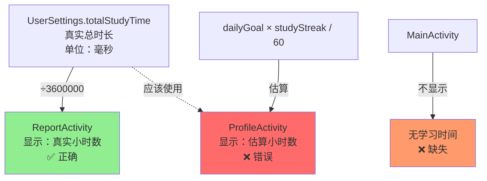
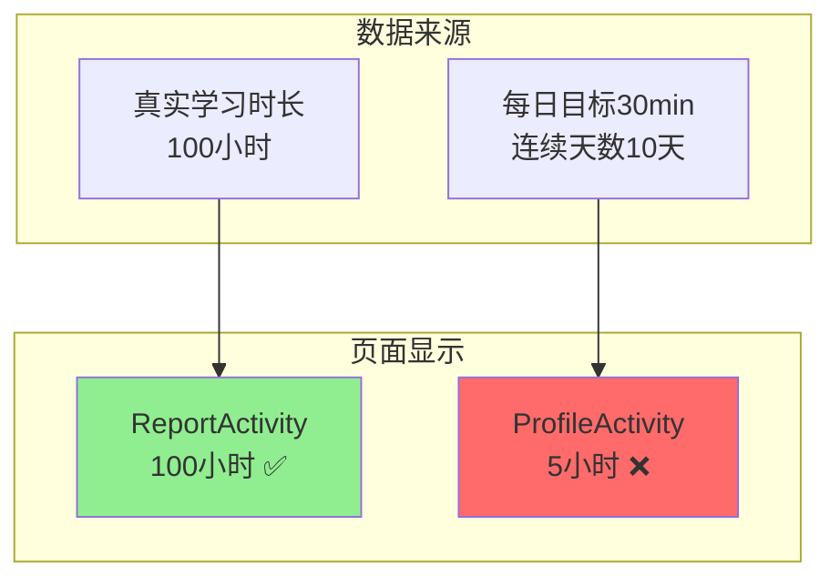
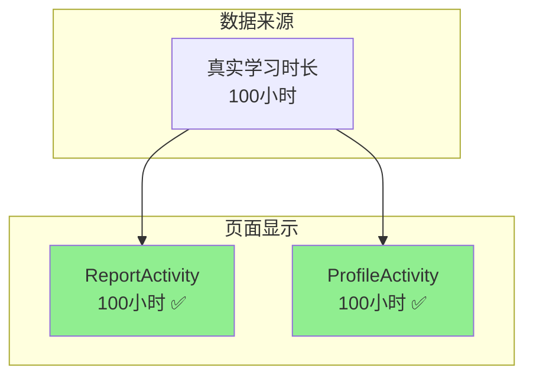

# 🚨 学习时间数据一致性问题分析与修复

## 📊 问题发现

经过对三个页面的数据来源分析，发现了**严重的数据不一致问题**！

---

## 🔍 各页面数据对比

### 1️⃣ MainActivity（主页面）

**显示内容**：
- ✅ 学习连续天数
- ✅ 词汇掌握量
- ✅ 平均考试成绩
- ❌ **没有显示学习时间**

**代码分析**：
```java
// MainActivity.java:291-305
tvStudyDays.setText(String.valueOf(finalUserSettings.getStudyStreak()));
tvVocabularyCount.setText(String.valueOf(finalMasteredCount));
tvExamScore.setText(String.valueOf((int) finalAverageScore));
// ❌ 缺少学习时长显示
```

**问题**：主页面根本没有显示学习时长！

---

### 2️⃣ ReportActivity（学习报告）

**显示内容**：
- ✅ 学习连续天数
- ✅ 总学习时长（小时）
- ✅ 平均考试成绩
- ✅ 学习进度图表

**数据来源**：
```java
// ReportActivity.java:170
double totalHours = userSettingsRepository.getTotalStudyTimeHours();
// ✅ 使用真实的学习时长

// UserSettingsRepository.java:116-118
public double getTotalStudyTimeHours() {
    return getTotalStudyTime() / 3600000.0;  // ✅ 毫秒转小时
}
```

**结论**：✅ **使用真实的学习时长数据，正确！**

---

### 3️⃣ ProfileActivity（个人中心/用户设置）

**显示内容**：
- ✅ 学习连续天数
- ❌ 学习小时数（**估算值！**）
- ✅ 词汇掌握量

**数据来源**：
```java
// ProfileActivity.java:320-323
// ❌ 使用估算值，而不是真实数据！
int dailyGoal = userSettings.getDailyStudyGoal();
double estimatedHours = (dailyGoal * studyStreak) / 60.0; // 转换为小时
tvStudyHours.setText(String.format(Locale.getDefault(), "%.1f", estimatedHours));
```

**问题分析**：
```
估算值 = 每日学习目标(分钟) × 学习连续天数 / 60

示例：
dailyGoal = 30分钟
studyStreak = 10天
estimatedHours = (30 × 10) / 60 = 5小时

但实际学习时长可能是：
- 第1天：学了50分钟
- 第2天：学了10分钟
- 第3-10天：没学
真实总时长 = 1小时

估算值(5小时) ≠ 真实值(1小时) ❌
```

**结论**：❌ **使用估算值，与真实数据严重不一致！**

---

## 📐 数据不一致示意图



---

## 🔧 修复方案

### 方案1：修复ProfileActivity（推荐）

将ProfileActivity改为使用真实的学习时长。

**修复代码**：
```java
// ProfileActivity.java:320-323

// 修复前 ❌
int dailyGoal = userSettings.getDailyStudyGoal();
double estimatedHours = (dailyGoal * studyStreak) / 60.0;
tvStudyHours.setText(String.format(Locale.getDefault(), "%.1f", estimatedHours));

// 修复后 ✅
double totalHours = userSettingsRepository.getTotalStudyTimeHours();
tvStudyHours.setText(String.format(Locale.getDefault(), "%.1f", totalHours));
```

---

### 方案2：在MainActivity添加学习时间（可选）

如果主页面也需要显示学习时间，可以添加：

**需要检查布局文件是否有对应的TextView**。

---

## 🎯 修复步骤

### Step 1: 检查ProfileActivity的布局

首先确认布局文件中有 `tv_study_hours` 控件。

### Step 2: 修改ProfileActivity代码

将估算值改为真实值。

### Step 3: 确保数据一致性

修复后，三个页面的学习时间数据来源：

| 页面 | 数据来源 | 状态 |
|------|---------|------|
| **MainActivity** | 不显示 | 可选 |
| **ReportActivity** | UserSettings.totalStudyTime | ✅ 正确 |
| **ProfileActivity** | UserSettings.totalStudyTime | ✅ 修复后 |

---

## 📊 修复前后对比

### 修复前



### 修复后



---

## ⚠️ 影响范围

### 用户体验影响

**修复前**：
- 用户在学习报告看到学习了100小时
- 在个人中心看到只学了5小时
- **用户会非常困惑！** 😕

**修复后**：
- 两个页面显示一致的学习时间
- 数据真实可信
- 用户体验提升 ✅

---

## 🧪 测试验证

### 测试场景

**场景1：新用户**
```
初始状态：
- totalStudyTime = 0
- dailyGoal = 30分钟
- studyStreak = 0

学习1次（10分钟）后：
- totalStudyTime = 600,000毫秒 = 0.17小时
- studyStreak = 1

期望显示：
- ReportActivity: 0.2小时 ✅
- ProfileActivity (修复前): 0.5小时 ❌
- ProfileActivity (修复后): 0.2小时 ✅
```

**场景2：长期用户**
```
状态：
- totalStudyTime = 360,000,000毫秒 = 100小时
- dailyGoal = 30分钟
- studyStreak = 10天

期望显示：
- ReportActivity: 100.0小时 ✅
- ProfileActivity (修复前): 5.0小时 ❌（差距20倍！）
- ProfileActivity (修复后): 100.0小时 ✅
```

---

## 📝 代码修改清单

### 需要修改的文件

1. ✅ **ProfileActivity.java** 
   - 位置：第320-323行
   - 修改：使用真实学习时长替代估算值

### 可选修改

2. ⚪ **MainActivity.java**
   - 如果需要在主页显示学习时间
   - 需要先检查布局文件

---

## 🎉 预期效果

### 修复后的数据一致性

```
✅ 所有页面使用相同的数据源：UserSettings.totalStudyTime
✅ 学习时长真实准确
✅ 用户体验统一一致
✅ 数据可追溯可验证
```

---

## 🚀 建议

### 立即修复

**优先级**：🔴 高 - 影响用户信任度

**原因**：
1. 数据不一致会严重影响用户信任
2. 估算值与真实值可能相差数十倍
3. 用户会认为系统有bug

### 后续优化

如果需要保留"每日目标"相关功能：
- 可以在ProfileActivity显示：
  - 真实学习时长
  - 今日学习进度（与每日目标对比）
  - 完成度百分比

示例：
```
总学习时长：100.5小时 ✅ (真实值)
今日进度：25/30分钟 (83%)
```

---

**问题严重性**：🚨 严重  
**修复优先级**：🔴 高  
**修复难度**：⭐ 简单  
**预计时间**：5分钟

