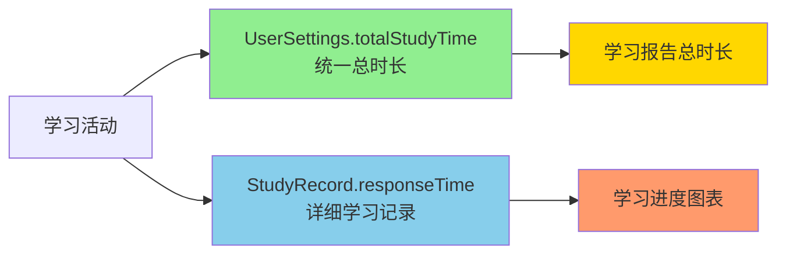

# 📚 学习时间统计系统 - 快速指南

## 🎯 系统概述

应用现在使用**双重记录机制**来追踪和显示学习时间：



---

## ✅ 支持的学习活动

| 活动类型 | Activity | 时间记录 | 图表显示 |
|---------|----------|---------|---------|
| 词汇训练 | VocabularyActivity | ✅ | ✅ |
| 模拟考试 | MockExamActivity | ✅ | ✅ |
| 真题练习 | RealExamActivity | ✅ | ✅ |

---

## 📊 查看学习统计

### 1. 打开学习报告页面
```
主页 → 点击"学习报告"按钮
```

### 2. 查看统计数据
- **总学习时长**：显示所有学习活动的累计时间
- **学习进度图表**：显示最近7天的每日学习时长趋势
- **学习连续天数**：自动追踪学习习惯

---

## 🔧 技术说明

### 数据存储位置

#### 1. UserSettings 表
```java
// 总学习时长（毫秒）
private long totalStudyTime;

// 获取小时数
public double getTotalStudyTimeHours() {
    return totalStudyTime / 3600000.0;
}
```

**用途：**
- 快速查询总学习时长
- O(1) 时间复杂度
- 显示在学习报告顶部

#### 2. StudyRecords 表
```java
// 每次学习活动的时长（毫秒）
private long responseTime;

// 学习日期
private Date studyDate;

// 学习类型
private String studyType; // "vocabulary", "mock_exam", "real_exam"
```

**用途：**
- 按日期统计学习时长
- 显示学习进度图表
- 详细学习数据分析

---

## 🚀 使用方法

### 开发者 - 记录学习时间

```java
// 在任何学习活动结束时调用
long duration = System.currentTimeMillis() - startTime;
userSettingsRepository.recordStudyTime(duration, "activity_type");
```

**同时创建详细记录：**
```java
StudyRecordEntity studyRecord = new StudyRecordEntity();
studyRecord.setStudyType("activity_type");
studyRecord.setResponseTime(duration);
studyRecord.setScore(score);
studyRecord.setNotes("活动描述");
studyRecordRepository.addStudyRecord(studyRecord);
```

### 开发者 - 获取学习时间

```java
// 获取总学习时长（小时）
double hours = userSettingsRepository.getTotalStudyTimeHours();

// 获取最近7天每日学习时长
List<DailyStudyTime> dailyData = studyRecordRepository.getDailyStudyTime(7);
```

---

## 📱 用户界面

### 学习报告页面显示

```
┌─────────────────────────────────┐
│   学习统计                       │
├─────────────────────────────────┤
│  连续学习  │  总时长  │  平均分  │
│    7天    │  12.5h  │   85    │
└─────────────────────────────────┘

┌─────────────────────────────────┐
│   学习进度图表    最近7天        │
├─────────────────────────────────┤
│           📈                     │
│        ●                         │
│    ●       ●   ●                │
│  ●           ●     ●   ●        │
│                                  │
│  周一 周二 周三 周四 周五 周六 今日│
└─────────────────────────────────┘
```

---

## 🔍 数据验证

### SQL 查询示例

```sql
-- 查询总学习时长
SELECT totalStudyTime / 3600000.0 as hours 
FROM user_settings 
WHERE id = 1;

-- 查询最近7天每日学习时长
SELECT 
    strftime('%Y-%m-%d', studyDate / 1000, 'unixepoch') as date,
    SUM(responseTime) / 3600.0 as hours,
    COUNT(*) as activities
FROM study_records
WHERE studyDate >= (strftime('%s', 'now', '-7 days') * 1000)
GROUP BY date
ORDER BY date;
```

---

## ⚠️ 注意事项

1. **时间单位统一为毫秒**
   ```java
   long duration = endTime - startTime; // 毫秒
   ```

2. **后台线程执行**
   ```java
   new Thread(() -> {
       userSettingsRepository.recordStudyTime(duration, type);
   }).start();
   ```

3. **异常处理**
   ```java
   try {
       userSettingsRepository.recordStudyTime(duration, type);
   } catch (Exception e) {
       e.printStackTrace();
       // 失败不影响用户体验
   }
   ```

---

## 🎊 功能特性

✅ **自动累加**：学习时长自动累计到总时长  
✅ **实时更新**：完成学习活动后立即更新  
✅ **图表展示**：7天学习趋势一目了然  
✅ **多类型支持**：词汇、考试、练习全覆盖  
✅ **高性能**：单表查询，毫秒级响应  
✅ **数据一致**：双重记录确保数据完整  

---

## 📞 问题排查

### 问题1：图表不显示数据
**检查：**
- 确认已完成学习活动并保存
- 检查 StudyRecord 是否创建
- 查看数据库中的 study_records 表

### 问题2：总时长为0
**检查：**
- 确认调用了 `recordStudyTime()`
- 检查 user_settings 表的 totalStudyTime 字段
- 验证数据库版本是否为9

### 问题3：时间单位错误
**确认：**
- 数据库存储：毫秒
- 显示给用户：小时或分钟
- 使用提供的转换方法

---

## 🔄 更新日志

### v9.0 (当前版本)
- ✅ 添加 UserSettings.totalStudyTime 字段
- ✅ 实现统一时间记录接口
- ✅ 修复模拟考试和真题练习的图表显示
- ✅ 提供数据库迁移策略

### v8.0 (之前版本)
- StudyRecord.responseTime 已存在
- 仅词汇训练记录到 StudyRecord
- 图表数据不完整

---

## 📚 相关文档

- [统一学习时间存储系统实现报告.md](统一学习时间存储系统实现报告.md)
- [学习进度图表修复说明.md](学习进度图表修复说明.md)
- [学习记录图表功能实现总结.md](学习记录图表功能实现总结.md)

