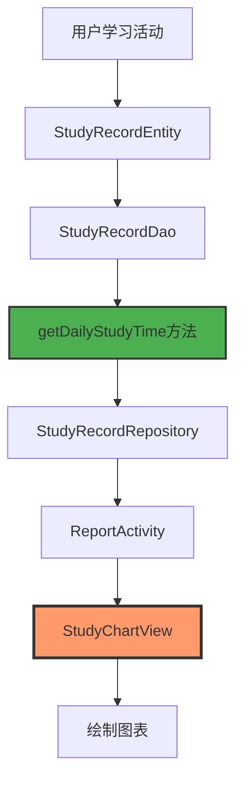
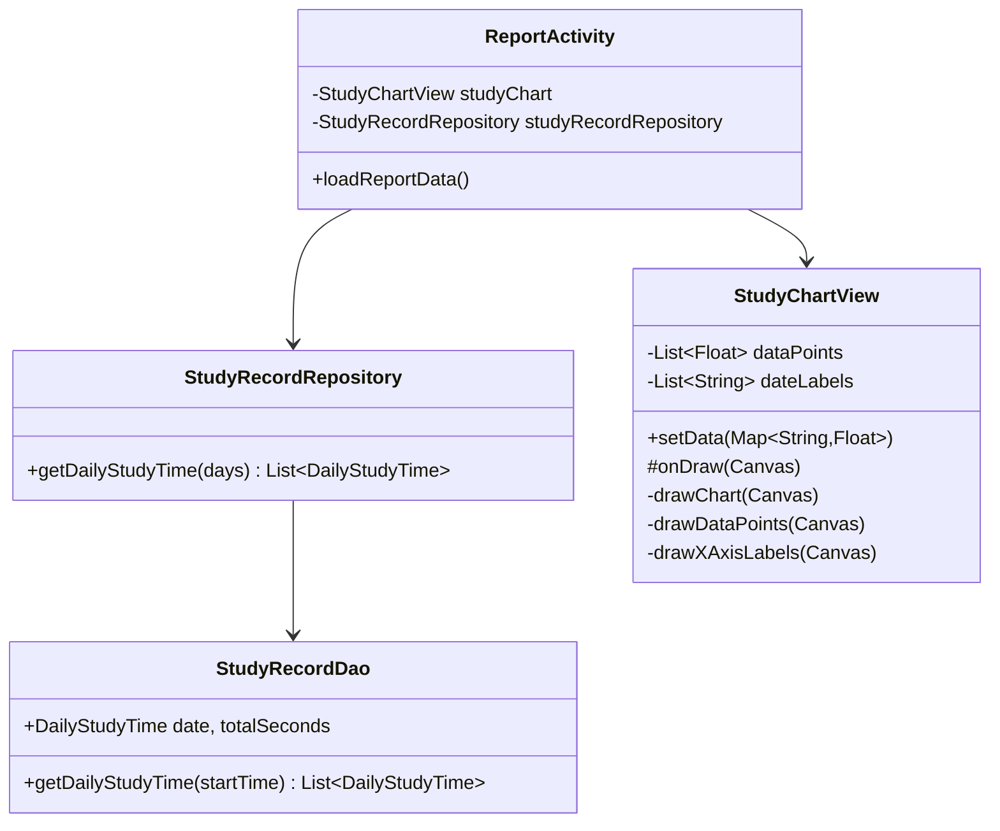
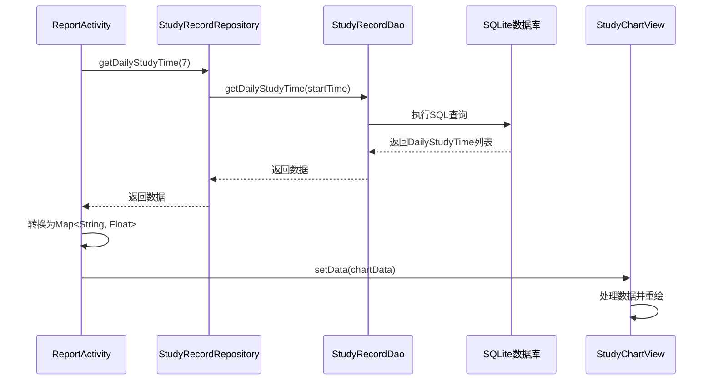

# 📊 学习记录图表功能实现总结

## 🎯 功能概述

成功实现学习报告中的学习记录图表功能，展示最近7天的学习时长，包含以下特性：
- ✅ 橙色曲线图，带半透明填充区域
- ✅ 数据点标记，当日数据点突出显示
- ✅ 日期标签（格式：MM/dd），今日标记为橙色
- ✅ 自动从数据库读取真实学习时长数据
- ✅ 时长格式化显示（秒、分钟、小时）
- ✅ 支持空数据处理

---

## 🏗️ 架构设计

### 数据流程图



### 组件关系



---

## 📁 文件改动清单

### 1. 新增文件

#### `app/src/main/java/com/example/mybighomework/view/StudyChartView.java`
**自定义学习时长图表视图**

**主要功能：**
- 绘制橙色曲线图和半透明填充区域
- 显示数据点标记（当日数据点更大）
- 显示日期标签（X轴）
- 显示当日学习时长标题
- 支持数据动态更新

**核心方法：**
```java
// 设置图表数据
public void setData(Map<String, Float> dailyData)

// 绘制图表
protected void onDraw(Canvas canvas)

// 绘制曲线和填充
private void drawChart(Canvas canvas)

// 绘制数据点
private void drawDataPoints(Canvas canvas)

// 绘制X轴标签
private void drawXAxisLabels(Canvas canvas)

// 格式化时间显示
private String formatTime(float seconds)
```

**颜色配置：**
- 曲线颜色：`#FF9A6C`（橙色）
- 填充颜色：`#33FF9A6C`（半透明橙色）
- 数据点颜色：`#FF9A6C`（橙色）
- 网格线颜色：`#E0E0E0`（浅灰色）
- 文本颜色：`#666666`（深灰色）

---

### 2. 修改的文件

#### `app/src/main/java/com/example/mybighomework/database/dao/StudyRecordDao.java`
**新增查询方法**

```java
// 获取每日学习时长（秒），返回Map<日期, 时长>
@Query("SELECT strftime('%Y-%m-%d', studyDate / 1000, 'unixepoch') as date, " +
       "SUM(responseTime) / 1000.0 as totalSeconds " +
       "FROM study_records " +
       "WHERE studyDate >= :startTime " +
       "GROUP BY date " +
       "ORDER BY date ASC")
List<DailyStudyTime> getDailyStudyTime(long startTime);

// 内部类用于每日学习时长
class DailyStudyTime {
    public String date;
    public double totalSeconds;
}
```

**SQL查询逻辑：**
1. 使用 `strftime` 函数将时间戳转换为日期格式（yyyy-MM-dd）
2. 使用 `SUM` 聚合函数计算每日总学习时长
3. 将毫秒转换为秒（除以1000.0）
4. 按日期分组并排序

---

#### `app/src/main/java/com/example/mybighomework/repository/StudyRecordRepository.java`
**新增封装方法**

```java
// 获取每日学习时长数据（最近N天）
public List<com.example.mybighomework.database.dao.StudyRecordDao.DailyStudyTime> getDailyStudyTime(int days) {
    long startTime = System.currentTimeMillis() - (days * 24L * 60 * 60 * 1000);
    return studyRecordDao.getDailyStudyTime(startTime);
}
```

**功能说明：**
- 计算N天前的时间戳
- 调用DAO层方法获取数据
- 返回每日学习时长列表

---

#### `app/src/main/res/layout/activity_report.xml`
**替换图表占位符为真实图表视图**

**修改前：**
```xml
<!-- 模拟图表区域 -->
<LinearLayout
    android:layout_width="match_parent"
    android:layout_height="200dp"
    android:background="@drawable/bg_chart_area"
    android:gravity="center"
    android:orientation="vertical">
    
    <ImageView
        android:layout_width="48dp"
        android:layout_height="48dp"
        android:src="@drawable/ic_chart"
        app:tint="@color/text_hint" />
    
    <TextView
        android:layout_width="wrap_content"
        android:layout_height="wrap_content"
        android:layout_marginTop="8dp"
        android:text="@string/chart_placeholder"
        android:textColor="@color/text_hint"
        android:textSize="14sp" />
</LinearLayout>
```

**修改后：**
```xml
<!-- 学习时长图表 -->
<com.example.mybighomework.view.StudyChartView
    android:id="@+id/study_chart"
    android:layout_width="match_parent"
    android:layout_height="220dp"
    android:background="@drawable/bg_chart_area" />
```

---

#### `app/src/main/java/com/example/mybighomework/ReportActivity.java`
**新增图表数据加载逻辑**

**新增导入：**
```java
import com.example.mybighomework.database.dao.StudyRecordDao;
import com.example.mybighomework.view.StudyChartView;
import java.util.HashMap;
import java.util.List;
import java.util.Map;
```

**新增成员变量：**
```java
// 学习时长图表
private StudyChartView studyChart;
```

**初始化图表：**
```java
// 初始化学习时长图表
studyChart = findViewById(R.id.study_chart);
```

**加载图表数据：**
```java
// 获取最近7天的学习时长数据
List<StudyRecordDao.DailyStudyTime> dailyStudyTimeList = studyRecordRepository.getDailyStudyTime(7);

// 转换为Map格式
Map<String, Float> chartData = new HashMap<>();
for (StudyRecordDao.DailyStudyTime dailyTime : dailyStudyTimeList) {
    chartData.put(dailyTime.date, (float) dailyTime.totalSeconds);
}

// 更新学习时长图表
studyChart.setData(chartData);
```

---

## 🎨 图表特性详解

### 1. 曲线绘制
- 使用 `Path` 绘制平滑曲线
- 曲线宽度：6dp
- 圆角端点和连接处
- 橙色主色调（`#FF9A6C`）

### 2. 填充区域
- 使用 `Path` 绘制曲线下方的填充区域
- 半透明橙色（`#33FF9A6C`）
- 自动闭合到底部

### 3. 数据点标记
- 外圈白色圆形（半径12dp）
- 内圈橙色圆形
  - 当日数据点：半径14dp
  - 其他数据点：半径8dp

### 4. 日期标签
- 格式：MM/dd
- 最后一天显示"今日"
- 今日标签使用橙色加粗
- 其他标签使用灰色

### 5. 时长格式化
根据学习时长自动选择合适的单位：
- 小于60秒：显示为 "Xs"
- 60秒-3600秒：显示为 "Xm" 或 "XmYs"
- 大于3600秒：显示为 "Xh" 或 "XhYm"

示例：
- `45s` → 45秒
- `2m30s` → 2分30秒
- `1h15m` → 1小时15分钟

---

## 📊 数据处理流程

### 数据获取流程



### 数据转换过程

1. **数据库查询结果**
   ```
   date: "2024-10-05", totalSeconds: 120.0
   date: "2024-10-06", totalSeconds: 0.0
   ```

2. **转换为Map格式**
   ```java
   Map<String, Float> chartData = new HashMap<>();
   chartData.put("2024-10-05", 120.0f);
   chartData.put("2024-10-06", 0.0f);
   ```

3. **图表内部处理**
   - 匹配最近7天的日期
   - 填充缺失日期的数据（默认为0）
   - 计算最大值用于Y轴比例
   - 转换日期格式为 MM/dd

---

## 🎯 核心算法

### Y坐标计算
```java
private float getYPosition(float value) {
    if (maxValue == 0) {
        return paddingTop + chartHeight;
    }
    
    float ratio = value / maxValue;
    return paddingTop + chartHeight - (chartHeight * ratio);
}
```

**逻辑说明：**
- 计算数据值占最大值的比例
- 根据比例计算Y坐标位置
- 坐标系从上到下，需要从底部减去对应高度

### X坐标计算
```java
float stepX = chartWidth / (dataPoints.size() - 1);
float x = paddingLeft + stepX * i;
```

**逻辑说明：**
- 将图表宽度均分为N-1段（N为数据点数量）
- 每个数据点的X坐标为左边距 + 步长 × 索引

---

## 🎉 功能亮点

### 1. 真实数据驱动
✅ 从数据库直接读取用户真实学习时长  
✅ 自动聚合每日数据  
✅ 支持空数据和缺失数据处理

### 2. 视觉效果优秀
✅ 平滑的橙色曲线  
✅ 半透明填充区域  
✅ 醒目的数据点标记  
✅ 今日数据突出显示

### 3. 用户体验友好
✅ 一目了然的学习趋势  
✅ 清晰的日期标签  
✅ 智能的时长格式化  
✅ 自动适配不同数据范围

### 4. 高性能优化
✅ 异步数据加载（ExecutorService）  
✅ 主线程更新UI  
✅ 高效的Canvas绘制  
✅ 缓存计算结果

---

## 📱 效果展示

### 图表样式
- **曲线颜色**：温暖的橙色 `#FF9A6C`
- **填充颜色**：半透明橙色 `#33FF9A6C`
- **数据点**：白色外圈 + 橙色内圈
- **今日标记**：橙色加粗文本 + 更大的数据点
- **背景**：淡灰色圆角卡片

### 数据展示
- 显示最近7天的学习时长
- X轴：日期标签（MM/dd格式）
- Y轴：自动缩放，适应数据范围
- 标题：显示"当日学习时长: Xm"

---

## 🔧 使用说明

### 在其他Activity中使用

1. **在布局文件中添加图表**
   ```xml
   <com.example.mybighomework.view.StudyChartView
       android:id="@+id/my_chart"
       android:layout_width="match_parent"
       android:layout_height="220dp" />
   ```

2. **在Activity中初始化并设置数据**
   ```java
   StudyChartView chartView = findViewById(R.id.my_chart);
   
   // 获取数据
   Map<String, Float> data = new HashMap<>();
   data.put("2024-10-05", 120.0f);  // 120秒
   data.put("2024-10-06", 0.0f);
   
   // 设置数据
   chartView.setData(data);
   ```

### 自定义图表样式

可以在 `StudyChartView.java` 的 `init()` 方法中修改颜色配置：
```java
private int lineColor = Color.parseColor("#FF9A6C");        // 曲线颜色
private int pointColor = Color.parseColor("#FF9A6C");       // 数据点颜色
private int fillColor = Color.parseColor("#33FF9A6C");      // 填充颜色
private int textColor = Color.parseColor("#666666");        // 文本颜色
private int gridColor = Color.parseColor("#E0E0E0");        // 网格线颜色
```

---

## 🚀 未来优化方向

### 功能扩展
- [ ] 支持多种图表类型（柱状图、饼图等）
- [ ] 支持数据点点击事件，显示详细信息
- [ ] 支持左右滑动查看更多历史数据
- [ ] 支持缩放和拖拽功能

### 性能优化
- [ ] 使用硬件加速绘制
- [ ] 实现数据缓存机制
- [ ] 优化大数据量的绘制性能

### 视觉优化
- [ ] 添加动画效果（曲线绘制动画）
- [ ] 支持主题切换（深色模式）
- [ ] 添加更多自定义选项（字体、线宽等）

---

## ✅ 测试建议

### 单元测试
1. 测试数据格式化方法
2. 测试Y坐标计算方法
3. 测试日期生成逻辑

### 集成测试
1. 测试数据库查询是否正确
2. 测试数据转换是否准确
3. 测试图表是否正常显示

### UI测试
1. 测试不同数据范围的显示效果
2. 测试空数据的处理
3. 测试不同屏幕尺寸的适配

---

## 📖 总结

成功实现了学习报告中的学习记录图表功能，具备以下特点：

✅ **完整性**：从数据库查询到UI展示的完整链路  
✅ **美观性**：符合设计稿的视觉效果  
✅ **实用性**：真实数据驱动，准确反映学习情况  
✅ **可扩展性**：代码结构清晰，易于扩展和维护

该图表为用户提供了直观的学习时长趋势展示，帮助用户更好地了解自己的学习习惯和进度，提升了应用的用户体验。

