# 📊 学习记录图表架构图

## 🏗️ 整体架构

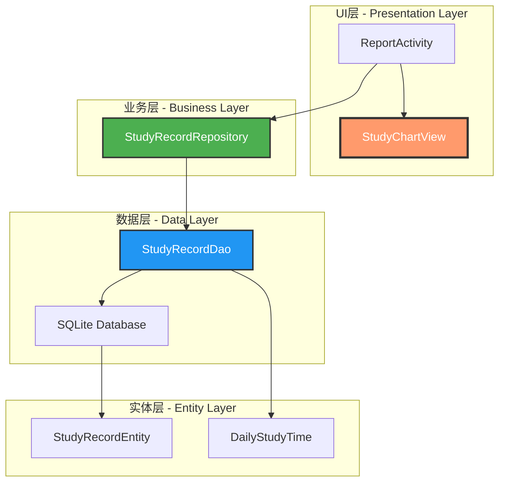

---

## 📊 数据流转过程

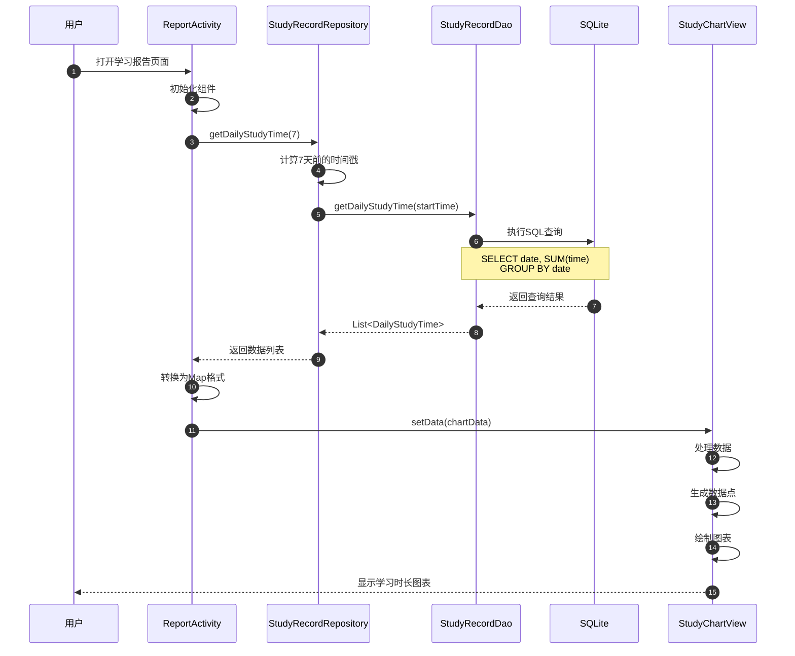

---

## 🎨 图表绘制流程

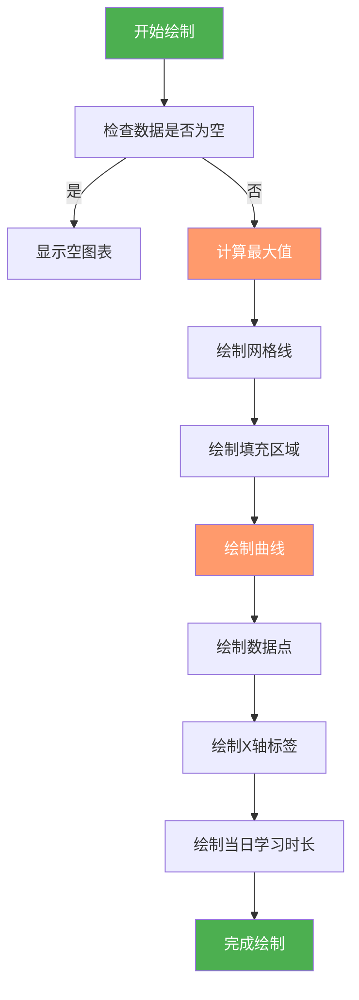

---

## 🗂️ 类关系图

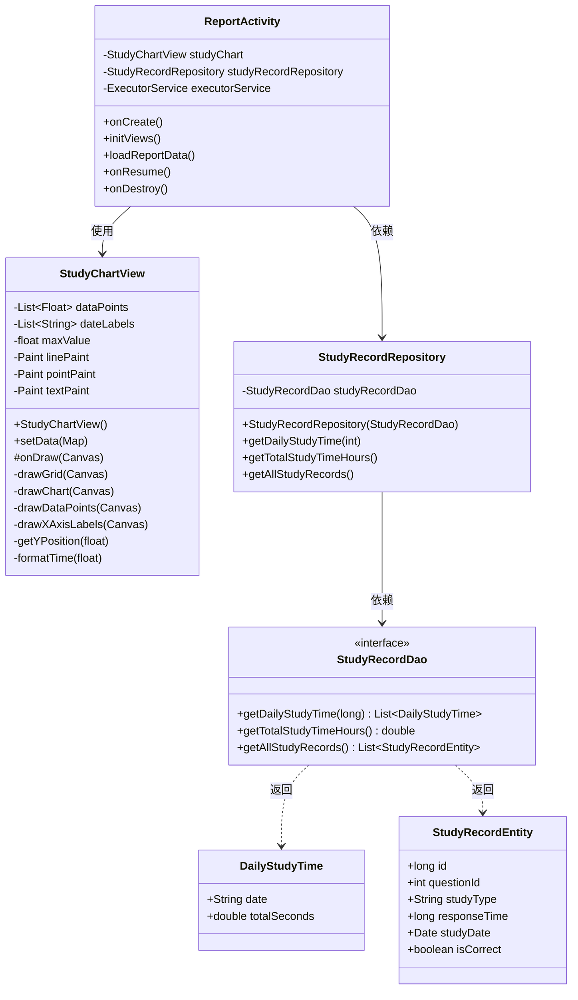

---

## 🔄 生命周期流程

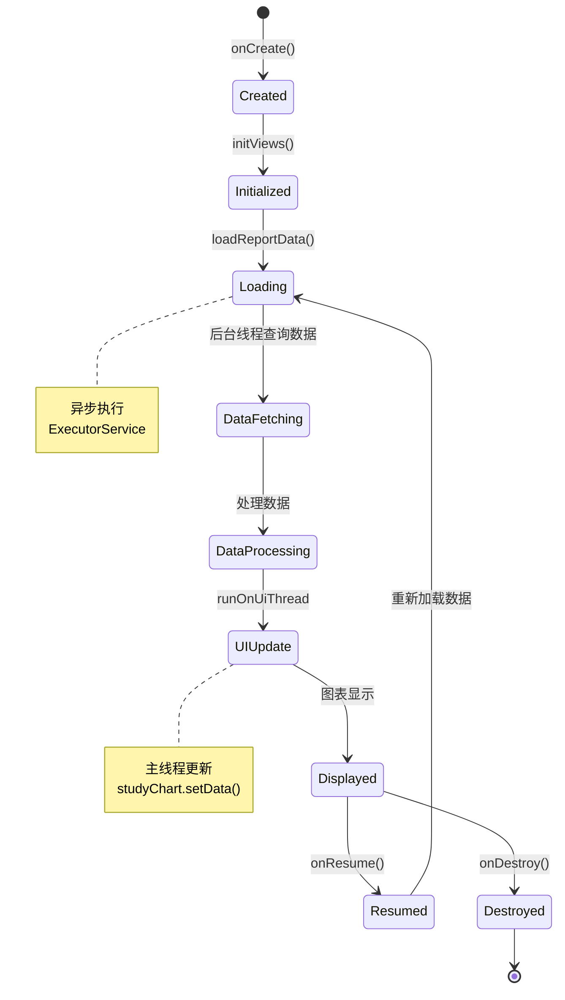

---

## 📊 数据模型关系

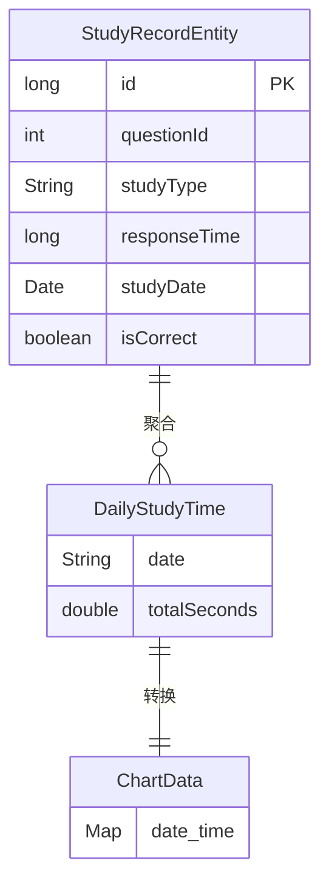

---

## 🎯 模块依赖关系

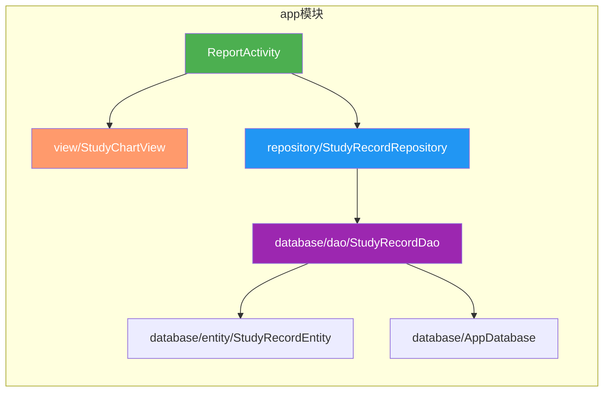

---

## 🎨 图表绘制详细流程

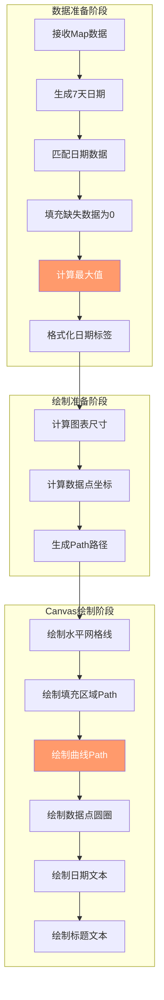

---

## 📊 坐标计算逻辑

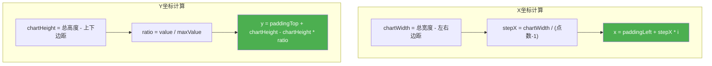

---

## 🎨 绘制层级关系

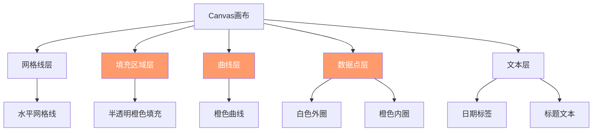

---

## 🔧 配置与扩展点

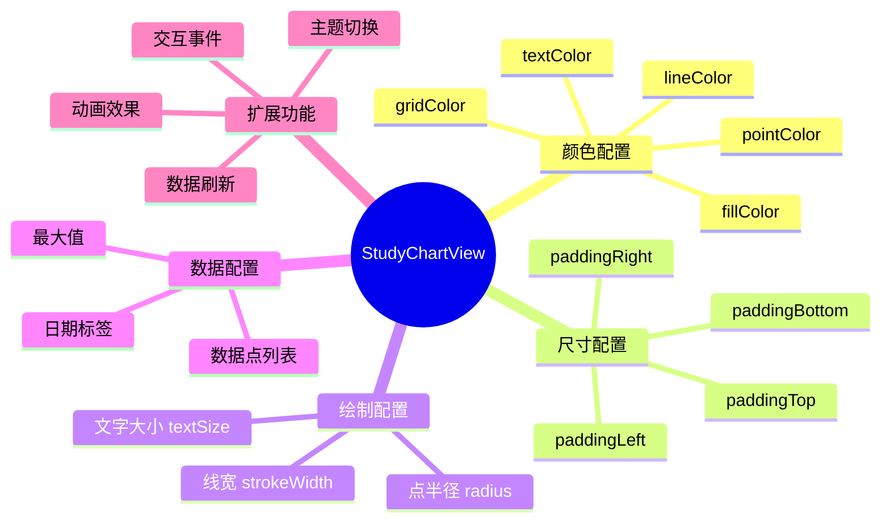

---

## 📱 UI组件树

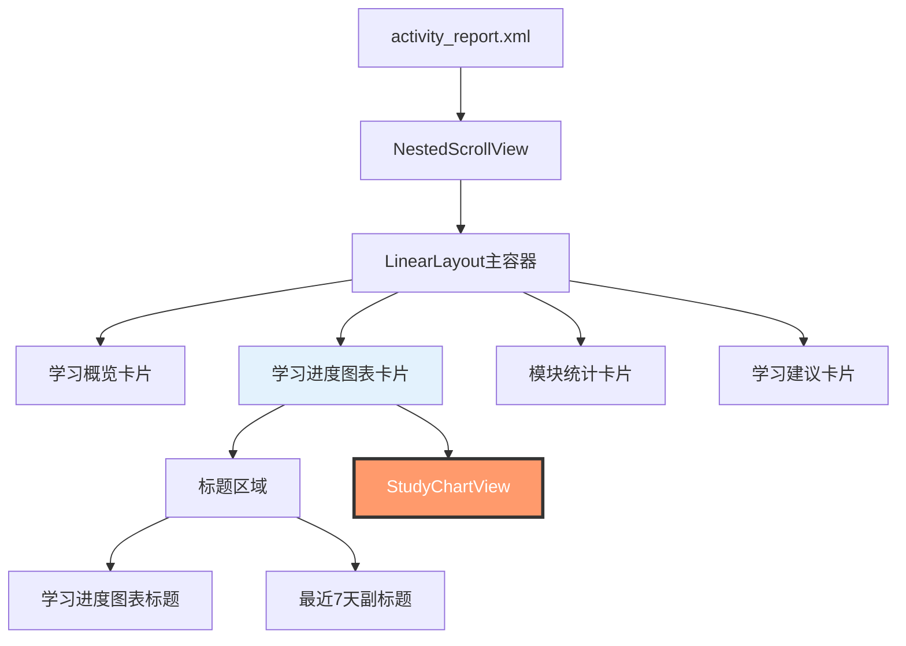

---

## 🚀 性能优化架构

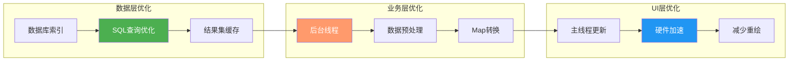

---

## 📊 总结

本架构图展示了学习记录图表功能的完整技术架构，包括：

- ✅ **分层架构**：清晰的UI层、业务层、数据层分离
- ✅ **数据流转**：从数据库到UI的完整数据链路
- ✅ **绘制流程**：详细的Canvas绘制步骤
- ✅ **类关系**：各组件之间的依赖关系
- ✅ **性能优化**：多层次的性能优化策略

这种架构设计确保了代码的可维护性、可扩展性和高性能。

