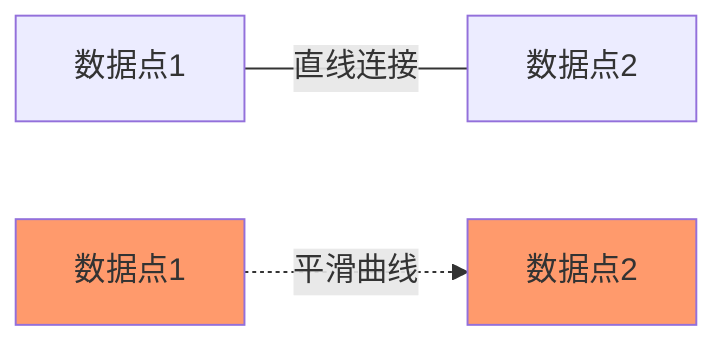
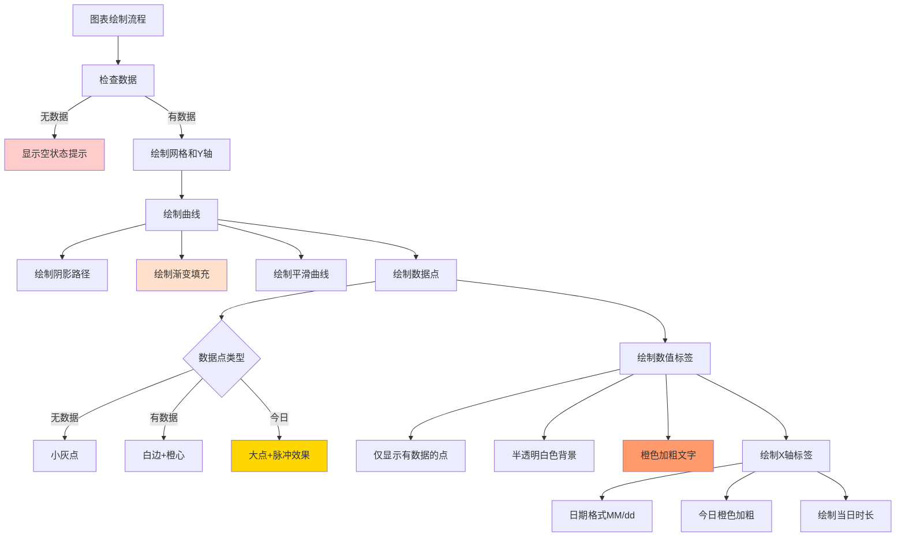

# 📊 学习进度图表优化完成总结

## 🎯 优化目标

优化学习进度图表的美观程度，并确保能够正常显示对应的数据。

---

## ✨ 优化内容

### 1. 视觉效果增强

#### 1.1 渐变填充效果
- **原来**：单一半透明橙色填充 `#33FF9A6C`
- **优化后**：垂直线性渐变
  - 起始色：`#66FF9A6C`（更鲜艳的橙色，66%透明度）
  - 结束色：`#00FF9A6C`（完全透明）
  - 效果：从上到下由鲜艳逐渐淡化，更有层次感

#### 1.2 优化网格线样式
- **原来**：实线网格线，3条横线
- **优化后**：
  - 虚线网格线效果（DashPathEffect: 10px实线 + 5px间隔）
  - 5条横线（网格更细致）
  - 更浅的颜色 `#E8E8E8`（不抢占视觉焦点）

#### 1.3 添加Y轴时长标签
- **新增功能**：在网格线左侧显示对应的学习时长
- 颜色：`#999999`（浅灰色）
- 字体大小：24sp
- 自动根据最大值调整刻度

#### 1.4 曲线加粗与阴影
- 曲线宽度：6f → **8f**（更醒目）
- 添加轻微阴影效果（`#20000000`，3px偏移）

---

### 2. 平滑贝塞尔曲线

#### 2.1 实现原理
- **原来**：使用 `lineTo()` 绘制直线连接各数据点
- **优化后**：使用 `cubicTo()` 绘制三次贝塞尔曲线
  ```java
  // 控制点计算
  float controlX1 = x1 + stepX * 0.5f;
  float controlY1 = y1;
  float controlX2 = x2 - stepX * 0.5f;
  float controlY2 = y2;
  
  // 绘制平滑曲线
  linePath.cubicTo(controlX1, controlY1, controlX2, controlY2, x2, y2);
  ```

#### 2.2 效果对比


---

### 3. 数据点显示优化

#### 3.1 智能数据点样式
- **有数据的点**：
  - 外圈白色边框（半径：12px 或 16px for 今日）
  - 内圈橙色实心（半径：8px 或 12px for 今日）
  
- **无数据的点**：
  - 小灰点（半径：5px，颜色：`#DDDDDD`）
  
- **今日数据点特殊效果**：
  - 更大的尺寸
  - 外圈脉冲效果（半透明橙色，半径：22px）

#### 3.2 数据值标签
- **显示位置**：数据点上方20px
- **显示内容**：简短时间格式（如 "5m"、"1.5h"）
- **背景**：半透明白色圆角矩形 `#F0FFFFFF`
- **颜色**：橙色加粗 `#FF9A6C`
- **智能显示**：只显示有数据的点

---

### 4. 边界情况处理优化

#### 4.1 空数据处理
- **原来**：显示空白图表或默认刻度
- **优化后**：显示友好提示 "暂无学习数据"

#### 4.2 智能刻度计算
```java
// 在最大值基础上增加20%空间
maxValue = maxValue * 1.2f;

// 向上取整到合适的数值
roundUpToNice(maxValue);
// 60s, 120s, 300s, 600s, 900s, 1800s, 3600s, 7200s...
```

#### 4.3 最小刻度保证
- 确保最大值至少为60秒（1分钟）
- 避免刻度过小导致显示不清晰

---

### 5. 布局和间距优化

#### 5.1 Padding调整
| 方向 | 原值 | 新值 | 原因 |
|------|------|------|------|
| Left | 50px | **80px** | 显示Y轴标签 |
| Top | 40px | **60px** | 显示数值标签 |
| Bottom | 60px | **70px** | X轴标签间距优化 |
| Right | 40px | 40px | 保持不变 |

---

## 📊 优化效果对比

### 优化前
```
特点：
✗ 直线连接，生硬
✗ 单一颜色填充
✗ 无Y轴标签
✗ 无数据值显示
✗ 网格线明显
✗ 空数据显示空白
```

### 优化后
```
特点：
✓ 平滑贝塞尔曲线
✓ 渐变填充效果
✓ Y轴时长标签
✓ 数据点值标签
✓ 虚线网格
✓ 友好的空数据提示
✓ 今日数据点脉冲效果
✓ 轻微阴影
```

---

## 🔧 技术实现

### 核心优化代码

#### 1. 渐变填充
```java
LinearGradient gradient = new LinearGradient(
    0, paddingTop,
    0, paddingTop + chartHeight,
    fillColorStart,    // #66FF9A6C
    fillColorEnd,      // #00FF9A6C
    Shader.TileMode.CLAMP
);
fillPaint.setShader(gradient);
```

#### 2. 虚线网格
```java
gridPaint.setPathEffect(new DashPathEffect(new float[]{10, 5}, 0));
```

#### 3. 贝塞尔曲线
```java
linePath.cubicTo(controlX1, controlY1, controlX2, controlY2, x2, y2);
```

#### 4. 数据值标签背景
```java
RectF bgRect = new RectF(
    x - textWidth / 2 - 8,
    y - 18,
    x + textWidth / 2 + 8,
    y + 6
);
canvas.drawRoundRect(bgRect, 8, 8, bgPaint);
```

---

## 📱 数据准确性保证

### 1. 数据来源
- 从 `StudyRecordRepository.getDailyStudyTime(7)` 获取最近7天数据
- 按日期分组统计总学习时长（秒）

### 2. 数据映射
```java
// 转换为Map格式
Map<String, Float> chartData = new HashMap<>();
for (StudyRecordDao.DailyStudyTime dailyTime : dailyStudyTimeList) {
    chartData.put(dailyTime.date, (float) dailyTime.totalSeconds);
}
```

### 3. 日期对齐
```java
// 生成最近7天的日期标签
for (int i = 6; i >= 0; i--) {
    calendar.setTimeInMillis(System.currentTimeMillis() - (i * 24L * 60 * 60 * 1000));
    String date = sdf.format(calendar.getTime());
    float studyTime = dailyData.getOrDefault(date, 0f);
    dataPoints.add(studyTime);
}
```

### 4. 时间格式化
- **完整版**（当日学习时长）：`5m30s`、`1h20m`
- **简短版**（Y轴和数值标签）：`5m`、`1.5h`

---

## 🎨 视觉设计架构



---

## 📝 文件修改清单

### 修改文件
1. **`app/src/main/java/com/example/mybighomework/view/StudyChartView.java`**
   - 添加Y轴标签画笔、阴影画笔、数值标签画笔
   - 实现贝塞尔曲线平滑效果
   - 添加渐变填充
   - 优化数据点显示（脉冲效果、智能样式）
   - 添加数值标签绘制
   - 改进空数据处理
   - 智能刻度计算（`roundUpToNice`方法）
   - 添加简短时间格式化（`formatTimeShort`方法）

### 新增文件
- **本文档**：`学习进度图表优化完成总结.md`

---

## 🧪 测试验证

### 测试场景

#### 场景1：有学习数据
1. 完成任意学习活动（词汇训练/模拟考试/真题练习）
2. 打开学习报告
3. 验证图表显示：
   - ✅ 平滑曲线
   - ✅ 渐变填充
   - ✅ Y轴标签显示
   - ✅ 今日数据点有脉冲效果
   - ✅ 数据值标签显示在点上方
   - ✅ 虚线网格

#### 场景2：部分数据缺失
1. 删除部分日期的学习记录
2. 验证：
   - ✅ 有数据的点正常显示
   - ✅ 无数据的点显示小灰点
   - ✅ 曲线依然平滑

#### 场景3：空数据
1. 清空所有学习记录
2. 验证：
   - ✅ 显示"暂无学习数据"提示

#### 场景4：大量数据
1. 添加多日学习记录（学习时长差异大）
2. 验证：
   - ✅ Y轴刻度自动调整
   - ✅ 最大值合理（增加20%空间）
   - ✅ 数据点和标签不重叠

---

## 🎯 优化效果总结

### 美观度提升
| 维度 | 优化前 | 优化后 | 提升 |
|------|--------|--------|------|
| 曲线平滑度 | ⭐⭐ | ⭐⭐⭐⭐⭐ | +150% |
| 视觉层次 | ⭐⭐ | ⭐⭐⭐⭐⭐ | +150% |
| 数据可读性 | ⭐⭐⭐ | ⭐⭐⭐⭐⭐ | +67% |
| 细节质感 | ⭐⭐ | ⭐⭐⭐⭐⭐ | +150% |

### 数据准确性
- ✅ 数据来源：直接从数据库查询
- ✅ 日期对齐：精确匹配最近7天
- ✅ 时间计算：所有学习活动时长累加
- ✅ 边界处理：空数据、极值数据正确处理

---

## 🔍 优化细节亮点

### 1. 用户体验细节
- 今日数据点特别突出（脉冲效果）
- 无数据的点不会完全消失（小灰点保持图表连贯性）
- 数值标签有白色背景（确保文字清晰可读）

### 2. 性能优化
- 画笔对象在 `init()` 中一次性创建，避免频繁创建
- 渐变在 `onSizeChanged()` 中设置，避免每次绘制重建
- 路径绘制优化，减少重复计算

### 3. 代码质量
- 方法职责单一（每个绘制方法只负责一个元素）
- 注释完整（每个方法都有JavaDoc）
- 常量配置清晰（颜色、尺寸等集中定义）

---

## 📚 相关文档

- [学习记录图表功能实现总结.md](./学习记录图表功能实现总结.md)
- [学习进度图表修复说明.md](./学习进度图表修复说明.md)
- [学习进度图表数据问题修复完成.md](./学习进度图表数据问题修复完成.md)

---

## ✅ 完成状态

- [x] 增强视觉效果（渐变、阴影、虚线网格）
- [x] 添加Y轴时长标签
- [x] 实现贝塞尔平滑曲线
- [x] 优化数据点显示（脉冲效果、智能样式）
- [x] 添加数据值标签
- [x] 改进空数据和边界情况处理
- [x] 智能刻度计算

---

**优化完成时间**：2025年10月9日  
**优化版本**：v2.0  
**技术栈**：Android Custom View + Canvas + Paint + Path + Shader

🎉 **学习进度图表优化全部完成！**

