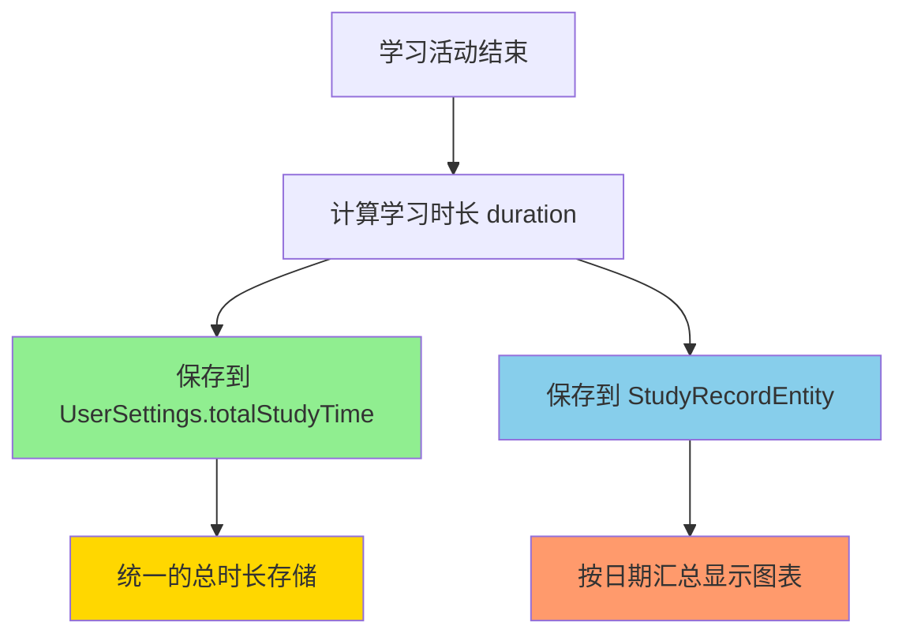
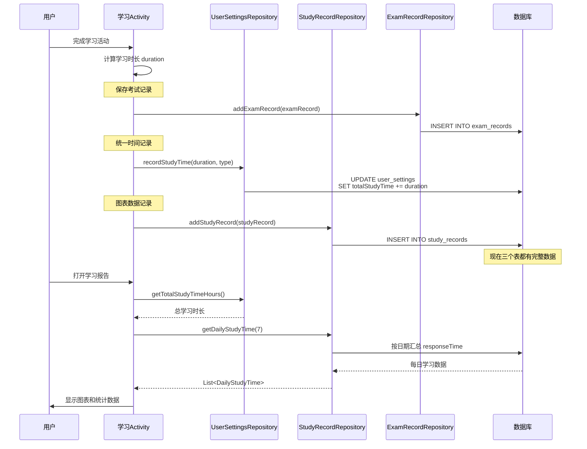

# 📊 学习进度图表修复说明

## 🐛 问题描述

学习进度图表中的学习时长没有更新，模拟考试和真题练习的学习时间未显示在图表中。

## 🔍 问题原因

学习进度图表 (`StudyChartView`) 的数据来源是 `StudyRecordEntity` 表，通过按天汇总 `responseTime` 字段来显示每日学习时长。

**问题在于：**
- ✅ `VocabularyActivity` 保存了 `StudyRecord`，所以词汇训练时长正常显示
- ❌ `MockExamActivity` 只保存了 `ExamRecord`，没有保存 `StudyRecord`
- ❌ `RealExamActivity` 只保存了 `ExamRecord`，没有保存 `StudyRecord`

**结果：** 模拟考试和真题练习的学习时长未体现在图表中

---

## ✅ 修复方案

### 双重记录机制



### 数据流程

1. **统一时长存储** (`UserSettings.totalStudyTime`)
   - 用于快速查询总学习时长
   - 显示在学习报告的总时长统计中
   
2. **详细学习记录** (`StudyRecordEntity.responseTime`)
   - 记录每次学习活动的详细信息
   - 用于图表按天统计显示
   - 用于学习数据分析

---

## 🛠️ 修改内容

### 1. MockExamActivity

**添加导入：**
```java
import com.example.mybighomework.database.entity.StudyRecordEntity;
import com.example.mybighomework.repository.StudyRecordRepository;
```

**添加成员变量：**
```java
private StudyRecordRepository studyRecordRepository;
```

**初始化 Repository：**
```java
private void initDatabase() {
    AppDatabase database = AppDatabase.getInstance(this);
    wrongQuestionRepository = new WrongQuestionRepository(database.wrongQuestionDao());
    examRecordRepository = new ExamRecordRepository(database.examDao());
    userSettingsRepository = new UserSettingsRepository(this);
    studyRecordRepository = new StudyRecordRepository(database.studyRecordDao()); // 新增
    
    examStartTime = System.currentTimeMillis();
}
```

**保存考试记录时同时创建学习记录：**
```java
// 保存到数据库
examRecordRepository.addExamRecord(examRecord);

// 【统一时间记录】记录模拟考试时长到用户设置
userSettingsRepository.recordStudyTime(duration, "mock_exam");

// 【图表数据】同时创建学习记录用于图表显示
StudyRecordEntity studyRecord = new StudyRecordEntity();
studyRecord.setStudyType("mock_exam");
studyRecord.setQuestionId(0);
studyRecord.setVocabularyId(0);
studyRecord.setCorrect(correctAnswers > wrongAnswers);
studyRecord.setResponseTime(duration);
studyRecord.setScore(score);
studyRecord.setNotes("模拟考试 - 得分:" + score);
studyRecordRepository.addStudyRecord(studyRecord);
```

---

### 2. RealExamActivity

**添加导入：**
```java
import com.example.mybighomework.database.entity.StudyRecordEntity;
import com.example.mybighomework.repository.StudyRecordRepository;
```

**添加成员变量：**
```java
private StudyRecordRepository studyRecordRepository;
```

**初始化 Repository：**
```java
// 初始化Repository
AppDatabase database = AppDatabase.getInstance(this);
examRecordRepository = new ExamRecordRepository(database.examDao());
userSettingsRepository = new UserSettingsRepository(this);
studyRecordRepository = new StudyRecordRepository(database.studyRecordDao()); // 新增

examStartTime = System.currentTimeMillis();
```

**保存考试记录时同时创建学习记录：**
```java
// 保存到数据库
examRecordRepository.addExamRecord(examRecord);

// 【统一时间记录】记录真题练习时长到用户设置
userSettingsRepository.recordStudyTime(duration, "real_exam");

// 【图表数据】同时创建学习记录用于图表显示
StudyRecordEntity studyRecord = new StudyRecordEntity();
studyRecord.setStudyType("real_exam");
studyRecord.setQuestionId(0);
studyRecord.setVocabularyId(0);
studyRecord.setCorrect(answeredCount > (allQuestions.size() - answeredCount));
studyRecord.setResponseTime(duration);
studyRecord.setScore(score);
studyRecord.setNotes("真题练习 - 得分:" + score);
studyRecordRepository.addStudyRecord(studyRecord);
```

---

## 📊 数据存储对比

| 存储位置 | 字段 | 用途 | 数据粒度 |
|---------|------|------|---------|
| `UserSettings.totalStudyTime` | long（毫秒） | 快速查询总时长 | 累计总和 |
| `StudyRecord.responseTime` | long（毫秒） | 图表展示、详细分析 | 每次学习记录 |
| `ExamRecord.duration` | long（毫秒） | 考试记录存档 | 每次考试记录 |

---

## 🔄 完整数据流



---

## ✅ 验证方法

### 测试步骤

1. **完成模拟考试**
   ```
   1. 进入模拟考试
   2. 完成考试或等待时间到
   3. 查看学习报告
   4. 验证：图表显示今日学习时长
   5. 验证：总学习时长增加
   ```

2. **完成真题练习**
   ```
   1. 进入真题练习
   2. 完成练习并保存
   3. 查看学习报告
   4. 验证：图表显示今日学习时长
   5. 验证：总学习时长增加
   ```

3. **完成词汇训练**
   ```
   1. 进入词汇训练
   2. 完成一组训练
   3. 查看学习报告
   4. 验证：图表显示今日学习时长
   5. 验证：总学习时长增加
   ```

### 预期结果

- ✅ 图表显示所有三种学习活动的时长
- ✅ 每日学习时长正确累加
- ✅ 总学习时长与图表数据一致
- ✅ 最近7天的学习趋势清晰可见

---

## 📝 数据库查询验证

### 查询总学习时长
```sql
SELECT totalStudyTime FROM user_settings WHERE id = 1;
```

### 查询每日学习记录
```sql
SELECT 
    strftime('%Y-%m-%d', studyDate / 1000, 'unixepoch') as date,
    SUM(responseTime) / 1000.0 as totalSeconds,
    COUNT(*) as recordCount
FROM study_records
WHERE studyDate >= (strftime('%s', 'now', '-7 days') * 1000)
GROUP BY date
ORDER BY date ASC;
```

### 查询所有学习记录
```sql
SELECT 
    studyType,
    responseTime,
    datetime(studyDate / 1000, 'unixepoch') as studyDate,
    notes
FROM study_records
ORDER BY studyDate DESC
LIMIT 10;
```

---

## 🎉 修复效果

### 修复前
- ❌ 图表只显示词汇训练时长
- ❌ 模拟考试和真题练习不计入图表
- ❌ 学习时长统计不完整

### 修复后
- ✅ 图表显示所有学习活动
- ✅ 词汇训练、模拟考试、真题练习全部计入
- ✅ 学习时长统计完整准确
- ✅ 学习趋势一目了然

---

## 🔮 未来优化建议

### 1. 分类统计
在图表中用不同颜色区分不同类型的学习活动：
- 🟠 橙色：词汇训练
- 🔵 蓝色：模拟考试  
- 🟢 绿色：真题练习

### 2. 详细分析
点击图表数据点可查看当天的详细学习记录：
```java
public void onChartPointClick(String date) {
    List<StudyRecordEntity> records = studyRecordRepository
        .getStudyRecordsByDate(date);
    showDetailDialog(records);
}
```

### 3. 学习效率分析
结合学习时长和正确率分析学习效率：
```java
double efficiency = correctRate / (studyTimeHours > 0 ? studyTimeHours : 1);
```

---

## 📋 总结

通过本次修复，实现了：

1. ✅ **双重记录机制**：统一时长存储 + 详细学习记录
2. ✅ **完整数据收集**：所有学习活动都正确记录
3. ✅ **图表正常显示**：学习进度图表显示完整数据
4. ✅ **数据一致性**：总时长与详细记录保持一致

现在用户可以在学习报告中看到完整准确的学习时长统计和趋势图表了！🎊

