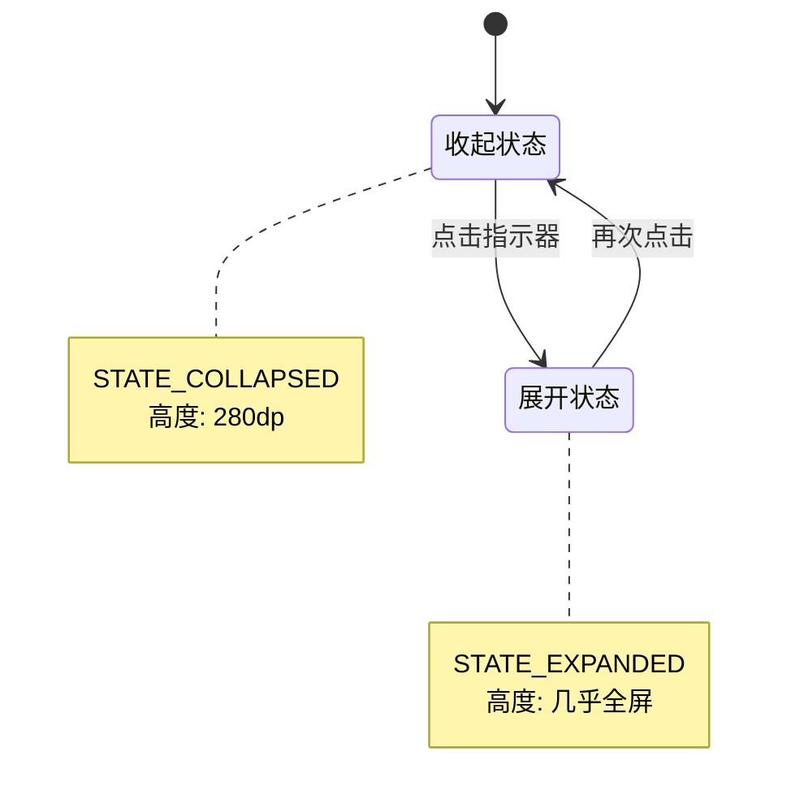

# 拖动指示器点击切换功能说明

## 🎯 功能概述

将真题练习界面底部的拖动指示器改为**点击切换**模式，用户只需轻点指示器即可在展开/收起状态之间快速切换。

## ✨ 交互方式

### 原来的交互
- ❌ 需要拖动指示器上下滑动
- ❌ 需要滑动超过50px才能触发
- ❌ 操作相对复杂

### 现在的交互
- ✅ **轻点一下**即可切换
- ✅ 点击有涟漪反馈效果
- ✅ 操作简单直观
- ✅ 点击区域更大（80dp + 40dp padding）

## 🎨 视觉设计

### 中间突出的指示器

```
      ┌─────────┐
      │ 中间突出 │
══════╪═════════╪══════
      └─────────┘
  细条   主体部分   细条
```

**尺寸参数**:
- 指示器总宽度: 80dp
- 指示器总高度: 8dp
- 中间部分: 48dp × 6dp (深灰色 #BBBBBB)
- 两侧部分: 16dp × 3dp (浅灰色 #DDDDDD)
- 点击区域: 120dp × 32dp (包含 padding)

**视觉反馈**:
- 点击时显示涟漪效果 (Material Design Ripple)
- 使用系统默认的 `selectableItemBackgroundBorderless`

## 🔧 实现原理

### 切换逻辑



### 代码实现

#### 1. Java 代码 (RealExamActivity.java)

```java
private void setupDragIndicator() {
    dragIndicator.setOnClickListener(v -> {
        // 获取当前状态
        int currentState = bottomSheetBehavior.getState();
        
        // 切换状态
        if (currentState == BottomSheetBehavior.STATE_COLLAPSED) {
            // 收起 → 展开
            bottomSheetBehavior.setState(BottomSheetBehavior.STATE_EXPANDED);
        } else if (currentState == BottomSheetBehavior.STATE_EXPANDED) {
            // 展开 → 收起
            bottomSheetBehavior.setState(BottomSheetBehavior.STATE_COLLAPSED);
        } else {
            // 其他状态默认展开
            bottomSheetBehavior.setState(BottomSheetBehavior.STATE_EXPANDED);
        }
    });
}
```

#### 2. 布局文件 (activity_real_exam.xml)

```xml
<!-- 拖动指示器容器 - 提供更大的点击区域和涟漪效果 -->
<FrameLayout
    android:id="@+id/drag_indicator_container"
    android:layout_width="wrap_content"
    android:layout_height="wrap_content"
    android:layout_gravity="center_horizontal"
    android:paddingHorizontal="20dp"
    android:paddingVertical="12dp"
    android:clickable="true"
    android:focusable="true"
    android:background="?attr/selectableItemBackgroundBorderless">
    
    <!-- 拖动指示器 - 中间突出视觉效果 -->
    <View
        android:id="@+id/drag_indicator"
        android:layout_width="80dp"
        android:layout_height="8dp"
        android:background="@drawable/bg_drag_indicator" />
        
</FrameLayout>
```

#### 3. 指示器样式 (bg_drag_indicator.xml)

```xml
<layer-list xmlns:android="http://schemas.android.com/apk/res/android">
    <!-- 中间突出的主体部分 -->
    <item
        android:gravity="center"
        android:width="48dp"
        android:height="6dp">
        <shape android:shape="rectangle">
            <solid android:color="#BBBBBB" />
            <corners android:radius="3dp" />
        </shape>
    </item>
    
    <!-- 左侧较细的部分 -->
    <item
        android:gravity="left|center_vertical"
        android:width="16dp"
        android:height="3dp">
        <shape android:shape="rectangle">
            <solid android:color="#DDDDDD" />
            <corners android:radius="1.5dp" />
        </shape>
    </item>
    
    <!-- 右侧较细的部分 -->
    <item
        android:gravity="right|center_vertical"
        android:width="16dp"
        android:height="3dp">
        <shape android:shape="rectangle">
            <solid android:color="#DDDDDD" />
            <corners android:radius="1.5dp" />
        </shape>
    </item>
</layer-list>
```

## 📱 使用说明

### 操作步骤

1. **点击指示器**
   - 轻触底部窗口顶部中间的突出指示器
   - 窗口会平滑地展开到全屏

2. **再次点击**
   - 再次轻触指示器
   - 窗口会平滑地收起到初始高度

3. **视觉反馈**
   - 点击时会看到涟漪扩散效果
   - 窗口会流畅地动画切换

## 🎯 优势分析

| 特性 | 拖动方式 | 点击方式 |
|------|---------|----------|
| **操作步骤** | 按住 + 滑动 (2步) | 轻触 (1步) |
| **学习成本** | 需要发现可拖动 | 一目了然 |
| **速度** | 较慢 (需拖动距离) | 快速 (即点即切) |
| **精确性** | 需要控制位置 | 无需控制 |
| **视觉反馈** | 跟随拖动 | 涟漪效果 |
| **单手操作** | 较困难 | 容易 |

## 🔄 与其他功能的兼容性

| 功能 | 兼容性 | 说明 |
|------|--------|------|
| 水平滑动切换题目 | ✅ 完全兼容 | 点击只在指示器区域生效 |
| 点击选项 | ✅ 完全兼容 | 不影响选项区域 |
| 题号切换 | ✅ 完全兼容 | 不影响题号区域 |
| 题目切换 | ✅ 完全兼容 | 保持窗口状态 |

## 🧪 测试检查清单

### 功能测试
- [ ] 点击指示器能够展开窗口
- [ ] 再次点击能够收起窗口
- [ ] 切换动画流畅无卡顿
- [ ] 点击区域足够大，容易操作

### 视觉测试
- [ ] 指示器中间部分突出明显
- [ ] 点击时有涟漪反馈效果
- [ ] 颜色层次清晰可见
- [ ] 与整体界面风格协调

### 交互测试
- [ ] 单手操作是否便捷
- [ ] 误触概率是否很低
- [ ] 与其他手势无冲突
- [ ] 快速连续点击是否正常

### 边界测试
- [ ] 在动画过程中点击
- [ ] 在其他状态下点击
- [ ] 切换题目后点击
- [ ] 多次快速点击

## 📐 技术细节

### BottomSheet 状态

```java
STATE_COLLAPSED   // 收起状态 (280dp)
STATE_EXPANDED    // 展开状态 (几乎全屏)
STATE_DRAGGING    // 拖动中 (不会出现,因为禁用了拖动)
STATE_SETTLING    // 动画中
STATE_HIDDEN      // 隐藏 (不使用)
```

### 点击区域计算

```
┌─────────────────────────────────┐
│     Padding Top: 12dp           │
│  ┌─────────────────────────┐   │
│  │  Padding Left: 20dp     │   │
│  │  ┌────────────────┐     │   │
│  │  │  Indicator     │     │   │
│  │  │  80dp × 8dp    │     │   │
│  │  └────────────────┘     │   │
│  │  Padding Right: 20dp    │   │
│  └─────────────────────────┘   │
│     Padding Bottom: 12dp        │
└─────────────────────────────────┘
总点击区域: 120dp × 32dp
```

## 💡 后续优化建议

1. **声音反馈**
   - 点击时播放轻微的"咔哒"声
   - 需要添加音效资源

2. **振动反馈**
   - 点击时提供轻微振动
   - 增强触觉反馈

3. **状态图标**
   - 收起时显示 "^" 图标
   - 展开时显示 "v" 图标
   - 提示用户可以切换

4. **动画优化**
   - 调整动画速度曲线
   - 使用更自然的缓动函数

5. **长按功能**
   - 长按指示器可恢复拖动模式
   - 提供更多操作选项

## 📝 修改记录

| 日期 | 修改内容 | 修改文件 |
|------|---------|---------|
| 2025-10-07 | 将拖动逻辑改为点击切换 | RealExamActivity.java |
| 2025-10-07 | 增大指示器尺寸和点击区域 | activity_real_exam.xml |
| 2025-10-07 | 添加涟漪点击反馈效果 | activity_real_exam.xml |
| 2025-10-07 | 优化指示器视觉设计(中间突出) | bg_drag_indicator.xml |

---

**实现日期**: 2025年10月7日  
**功能状态**: ✅ 已完成  
**相关文件**:
- `app/src/main/java/com/example/mybighomework/RealExamActivity.java`
- `app/src/main/res/layout/activity_real_exam.xml`
- `app/src/main/res/drawable/bg_drag_indicator.xml`

