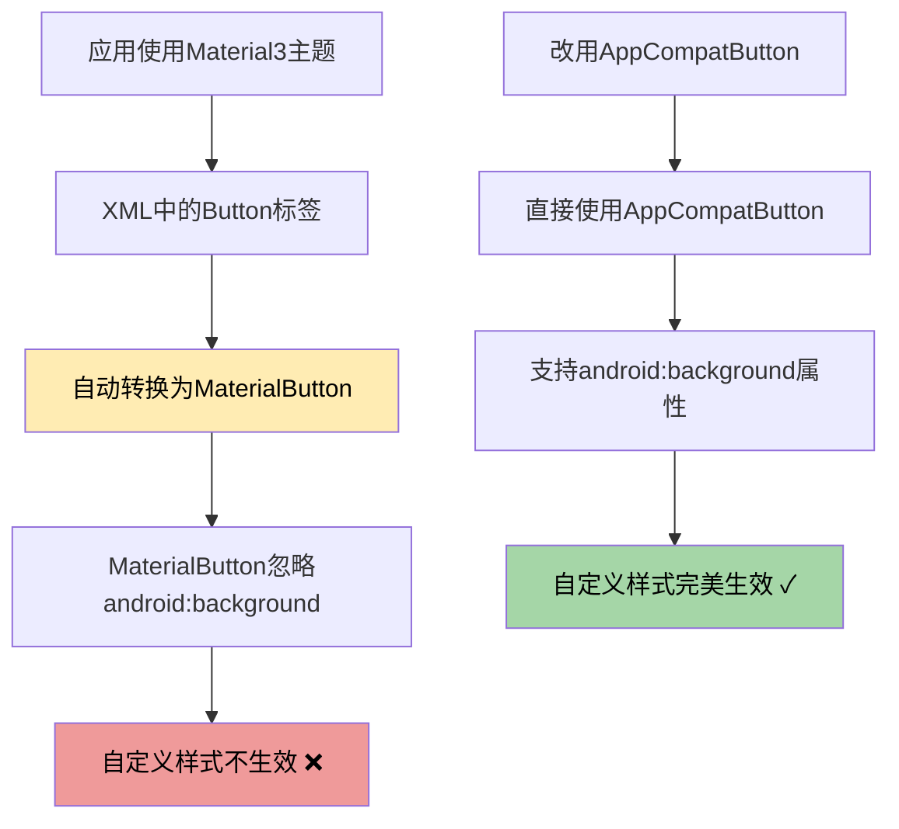

# 🎨 按钮样式统一修改总结

## ✅ 已完成的修改

### 修改的文件清单

#### 1. 布局文件（3个）

| 文件 | 位置 | 修改内容 | 状态 |
|-----|------|---------|------|
| `activity_vocabulary.xml` | 词汇训练 | 4个选项按钮 Button → AppCompatButton | ✓ 完成 |
| `activity_exam_practice.xml` | 真题练习 | 4个选项按钮 Button → AppCompatButton | ✓ 完成 |
| `activity_mock_exam.xml` | 模拟考试 | 4个选项按钮 Button → AppCompatButton | ✓ 完成 |

#### 2. Drawable资源文件（3个）

| 文件 | 用途 | 配色 | 状态 |
|-----|------|------|------|
| `btn_default_background.xml` | 默认/未选中状态 | 浅蓝色背景 + 深蓝色边框 | ✓ 完成 |
| `btn_correct_background.xml` | 正确答案 | 浅绿色背景 + 深绿色边框 | ✓ 完成 |
| `btn_error_background.xml` | 错误答案 | 粉红色背景 + 深红色边框 | ✓ 完成 |

## 🔍 问题原因分析

### 为什么需要使用 AppCompatButton？



**核心问题：** 
- 项目使用 `Theme.Material3.DayNight.NoActionBar` 主题
- Material3 会将 `<Button>` 自动转换为 `MaterialButton`
- `MaterialButton` 会忽略 `android:background` 属性
- 导致自定义背景样式无法生效

**解决方案：**
- 使用 `<androidx.appcompat.widget.AppCompatButton>`
- AppCompatButton 完全支持 `android:background` 属性
- Java 代码无需修改，仍然用 `Button` 类型接收

## 🎨 视觉效果对比

### 修改前（Material3 默认样式）
```
┌─────────────────────────────┐
│ A. 选项A  │ Material3默认样式│
├─────────────────────────────┤
│ B. 选项B  │ 圆角较小         │
├─────────────────────────────┤
│ C. 选项C  │ 没有明显边框     │
├─────────────────────────────┤
│ D. 选项D  │ 背景样式单一     │
└─────────────────────────────┘
```

### 修改后（自定义样式）
```
┌─────────────────────────────┐
│ A. 选项A  │ 浅蓝色 + 蓝边框 │ ✨
├─────────────────────────────┤
│ B. 选项B  │ 浅蓝色 + 蓝边框 │ ✨
├─────────────────────────────┤
│ C. 选项C  │ 浅蓝色 + 蓝边框 │ ✨
├─────────────────────────────┤
│ D. 选项D  │ 浅蓝色 + 蓝边框 │ ✨
└─────────────────────────────┘

选择答案后（假设C是正确答案，选了B）：
┌─────────────────────────────┐
│ A. 选项A  │ 保持蓝色        │
├─────────────────────────────┤
│ B. 选项B  │ 粉红色 + 红边框 │ ❌
├─────────────────────────────┤
│ C. 选项C  │ 浅绿色 + 绿边框 │ ✓
├─────────────────────────────┤
│ D. 选项D  │ 保持蓝色        │
└─────────────────────────────┘
```

## 📋 修改详情

### 1. 词汇训练（activity_vocabulary.xml）

**修改位置：** 第149-195行

**修改内容：**
```xml
<!-- 修改前 -->
<Button
    android:id="@+id/btn_option_a"
    android:background="@drawable/btn_default_background"
    ... />

<!-- 修改后 -->
<androidx.appcompat.widget.AppCompatButton
    android:id="@+id/btn_option_a"
    android:background="@drawable/btn_default_background"
    ... />
```

### 2. 真题练习（activity_exam_practice.xml）

**修改位置：** 第187-236行

**修改内容：** 同词汇训练，4个选项按钮全部改为 `AppCompatButton`

### 3. 模拟考试（activity_mock_exam.xml）

**修改位置：** 第164-218行

**修改内容：** 同词汇训练，4个选项按钮全部改为 `AppCompatButton`

## 🎯 按钮样式规范

### 颜色配置

| 状态 | 背景色 | 边框色 | 边框宽度 | 圆角 |
|-----|--------|--------|---------|------|
| **默认状态** | #BBDEFB（浅蓝） | #1976D2（深蓝） | 2dp | 12dp |
| **正确答案** | #A5D6A7（浅绿） | #388E3C（深绿） | 2dp | 12dp |
| **错误答案** | #EF9A9A（粉红） | #D32F2F（深红） | 2dp | 12dp |

### Drawable配置示例

```xml
<!-- btn_default_background.xml -->
<shape xmlns:android="http://schemas.android.com/apk/res/android"
    android:shape="rectangle">
    <corners android:radius="12dp" />
    <solid android:color="#BBDEFB" />
    <stroke
        android:width="2dp"
        android:color="#1976D2" />
</shape>
```

## 🚀 接下来的操作

### 第1步：同步项目
```
点击工具栏的 🐘 图标（Sync Project with Gradle Files）
或按快捷键 Ctrl + Shift + O
```

### 第2步：清理并重新构建
```
Build → Clean Project
Build → Rebuild Project
```

### 第3步：运行应用
```
按 Shift + F10 或点击运行按钮 ▶️
```

## 🧪 测试验证

### 测试清单

#### 词汇训练
- [ ] 进入词汇训练页面
- [ ] 检查4个选项按钮是否都是蓝色
- [ ] 选择一个答案
- [ ] 验证正确答案变绿色
- [ ] 验证错误选择变红色（如果选错）
- [ ] 点击下一题，检查按钮重置为蓝色

#### 真题练习
- [ ] 进入真题练习页面
- [ ] 检查4个选项按钮是否都是蓝色
- [ ] 选择一个答案
- [ ] 验证正确答案变绿色
- [ ] 验证错误选择变红色（如果选错）

#### 模拟考试
- [ ] 进入模拟考试页面
- [ ] 检查4个选项按钮是否都是蓝色
- [ ] 选择一个答案
- [ ] 验证正确答案变绿色
- [ ] 验证错误选择变红色（如果选错）

## 📊 影响范围

### 受影响的Activity

| Activity | 功能 | 修改内容 | 影响程度 |
|---------|------|---------|---------|
| `VocabularyActivity` | 词汇训练 | 4个选项按钮 | 已修改 ✓ |
| `ExamPracticeActivity` | 真题练习 | 4个选项按钮 | 已修改 ✓ |
| `MockExamActivity` | 模拟考试 | 4个选项按钮 | 已修改 ✓ |

### 未受影响的部分

- ✓ Java代码逻辑无需修改
- ✓ 数据库操作不受影响
- ✓ 其他UI组件正常工作
- ✓ 导航功能不受影响

## 💡 技术要点

### 1. AppCompatButton vs Button

```java
// Java代码中仍然使用Button类型
private Button btnOptionA, btnOptionB, btnOptionC, btnOptionD;

// AppCompatButton是Button的子类，完全兼容
btnOptionA = findViewById(R.id.btn_option_a); // ✓ 正常工作
```

### 2. 为什么不修改Java代码？

- `AppCompatButton` 继承自 `Button`
- 向上转型是安全的
- 不需要修改任何Java代码
- 保持代码简洁

### 3. 样式设置时机

```java
// 初始化时设置默认样式
private void resetOptionButtons() {
    button.setBackgroundResource(R.drawable.btn_default_background);
}

// 回答后高亮显示
private void highlightAnswers(int selectedOption, int correctOption) {
    if (i == correctOption) {
        buttons[i].setBackgroundResource(R.drawable.btn_correct_background);
    } else if (i == selectedOption) {
        buttons[i].setBackgroundResource(R.drawable.btn_error_background);
    }
}
```

## ✨ 优势总结

### 用户体验提升

1. **视觉一致性** ✨
   - 三个页面样式完全统一
   - 降低用户学习成本

2. **状态区分清晰** 🎯
   - 蓝色：默认状态
   - 绿色：正确答案
   - 红色：错误答案

3. **更好的可读性** 👀
   - 2dp边框更加醒目
   - 颜色对比度提高

### 技术优势

1. **兼容性好** ✓
   - AppCompatButton向后兼容
   - 支持旧版本Android

2. **易于维护** 🔧
   - 统一的drawable资源
   - 样式修改只需改一处

3. **性能影响小** ⚡
   - 只是改变了Button的类型
   - 不影响运行效率

## 📝 注意事项

1. **构建缓存**
   - 修改后必须Clean + Rebuild
   - 否则可能看不到效果

2. **主题兼容**
   - 如果未来改用其他主题
   - AppCompatButton仍然有效

3. **样式复用**
   - 三个drawable可在其他地方复用
   - 保持应用统一的视觉风格

## 🎉 完成状态

- ✅ 词汇训练按钮修改完成
- ✅ 真题练习按钮修改完成
- ✅ 模拟考试按钮修改完成
- ✅ Drawable资源文件优化完成
- ✅ 构建缓存已清理

## 📞 后续支持

如果遇到问题，请检查：

1. 是否执行了 Clean + Rebuild？
2. 是否清理了缓存？
3. 是否重新运行了应用？

详细故障排除请参考：
- `Material3按钮问题-根本原因分析.md`
- `快速修复指南.md`

---

**修改完成时间：** 2025-10-02  
**修改文件数量：** 6个（3个布局 + 3个drawable）  
**预计效果：** 三个页面按钮样式完全统一，视觉效果显著提升！ 🎨✨


