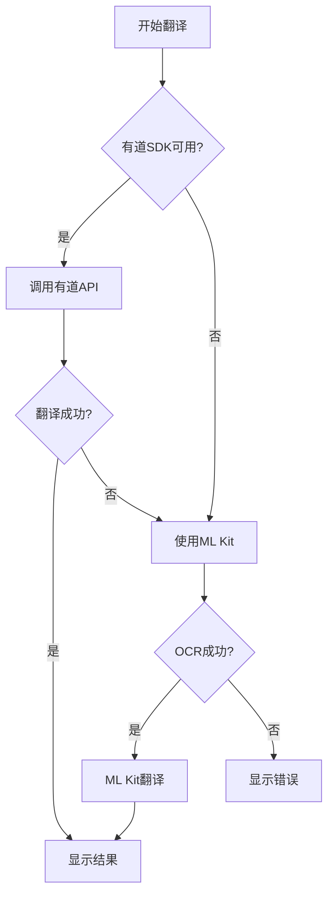

# 有道图片翻译SDK集成指南

## 📋 概述

本文档提供详细的有道智云图片翻译SDK集成步骤，用于提升应用的翻译质量。

**优势对比**：
- ✅ **翻译质量更高**：有道神经网络翻译引擎，翻译更加准确自然
- ✅ **支持图片直接翻译**：无需先OCR再翻译，减少错误累积
- ✅ **服务端渲染**：直接返回翻译后的图片，用户体验更好
- ✅ **支持更多语言**：中英日韩等多国语言互译
- ⚠️ **需要网络连接**：在线API调用，需要稳定网络
- ⚠️ **需要账号认证**：需要在有道智云平台注册获取appKey

## 🔧 集成前准备

### 1. 注册有道智云账号

1. 访问 [有道智云平台](https://ai.youdao.com/)
2. 注册账号并登录
3. 创建应用，获取 `appKey`（应用ID）
4. 记录您的appKey，后续配置需要使用

### 2. 下载SDK文件

从有道智云平台下载以下SDK文件：

**必需文件**：
- `YoudaoBase_v20230803.jar` - 基础库（必选）
- `online_auth.jar` - 认证库（必选）
- `zhiyun_offline_common.jar` - 通用库（必选）
- `YoudaoTranslateOnline_v2.0.1.jar` - 在线翻译SDK（必选）

**so库文件**（支持多架构）：
- `armeabi-v7a/` - ARM 32位
- `arm64-v8a/` - ARM 64位
- `x86/` - x86 32位
- `x86_64/` - x86 64位

## 📦 集成步骤

### 步骤1：导入SDK文件

1. 在项目的 `app/libs/` 目录下创建以下结构：

```
app/libs/
├── YoudaoBase_v20230803.jar
├── online_auth.jar
├── zhiyun_offline_common.jar
├── YoudaoTranslateOnline_v2.0.1.jar
├── armeabi-v7a/
│   └── [so文件]
├── arm64-v8a/
│   └── [so文件]
├── x86/
│   └── [so文件]
└── x86_64/
    └── [so文件]
```

2. 将下载的jar文件复制到 `app/libs/` 目录
3. 将so文件按架构复制到对应的子目录

### 步骤2：修改build.gradle配置

在 `app/build.gradle.kts` 文件中添加：

```kotlin
android {
    // ... 其他配置

    // 配置so库路径
    sourceSets {
        getByName("main") {
            jniLibs.srcDirs("libs")
        }
    }
}

dependencies {
    // ... 其他依赖

    // 有道翻译SDK
    implementation(files("libs/YoudaoBase_v20230803.jar"))
    implementation(files("libs/online_auth.jar"))
    implementation(files("libs/zhiyun_offline_common.jar"))
    implementation(files("libs/YoudaoTranslateOnline_v2.0.1.jar"))
}
```

### 步骤3：配置AndroidManifest权限

在 `AndroidManifest.xml` 中添加必要权限（如已存在则跳过）：

```xml
<manifest>
    <!-- 网络权限 -->
    <uses-permission android:name="android.permission.INTERNET" />
    
    <!-- WiFi状态 -->
    <uses-permission android:name="android.permission.ACCESS_WIFI_STATE" />
    
    <!-- 网络状态 -->
    <uses-permission android:name="android.permission.ACCESS_NETWORK_STATE" />
    
    <!-- 存储权限（Android 6.0+需要动态申请） -->
    <uses-permission android:name="android.permission.WRITE_EXTERNAL_STORAGE" />
    <uses-permission android:name="android.permission.READ_EXTERNAL_STORAGE" />
</manifest>
```

### 步骤4：配置代码混淆

在 `app/proguard-rules.pro` 文件末尾添加：

```proguard
# 有道翻译SDK混淆规则
-ignorewarnings
-libraryjars libs/YoudaoBase_v20230803.jar
-libraryjars libs/YoudaoTranslateOnline_v2.0.1.jar

-keep class com.youdao.sdk.ydtranslate.** { *; }
-keep class com.youdao.sdk.ydonlinetranslate.** { *; }
-keep class com.youdao.sdk.app.** { *; }
```

### 步骤5：配置appKey

打开 `app/src/main/java/com/example/mybighomework/YoudaoTranslateConfig.java`

将 `YOUR_YOUDAO_APP_KEY` 替换为您的实际appKey：

```java
public static final String APP_KEY = "your_actual_app_key_here";
```

### 步骤6：初始化SDK

在 `MyApplication.java` 的 `onCreate()` 方法中添加初始化代码：

```java
@Override
public void onCreate() {
    super.onCreate();
    
    // ... 其他初始化代码
    
    // 初始化有道翻译SDK
    if (YoudaoTranslateConfig.isConfigValid()) {
        try {
            YouDaoApplication.init(this, YoudaoTranslateConfig.APP_KEY);
            Log.d("MyApplication", "有道翻译SDK初始化成功");
        } catch (Exception e) {
            Log.e("MyApplication", "有道翻译SDK初始化失败", e);
        }
    } else {
        Log.w("MyApplication", "有道appKey未配置，将使用ML Kit离线翻译");
    }
}
```

### 步骤7：取消YoudaoTranslateHelper中的注释

打开 `YoudaoTranslateHelper.java`，找到标记为 `TODO: 集成有道SDK后，取消注释以下代码` 的部分，取消注释并根据实际API调整代码。

## 🎨 使用示例

### 基本使用

```java
// 在CameraTranslationActivity中调用
Bitmap imageBitmap = ...; // 要翻译的图片

YoudaoTranslateHelper.translateImage(
    imageBitmap,
    "zh-CHS",  // 源语言：中文
    "en",      // 目标语言：英文
    new YoudaoTranslateHelper.TranslateCallback() {
        @Override
        public void onSuccess(String resultImage, String originalText, String translatedText) {
            // 翻译成功
            // resultImage: 服务端渲染的结果图片（Base64）
            Bitmap result = YoudaoTranslateHelper.base64ToBitmap(resultImage);
            // 显示结果图片
        }
        
        @Override
        public void onError(int errorCode, String errorMessage) {
            // 翻译失败，回退到ML Kit
            Log.e(TAG, "有道翻译失败: " + errorMessage);
            // 使用ML Kit OCR + 翻译
        }
    }
);
```

## 🔄 混合翻译模式

应用已经实现了智能的混合翻译模式：

1. **优先使用有道翻译**：如果SDK已集成且网络可用
2. **自动回退到ML Kit**：如果有道翻译失败或不可用
3. **文本预处理优化**：无论使用哪种翻译，都会先优化文本质量



## ✅ 集成验证

### 检查清单

- [ ] SDK jar文件已复制到 `app/libs/` 目录
- [ ] so文件已按架构复制到对应目录
- [ ] `build.gradle.kts` 已添加依赖配置
- [ ] `AndroidManifest.xml` 已添加必要权限
- [ ] `proguard-rules.pro` 已添加混淆规则
- [ ] `YoudaoTranslateConfig.java` 中已配置真实的appKey
- [ ] `MyApplication.java` 已添加SDK初始化代码
- [ ] `YoudaoTranslateHelper.java` 中的TODO代码已取消注释

### 测试步骤

1. **编译测试**：运行 `./gradlew build`，确保编译通过
2. **运行测试**：在真机或模拟器上运行应用
3. **功能测试**：
   - 打开拍照翻译功能
   - 拍摄包含文字的图片
   - 观察翻译结果质量
   - 检查日志输出，确认使用的是有道翻译

### 日志验证

在Logcat中搜索以下标签：

```
YoudaoTranslate  # 有道翻译相关日志
MyApplication    # SDK初始化日志
CameraTranslation # 翻译流程日志
```

成功集成后应该看到：
```
D/MyApplication: 有道翻译SDK初始化成功
D/YoudaoTranslate: 调用有道图片翻译API
D/YoudaoTranslate: 翻译成功
```

## 🐛 常见问题

### 问题1：编译错误 - 找不到YouDaoApplication类

**原因**：SDK未正确导入

**解决方案**：
1. 检查jar文件是否在 `app/libs/` 目录
2. 确认 `build.gradle.kts` 中的dependencies配置
3. 执行 `File -> Invalidate Caches / Restart`

### 问题2：运行时崩溃 - UnsatisfiedLinkError

**原因**：so文件未正确导入

**解决方案**：
1. 检查so文件是否在对应架构的目录下
2. 确认 `build.gradle.kts` 中的 `jniLibs.srcDirs` 配置
3. Clean 并 Rebuild 项目

### 问题3：翻译失败 - 认证错误

**原因**：appKey配置错误

**解决方案**：
1. 检查 `YoudaoTranslateConfig.APP_KEY` 是否正确
2. 确认appKey在有道智云平台是否有效
3. 检查网络连接是否正常

### 问题4：翻译质量不理想

**优化建议**：
1. 确保拍照清晰，光线充足
2. 文字尽量水平放置
3. 避免复杂背景干扰
4. 可以尝试调整相机参数

## 📊 性能对比

| 指标 | ML Kit离线翻译 | 有道在线翻译 |
|------|--------------|-------------|
| 翻译质量 | ⭐⭐⭐ | ⭐⭐⭐⭐⭐ |
| 响应速度 | 快（本地） | 中等（网络） |
| 网络要求 | 不需要 | 必需 |
| 语言支持 | 有限 | 丰富 |
| 成本 | 免费 | 按量收费 |

## 🎯 优化效果

集成有道翻译SDK后，您将获得：

1. **翻译质量提升**：
   - 专业术语翻译更准确
   - 长句子翻译更流畅
   - 上下文理解更到位

2. **用户体验改善**：
   - 服务端渲染，结果更美观
   - 一次请求完成OCR+翻译
   - 支持更多语言对

3. **智能降级**：
   - 无网络时自动使用离线翻译
   - API失败时无缝切换
   - 用户无感知切换

## 📚 参考资源

- [有道智云官网](https://ai.youdao.com/)
- [有道智云控制台](https://ai.youdao.com/console/)
- [API文档](https://ai.youdao.com/DOCSIRMA/html/index.html)
- [SDK下载](https://ai.youdao.com/sdk.s)

## 💡 最佳实践

1. **混合使用**：优先有道，降级ML Kit
2. **缓存结果**：避免重复翻译相同内容
3. **用户反馈**：提供翻译质量反馈机制
4. **错误处理**：完善的错误提示和重试机制
5. **性能监控**：记录翻译成功率和响应时间

---

**注意事项**：
- 请妥善保管您的appKey，不要泄露给他人
- 注意监控API调用量，避免超出配额
- 定期更新SDK到最新版本
- 遵守有道智云服务条款

如有问题，请参考有道智云官方文档或联系技术支持。

