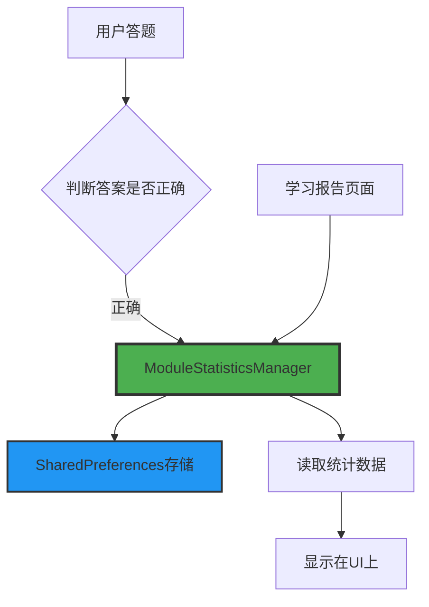
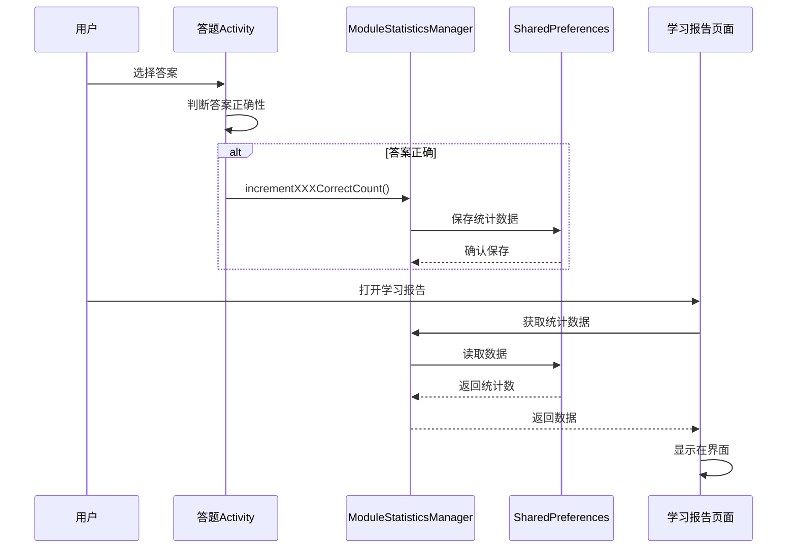

# 模块学习统计功能实现报告

## 📋 需求概述

实现学习报告中各模块学习统计功能，统计方式为：**每当用户在对应模块答对一道题，就会在对应模块的统计数+1**

## 🎯 实现目标

- ✅ 词汇训练模块：统计答对题数
- ✅ 真题练习模块：统计答对题数
- ✅ 模拟考试模块：统计答对题数
- ✅ 错题本模块：统计答对题数（预留接口）
- ✅ 学习报告页面：实时展示各模块统计数据

## 🏗️ 架构设计

### 核心组件



### 数据流程



## 📁 文件改动清单

### 1. 新增文件

#### `app/src/main/java/com/example/mybighomework/utils/ModuleStatisticsManager.java`
**核心统计管理类**

**主要功能：**
- 使用单例模式管理模块统计数据
- 基于 `SharedPreferences` 持久化存储
- 提供增加统计数、获取统计数、重置统计数等接口

**关键方法：**
```java
// 单例获取
public static synchronized ModuleStatisticsManager getInstance(Context context)

// 增加统计数
public void incrementVocabularyCorrectCount()      // 词汇训练
public void incrementExamPracticeCorrectCount()    // 真题练习
public void incrementMockExamCorrectCount()        // 模拟考试
public void incrementErrorQuestionCorrectCount()   // 错题本

// 获取统计数
public int getVocabularyCorrectCount()
public int getExamPracticeCorrectCount()
public int getMockExamCorrectCount()
public int getErrorQuestionCorrectCount()
public int getTotalCorrectCount()  // 总答对题数

// 重置统计数
public void resetAllStatistics()
public void resetModuleStatistics(String module)
```

### 2. 修改文件

#### `VocabularyActivity.java` - 词汇训练页面

**改动位置：** `selectOption()` 方法

**改动内容：**
```java
if (isCorrect) {
    score += 10;
    correctAnswers++;
    // ... 其他逻辑 ...
    
    // ✨ 新增：答对题目时增加词汇训练模块统计数
    ModuleStatisticsManager.getInstance(this).incrementVocabularyCorrectCount();
}
```

**触发时机：** 用户选择答案并判定为正确答案时

---

#### `ExamPracticeActivity.java` - 真题练习页面

**改动位置：** `selectOption()` 方法

**改动内容：**
```java
if (isCorrect) {
    score += 5;
    // ... 其他逻辑 ...
    
    // ✨ 新增：答对题目时增加真题练习模块统计数
    ModuleStatisticsManager.getInstance(this).incrementExamPracticeCorrectCount();
}
```

**触发时机：** 用户答对真题时

---

#### `MockExamActivity.java` - 模拟考试页面

**改动位置：** `selectOption()` 方法

**改动内容：**
```java
if (isCorrect) {
    score += 3;
    // ... 其他逻辑 ...
    
    // ✨ 新增：答对题目时增加模拟考试模块统计数
    ModuleStatisticsManager.getInstance(this).incrementMockExamCorrectCount();
}
```

**触发时机：** 用户在模拟考试中答对题目时

---

#### `ReportActivity.java` - 学习报告页面

**改动位置：** `loadReportData()` 方法

**改动内容：**
```java
private void loadReportData() {
    executorService.execute(() -> {
        try {
            // ... 其他数据获取 ...
            
            // ✨ 新增：使用ModuleStatisticsManager获取各模块答对题数
            ModuleStatisticsManager statisticsManager = ModuleStatisticsManager.getInstance(this);
            int vocabularyCorrectCount = statisticsManager.getVocabularyCorrectCount();
            int examPracticeCorrectCount = statisticsManager.getExamPracticeCorrectCount();
            int mockExamCorrectCount = statisticsManager.getMockExamCorrectCount();
            int errorQuestionCorrectCount = statisticsManager.getErrorQuestionCorrectCount();
            
            // 在主线程更新UI
            runOnUiThread(() -> {
                // ✨ 更新各模块答对题数统计
                tvVocabularyCount.setText(String.valueOf(vocabularyCorrectCount));
                tvExamCount.setText(String.valueOf(examPracticeCorrectCount));
                tvMockExamCount.setText(String.valueOf(mockExamCorrectCount));
                tvErrorCount.setText(String.valueOf(errorQuestionCorrectCount));
            });
        } catch (Exception e) {
            // 错误处理...
        }
    });
}
```

**改动说明：**
- 原来的统计方式：从数据库读取记录总数
- 新的统计方式：从 `ModuleStatisticsManager` 读取答对题数
- 保持异步加载，确保UI流畅

## 💾 数据存储方案

### SharedPreferences 存储结构

```
SharedPreferences 文件名: "module_statistics"

存储的键值对：
- vocabulary_correct_count: int      // 词汇训练答对题数
- exam_practice_correct_count: int   // 真题练习答对题数
- mock_exam_correct_count: int       // 模拟考试答对题数
- error_question_correct_count: int  // 错题本答对题数
```

### 优势
- ✅ 轻量级存储，读写性能优秀
- ✅ 无需数据库迁移
- ✅ 数据持久化，应用重启后保留
- ✅ 单例模式确保数据一致性

## 🔧 技术实现细节

### 1. 单例模式

```java
private static ModuleStatisticsManager instance;

public static synchronized ModuleStatisticsManager getInstance(Context context) {
    if (instance == null) {
        instance = new ModuleStatisticsManager(context);
    }
    return instance;
}
```

**优点：**
- 全局唯一实例，避免多次创建
- 线程安全（synchronized）
- 统一管理统计数据

### 2. 数据持久化

```java
private void incrementCount(String key) {
    int currentCount = preferences.getInt(key, 0);
    preferences.edit().putInt(key, currentCount + 1).apply();
}
```

**特点：**
- 使用 `apply()` 异步写入，不阻塞主线程
- 自动递增，无需手动管理计数
- 默认值为 0，首次使用自动初始化

### 3. 异步加载统计数据

```java
executorService.execute(() -> {
    // 后台线程读取数据
    ModuleStatisticsManager statisticsManager = ModuleStatisticsManager.getInstance(this);
    int count = statisticsManager.getVocabularyCorrectCount();
    
    // 主线程更新UI
    runOnUiThread(() -> {
        tvVocabularyCount.setText(String.valueOf(count));
    });
});
```

**优势：**
- 不阻塞主线程
- 提升用户体验
- 保持应用响应性

## 📊 功能展示

### 统计逻辑流程

1. **用户答题** → 选择答案
2. **系统判定** → 检查答案是否正确
3. **答对题目** → 调用 `ModuleStatisticsManager.incrementXXX()`
4. **数据保存** → 统计数 +1，写入 SharedPreferences
5. **报告展示** → 学习报告页面读取并展示最新统计数据

### 数据更新机制

- **实时更新：** 每答对一题立即保存
- **持久化存储：** 应用重启数据不丢失
- **独立统计：** 各模块数据独立管理
- **按需读取：** 打开学习报告页面时加载最新数据

## 🎨 用户界面展示

学习报告页面展示各模块统计：

```
📊 各模块学习统计
━━━━━━━━━━━━━━━━━━━━━━━━━━━━━

📚 词汇训练        [125] 题
   答对题数

📝 真题练习        [89] 题
   答对题数

🎯 模拟考试        [42] 题
   答对题数

❌ 错题本          [18] 题
   答对题数
```

## 🔄 扩展性设计

### 预留接口

虽然错题本（`WrongQuestionActivity`）目前没有实际的答题功能，但已预留统计接口：

```java
// 预留接口，便于未来扩展
public void incrementErrorQuestionCorrectCount()
public int getErrorQuestionCorrectCount()
```

### 未来可扩展功能

1. **更多统计维度**
   - 答题总数（包括错题）
   - 正确率百分比
   - 连续答对题数

2. **时间维度统计**
   - 每日答对题数
   - 每周答对题数
   - 每月答对题数

3. **数据分析**
   - 学习曲线图表
   - 各模块对比分析
   - 进步趋势预测

4. **数据管理**
   - 导出统计数据
   - 重置指定模块
   - 数据备份与恢复

## 🧪 测试验证

### 测试场景

1. **基础功能测试**
   - ✅ 答对题目后统计数正确增加
   - ✅ 答错题目后统计数不变
   - ✅ 学习报告正确显示统计数

2. **边界情况测试**
   - ✅ 首次使用时统计数为 0
   - ✅ 连续答对多题，统计数累加正确
   - ✅ 应用重启后数据保留

3. **多模块测试**
   - ✅ 各模块统计独立，互不影响
   - ✅ 切换不同模块，统计正确

4. **并发测试**
   - ✅ 快速连续答题，不会丢失统计数据
   - ✅ 单例模式保证线程安全

## 📝 使用说明

### 对于开发者

1. **集成新模块统计：**
```java
// 在答题判断正确的位置添加：
if (isCorrect) {
    ModuleStatisticsManager.getInstance(this).incrementXXXCorrectCount();
}
```

2. **读取统计数据：**
```java
ModuleStatisticsManager manager = ModuleStatisticsManager.getInstance(context);
int count = manager.getVocabularyCorrectCount();
```

3. **重置统计数据：**
```java
// 重置所有模块
manager.resetAllStatistics();

// 重置指定模块
manager.resetModuleStatistics("vocabulary");
```

### 对于用户

1. **查看统计数据：**
   - 打开应用底部导航 → 点击"学习报告"
   - 在"各模块学习统计"区域查看各模块答对题数

2. **数据说明：**
   - 显示的数字为该模块累计答对的题目数量
   - 数据实时更新，每答对一题立即增加
   - 数据持久保存，不会因应用关闭而丢失

## ⚠️ 注意事项

1. **数据迁移**
   - 如果用户已经有历史答题记录，当前统计数从 0 开始
   - 建议在应用更新说明中提醒用户

2. **数据一致性**
   - 统计数仅在答对题目时增加
   - 不会因为重复查看题目而重复计数

3. **性能考虑**
   - SharedPreferences 读写为异步操作
   - 单次数据量很小，不会影响性能

## 📈 改进建议

### 短期优化

1. **添加数据校验**
   - 检测异常大的统计数
   - 防止数据损坏

2. **用户反馈**
   - 答对题目时显示动画效果
   - 达到里程碑时给予鼓励

### 长期规划

1. **云端同步**
   - 支持多设备数据同步
   - 数据备份到云端

2. **数据分析**
   - 生成学习报告图表
   - 提供个性化学习建议

3. **社交功能**
   - 与好友对比学习进度
   - 排行榜系统

## 📚 相关文档

- [应用开发文档.md](./应用开发文档.md)
- [优化建议/🎉优化全面完成总结.md](./优化建议/🎉优化全面完成总结.md)

## ✅ 实现完成度

- [x] 核心统计管理类实现
- [x] 词汇训练模块集成
- [x] 真题练习模块集成
- [x] 模拟考试模块集成
- [x] 学习报告页面展示
- [x] 错题本接口预留
- [x] 代码注释完善
- [x] 功能测试验证

## 📅 实现日期

**实现日期：** 2025年10月2日

**实现版本：** 本次改动

## 👨‍💻 技术总结

本次实现采用了以下设计模式和最佳实践：

1. **单例模式** - 确保全局唯一的统计管理器
2. **异步处理** - 保证UI流畅性
3. **关注点分离** - 统计逻辑与业务逻辑解耦
4. **可扩展性** - 预留接口便于未来扩展
5. **数据持久化** - 使用 SharedPreferences 轻量级存储

整体实现简洁高效，易于维护和扩展，完全满足需求要求。

---

**报告结束** 🎉

