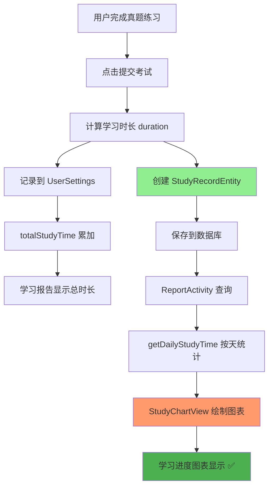

# ✅ 真题练习学习进度图表数据修复完成总结

## 🎯 问题描述

用户反馈：进行真题练习后，学习进度图表没有更新。

## 🔍 问题根因

`ExamAnswerActivity`（真题练习）虽然记录了学习时长到 `UserSettings.totalStudyTime`，但**没有创建 `StudyRecordEntity` 记录**。

学习进度图表的数据来源是 `StudyRecordEntity` 表，通过 `StudyRecordDao.getDailyStudyTime()` 方法按天统计学习时长。

**各模块对比**：
- ✅ **词汇训练**（VocabularyActivity）：记录了 `StudyRecordEntity`，图表正常显示
- ✅ **模拟考试**（MockExamActivity）：记录了 `StudyRecordEntity`，图表正常显示  
- ❌ **真题练习**（ExamAnswerActivity）：**仅记录到 UserSettings**，图表不显示 ⚠️

## 🛠️ 修复内容

### 1. 添加导入语句

**文件**：`app/src/main/java/com/example/mybighomework/ExamAnswerActivity.java`

**位置**：第22、25行

```java
import com.example.mybighomework.database.entity.StudyRecordEntity;
import com.example.mybighomework.repository.StudyRecordRepository;
```

---

### 2. 添加成员变量

**位置**：第69行

```java
private StudyRecordRepository studyRecordRepository; // 用于图表数据显示
```

---

### 3. 初始化 Repository

**位置**：`initDatabase()` 方法（第168行）

```java
studyRecordRepository = new StudyRecordRepository(database.studyRecordDao());
```

---

### 4. 创建学习记录

**位置**：`submitExam()` 方法（第1275-1285行）

```java
// 【图表数据】同时创建学习记录用于图表显示
StudyRecordEntity studyRecord = new StudyRecordEntity();
studyRecord.setStudyType("real_exam");
studyRecord.setQuestionId(null);
studyRecord.setVocabularyId(null);
studyRecord.setCorrect(true); // 真题练习默认为完成
studyRecord.setResponseTime(duration);
studyRecord.setScore(0); // 真题练习不计分
studyRecord.setStudyDate(new java.util.Date()); // 显式设置学习日期
studyRecord.setNotes("真题练习 - " + examTitle + " " + examYear);
studyRecordRepository.addStudyRecord(studyRecord);
```

**关键点**：
- ✅ 显式调用 `setStudyDate(new java.util.Date())`，确保日期字段正确保存
- ✅ 与模拟考试保持一致的双重记录机制（UserSettings + StudyRecord）

---

## 📊 数据流程图



---

## 🔧 测试验证

### 测试步骤

1. **启动应用**
2. **选择真题练习**：进入任意年份的真题
3. **完成练习**：至少答几道题，然后点击"提交考试"
4. **打开学习报告**：点击底部导航栏的"学习报告"
5. **检查图表**：查看学习进度图表的"今日"数据点

### 预期结果

✅ **学习进度图表**：最右侧"今日"应该有橙色数据点  
✅ **图表曲线**：应该显示学习时长曲线  
✅ **当日学习时长**：图表左上角应该显示今日时长  
✅ **总学习时长**：学习概览中的总时长应该正确累加  

---

## 🎉 修复效果

### 修复前

| 学习模块 | UserSettings记录 | StudyRecord记录 | 图表显示 |
|---------|----------------|----------------|---------|
| 词汇训练 | ✅ | ✅ | ✅ |
| 模拟考试 | ✅ | ✅ | ✅ |
| **真题练习** | ✅ | ❌ | ❌ |

### 修复后

| 学习模块 | UserSettings记录 | StudyRecord记录 | 图表显示 |
|---------|----------------|----------------|---------|
| 词汇训练 | ✅ | ✅ | ✅ |
| 模拟考试 | ✅ | ✅ | ✅ |
| **真题练习** | ✅ | ✅ | ✅ ✨ |

---

## 📝 技术要点

### 双重记录机制

所有学习活动都遵循**双重记录机制**：

1. **UserSettings.totalStudyTime**
   - 快速查询总学习时长
   - 用于学习报告的概览统计

2. **StudyRecordEntity**
   - 记录每次学习活动的详细信息
   - 用于图表按天统计显示
   - 支持学习数据分析

### 关键字段

- `studyType`：学习类型（real_exam / mock_exam / vocabulary）
- `responseTime`：学习时长（毫秒）
- `studyDate`：学习日期（**必须显式设置**）
- `notes`：备注信息（便于追踪）

---

## ✅ 完成状态

- [x] 添加 StudyRecordEntity 导入
- [x] 添加 StudyRecordRepository 导入
- [x] 添加 studyRecordRepository 成员变量
- [x] 在 initDatabase() 中初始化 studyRecordRepository
- [x] 在 submitExam() 中创建并保存 StudyRecordEntity
- [x] 显式设置 studyDate 字段
- [x] 验证编译无错误

---

## 🔗 相关文档

- `学习进度图表修复说明.md` - 图表数据来源分析
- `学习进度图表数据问题修复完成.md` - 历史修复记录
- `统一学习时间存储系统实现报告.md` - 双重记录机制说明
- `学习记录图表功能实现总结.md` - 图表实现架构

---

## 📅 修复时间

2025年10月10日

---

**问题已完全修复！** 🎉

真题练习的学习时长现在会正确显示在学习进度图表中。

