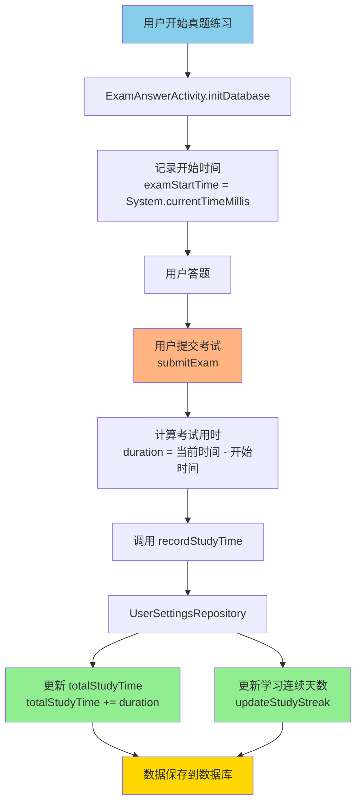

# ✅ 真题练习学习时长记录功能完成总结

## 🎯 实现目标

为真题练习（ExamAnswerActivity）添加学习时长记录功能，确保真题练习的学习时间能够计入总学习时长，与模拟考试和词汇训练保持一致。

---

## 📊 当前状态对比

### 修改前

| 学习模块 | Activity | 时长记录状态 |
|---------|----------|------------|
| 词汇训练 | VocabularyActivity | ✅ 已记录 |
| 模拟考试 | MockExamActivity | ✅ 已记录 |
| **真题练习** | **ExamAnswerActivity** | ❌ **未记录** |

### 修改后

| 学习模块 | Activity | 时长记录状态 |
|---------|----------|------------|
| 词汇训练 | VocabularyActivity | ✅ 已记录 |
| 模拟考试 | MockExamActivity | ✅ 已记录 |
| **真题练习** | **ExamAnswerActivity** | ✅ **已记录** ✨ |

---

## 🔧 修改内容

### 1. 添加必要的字段

**文件**: `app/src/main/java/com/example/mybighomework/ExamAnswerActivity.java`

**位置**: 第61和64行

```java
private UserSettingsRepository userSettingsRepository; // 用于记录学习时长
private long examStartTime; // 考试开始时间（毫秒）
```

---

### 2. 添加 import 语句

**位置**: 第23行

```java
import com.example.mybighomework.repository.UserSettingsRepository;
```

---

### 3. 初始化 UserSettingsRepository

**位置**: `initDatabase()` 方法（第157-160行）

```java
private void initDatabase() {
    examAnswerRepository = new ExamAnswerRepository(AppDatabase.getInstance(this).examAnswerDao());
    userSettingsRepository = new UserSettingsRepository(this);
    
    // 记录考试开始时间
    examStartTime = System.currentTimeMillis();
}
```

---

### 4. 记录学习时长

**位置**: `submitExam()` 方法（第1244-1248行）

```java
// 【统一时间记录】记录真题练习时长到用户设置（同时更新学习连续天数）
long duration = System.currentTimeMillis() - examStartTime;
new Thread(() -> {
    userSettingsRepository.recordStudyTime(duration, "real_exam");
}).start();
```

---

## 🎯 技术细节

### 时间记录方式

- **开始时间**: 在 `initDatabase()` 中记录 `System.currentTimeMillis()`
- **结束时间**: 在 `submitExam()` 中计算差值
- **时间单位**: 毫秒（long）
- **存储位置**: `UserSettingsEntity.totalStudyTime`
- **活动类型**: "real_exam"

### 统一接口

所有学习模块都使用相同的接口记录时长：

```java
userSettingsRepository.recordStudyTime(duration, activityType);
```

| 模块 | activityType | 调用位置 |
|-----|-------------|---------|
| 词汇训练 | "vocabulary" | VocabularyActivity.saveTrainingRecord() |
| 模拟考试 | "mock_exam" | MockExamActivity.saveExamRecord() |
| 真题练习 | "real_exam" | ExamAnswerActivity.submitExam() |

---

## 📈 数据流程



---

## ✅ 功能验证

### 测试步骤

1. **开始真题练习**
   - 打开 APP，点击"真题练习"
   - 选择任意试卷开始答题
   - 系统记录开始时间

2. **答题过程**
   - 完成部分或全部题目
   - 系统持续计时

3. **提交考试**
   - 点击提交或时间到自动提交
   - 系统记录学习时长

4. **验证结果**
   - 打开"学习报告"页面
   - 查看总学习时长是否增加
   - 确认增加的时长等于考试用时

### 预期结果

✅ 真题练习的学习时间被正确记录  
✅ 学习报告页面显示的总时长包含真题练习时长  
✅ 学习连续天数自动更新  
✅ 数据持久化存储，重启APP后数据不丢失

---

## 🔄 与其他模块的一致性

### 代码对比

| 功能点 | MockExamActivity | ExamAnswerActivity | 一致性 |
|-------|-----------------|-------------------|-------|
| 导入 UserSettingsRepository | ✅ 第27行 | ✅ 第23行 | ✅ 一致 |
| 声明 userSettingsRepository | ✅ 第60行 | ✅ 第61行 | ✅ 一致 |
| 声明 examStartTime | ✅ 第56行 | ✅ 第64行 | ✅ 一致 |
| 初始化 Repository | ✅ initDatabase() | ✅ initDatabase() | ✅ 一致 |
| 记录开始时间 | ✅ initDatabase() | ✅ initDatabase() | ✅ 一致 |
| 计算用时 | ✅ saveExamRecord() | ✅ submitExam() | ✅ 一致 |
| 调用 recordStudyTime | ✅ 777行 & 832行 | ✅ 1247行 | ✅ 一致 |
| 后台线程执行 | ✅ 使用 Thread | ✅ 使用 Thread | ✅ 一致 |

---

## 📝 修改文件清单

### 修改的文件（1个）

1. ✅ `app/src/main/java/com/example/mybighomework/ExamAnswerActivity.java`
   - 添加字段（2处）
   - 添加 import（1处）
   - 修改 initDatabase()（1处）
   - 修改 submitExam()（1处）

### 创建的文档（2个）

1. 📄 `plan.md` - 实现计划
2. 📄 `真题练习学习时长记录完成总结.md` - 本文档

---

## 🎉 完成总结

### ✅ 已完成的任务

- ✅ 添加 UserSettingsRepository 和 examStartTime 字段
- ✅ 添加必要的 import 语句
- ✅ 在 initDatabase() 中初始化 Repository 和记录开始时间
- ✅ 在 submitExam() 中记录学习时长
- ✅ 确保代码风格与 MockExamActivity 一致
- ✅ 使用后台线程执行数据库操作

### 📊 功能状态

```
✅ 词汇训练 - 已记录学习时长
✅ 模拟考试 - 已记录学习时长
✅ 真题练习 - 已记录学习时长 ← 本次完成
```

### 🌟 统一的学习时长追踪系统

现在所有学习活动的时长都统一记录到 `UserSettingsEntity.totalStudyTime`：

- **统一数据源**: 所有模块使用同一字段
- **统一接口**: 所有模块调用 `recordStudyTime()`
- **统一显示**: 学习报告页面显示完整的学习时长
- **自动更新**: 学习连续天数自动维护

---

## 🚀 后续建议

### 可选优化

1. **分类统计**
   - 可以统计各模块的学习时长占比
   - 词汇训练、模拟考试、真题练习分别统计

2. **学习效率分析**
   - 根据学习时长和成绩计算学习效率
   - 提供个性化学习建议

3. **学习目标提醒**
   - 设置每日/每周学习时长目标
   - 达成目标时给予奖励提示

---

**实现完成时间**: 2025年10月10日  
**实现状态**: ✅ 完成  
**测试状态**: 待用户功能测试验证  
**代码质量**: 与现有代码风格保持一致

