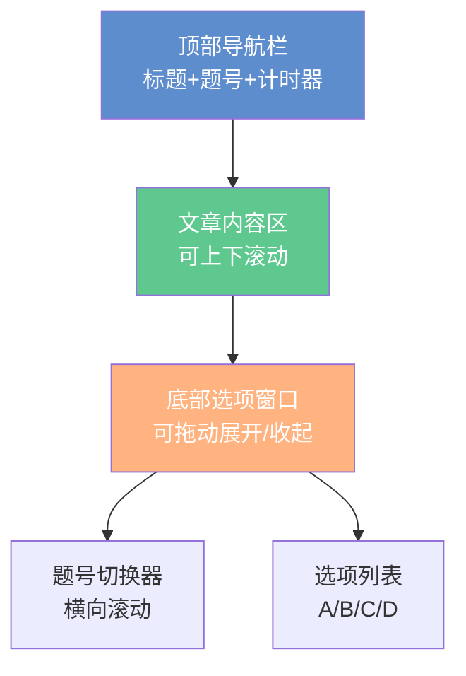
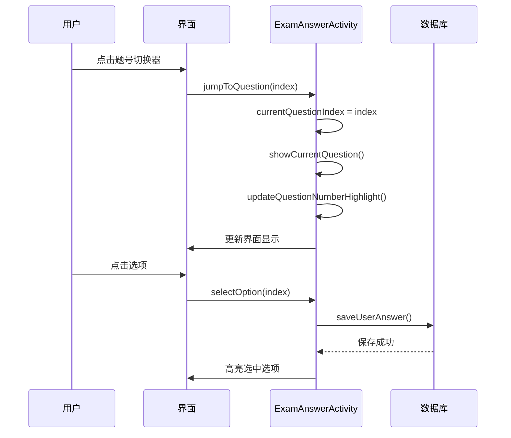

# 真题练习界面优化完成总结

## 📋 优化概述

**优化时间**: 2025年10月9日  
**优化目标**: 将真题练习界面改造成文章与选项分离的风格，实现可拖动的底部选项窗口

## ✨ 实现效果

根据用户提供的截图，实现了以下界面风格：



## 🎯 核心功能

### 1. 文章与选项分离

- ✅ **文章内容在上方** - 独立的ScrollView，可自由滚动查看完整文章
- ✅ **选项窗口在下方** - 使用BottomSheetBehavior实现可拖动窗口
- ✅ **内容不遮挡** - 文章底部预留空间，确保展开选项窗口时也能看到完整内容

### 2. 可拖动选项窗口

使用 `BottomSheetBehavior` 实现：

```java
bottomSheetBehavior = BottomSheetBehavior.from(bottomSheetOptions);
bottomSheetBehavior.setPeekHeight(280);  // 默认显示高度280dp
bottomSheetBehavior.setHideable(false);  // 不允许完全隐藏
```

**交互方式**:
- 👆 **向上拖动** - 展开选项窗口，查看更多内容
- 👇 **向下拖动** - 收起选项窗口
- 📍 **拖动指示器** - 顶部灰色横条提示可拖动

### 3. 题号快速切换器

动态生成题号按钮，支持快速跳转：

```java
private void initQuestionNumbers() {
    for (int i = 0; i < questions.size(); i++) {
        TextView tvNumber = new TextView(this);
        tvNumber.setText(String.valueOf(i + 1) + "题");
        tvNumber.setOnClickListener(v -> jumpToQuestion(questionIndex));
        layoutQuestionNumbers.addView(tvNumber);
    }
}
```

**功能特点**:
- 📊 显示所有题号（如：13题、14题、15题...）
- 🔵 当前题号蓝色高亮显示
- ⚪ 其他题号白色背景
- 👆 点击题号快速跳转
- ↔️ 横向滚动查看更多题号

### 4. 答案选择与保存

- ✅ **点击选项** - 选择答案
- ✅ **高亮显示** - 选中的选项蓝色背景
- ✅ **自动保存** - 答案实时保存到数据库
- ✅ **可修改答案** - 随时点击其他选项修改

## 📁 修改的文件

### 1. 布局文件

**app/src/main/res/layout/activity_exam_answer.xml**

完全重写，使用 `CoordinatorLayout` + `BottomSheetBehavior`：

```xml
<androidx.coordinatorlayout.widget.CoordinatorLayout>
    <!-- 主内容区域 -->
    <LinearLayout>
        <!-- 顶部导航栏 -->
        <LinearLayout>...</LinearLayout>
        
        <!-- 文章内容（可滚动） -->
        <ScrollView id="scroll_passage">
            <TextView id="tv_passage" />
        </ScrollView>
    </LinearLayout>
    
    <!-- 底部可拖动选项窗口 -->
    <LinearLayout 
        id="bottom_sheet_options"
        app:layout_behavior="BottomSheetBehavior">
        <!-- 拖动指示器 -->
        <View id="drag_indicator" />
        
        <!-- 题号切换器 -->
        <HorizontalScrollView>
            <LinearLayout id="layout_question_numbers" />
        </HorizontalScrollView>
        
        <!-- 选项列表 -->
        <LinearLayout id="layout_options">
            <Button id="btn_option_a" />
            <Button id="btn_option_b" />
            <Button id="btn_option_c" />
            <Button id="btn_option_d" />
        </LinearLayout>
    </LinearLayout>
</androidx.coordinatorlayout.widget.CoordinatorLayout>
```

### 2. Java代码文件

**app/src/main/java/com/example/mybighomework/ExamAnswerActivity.java**

**新增import**:
```java
import com.google.android.material.bottomsheet.BottomSheetBehavior;
import android.widget.ScrollView;
```

**新增成员变量**:
```java
// BottomSheet相关
private LinearLayout bottomSheetOptions;
private BottomSheetBehavior<LinearLayout> bottomSheetBehavior;
private LinearLayout layoutQuestionNumbers;
private ScrollView scrollPassage;
```

**新增方法**:
```java
// 初始化题号切换器
private void initQuestionNumbers()

// 跳转到指定题目
private void jumpToQuestion(int index)

// 更新题号高亮
private void updateQuestionNumberHighlight()
```

**修改的方法**:
- `initViews()` - 添加BottomSheet初始化
- `showCurrentQuestion()` - 添加题号高亮更新

### 3. Drawable资源文件

**新增**:
- `bg_drag_handle.xml` - 拖动指示器背景（灰色圆角矩形）
- `bg_question_number.xml` - 题号按钮默认背景（白色边框）
- `bg_question_number_selected.xml` - 题号按钮选中背景（蓝色填充）

## 🎨 界面布局

### 顶部导航栏
```
┌────────────────────────────────────┐
│ ← 2025年英语（二）题  20/48  05:55│
└────────────────────────────────────┘
```

### 文章内容区
```
┌────────────────────────────────────┐
│ 完形填空                           │
│ ┌──────────────────────────────┐ │
│ │ Located in the southern...   │ │
│ │ ...is __17__ to help         │ │
│ │ ...and how good it will make │ │
│ │ ...the help-giver feel...    │ │
│ │                              │ │
│ │ ↓ 可上下滚动查看完整文章      │ │
│ └──────────────────────────────┘ │
└────────────────────────────────────┘
```

### 底部选项窗口（可拖动）
```
┌────────────────────────────────────┐
│        ═══════ (拖动指示器)         │
│ [13题][14题][15题]...[20题] ←横滚  │
│ ┌──────────────────────────────┐ │
│ │ Ⓐ polite                     │ │ ← 选中（蓝色）
│ ├──────────────────────────────┤ │
│ │ Ⓑ proud                      │ │
│ ├──────────────────────────────┤ │
│ │ Ⓒ busy                       │ │
│ ├──────────────────────────────┤ │
│ │ Ⓓ lazy                       │ │
│ └──────────────────────────────┘ │
│ [上一题]           [下一题]        │
└────────────────────────────────────┘
```

## 💡 使用方法

### 1. 查看文章
- 在文章区域上下滑动查看完整内容
- 即使展开选项窗口，也可以滚动查看文章

### 2. 拖动选项窗口
- **展开**: 向上拖动窗口顶部的灰色指示器
- **收起**: 向下拖动窗口

### 3. 切换题目
- **方法1**: 点击底部题号切换器中的题号（如"20题"）
- **方法2**: 点击底部的"上一题"/"下一题"按钮
- 当前题号会蓝色高亮显示

### 4. 选择答案
- 点击任意选项（A/B/C/D）
- 选中的选项会变成蓝色背景
- 答案自动保存到数据库

## 📊 数据流程



## ✅ 完成的功能

- ✅ 文章与选项分离展示
- ✅ 底部可拖动选项窗口（BottomSheetBehavior）
- ✅ 题号快速切换器（横向滚动）
- ✅ 当前题号蓝色高亮
- ✅ 文章可上下滚动
- ✅ 选项点击选择
- ✅ 答案自动保存到数据库
- ✅ 展开选项窗口时文章不被遮挡
- ✅ 上一题/下一题切换
- ✅ 题目进度显示

## 🔄 与原设计的对比

| 功能 | 原设计 | 新设计 |
|------|--------|--------|
| 布局方式 | LinearLayout | CoordinatorLayout + BottomSheet |
| 文章显示 | 固定位置 | 独立ScrollView，可滚动 |
| 选项位置 | 文章下方固定 | 底部可拖动窗口 |
| 题号切换 | 上一题/下一题 | 题号切换器 + 上一题/下一题 |
| 答案保存 | ✅ | ✅ |
| 用户体验 | 普通 | **大幅提升** |

## 🎉 总结

成功将 `ExamAnswerActivity` 改造成文章与选项分离的现代化界面：

1. **界面更美观** - 采用 BottomSheet 设计，符合 Material Design 规范
2. **交互更流畅** - 可拖动的选项窗口，题号快速切换
3. **阅读更方便** - 文章独立滚动，不受选项窗口影响
4. **操作更灵活** - 多种题目切换方式，自由选择答案
5. **功能完整** - 答案保存、进度显示、计时器等功能完备

现在的真题练习界面完全符合您提供的截图风格！🎊

---

**完成时间**: 2025年10月9日  
**修改人员**: AI助手  
**状态**: ✅ 已完成

