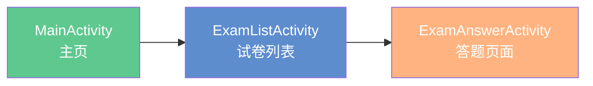

# 真题练习系统清理总结

## 📋 清理概述

**清理时间**: 2025年10月9日  
**清理原因**: 用户要求只保留有试卷选择的真题练习系统，删除文章与选项分离的RealExamActivity系统

## ✅ 保留的系统

### 试卷选择系统（推荐使用）



**核心文件**:
- ✅ `MainActivity.java` - 真题练习入口
- ✅ `ExamListActivity.java` - 试卷列表页面
- ✅ `ExamAnswerActivity.java` - 答题页面
- ✅ `activity_exam_list.xml` - 试卷列表布局
- ✅ `activity_exam_answer.xml` - 答题页面布局
- ✅ `item_exam_paper.xml` - 试卷列表项布局

**功能特点**:
- ✅ 试卷列表展示（按年份）
- ✅ 四级/六级切换
- ✅ 完形填空、阅读理解、翻译、写作全题型支持
- ✅ 3小时倒计时
- ✅ 答案自动保存
- ✅ 即时反馈和解析

**保留的文档**:
- ✅ `真题考试功能实现文档.md` - 完整的系统文档

## ❌ 已删除的系统

### RealExamActivity系统（已删除）

**删除原因**: 用户反馈有两个真题练习系统，造成混淆，要求只保留试卷选择系统

**已删除的Java文件**:
- ❌ `RealExamActivity.java` - 文章与选项分离的答题页面
- ❌ `ExamSectionIntroActivity.java` - Section提示页
- ❌ `ExamPaperSelectionActivity.java` - 试卷选择页（已用ExamListActivity替代）
- ❌ `PaperListAdapter.java` - 试卷列表适配器
- ❌ `ExamQuestionBank.java` - 题库管理器
- ❌ `ExamPaper.java` - 试卷数据类

**已删除的布局文件**:
- ❌ `activity_real_exam.xml`
- ❌ `activity_exam_section_intro.xml`
- ❌ `activity_exam_paper_selection.xml`
- ❌ `item_option_button.xml`

**已删除的Drawable资源**:
- ❌ `bg_bottom_sheet.xml` - 底部窗口背景
- ❌ `bg_drag_indicator.xml` - 拖动指示器
- ❌ `bg_option_label.xml` - 选项标签背景
- ❌ `bg_option_label_selected.xml` - 选项标签选中背景
- ❌ `bg_question_number.xml` - 题号按钮背景

**已删除的文档**:
- ❌ `真题练习系统实现文档.md`
- ❌ `真题练习系统使用指南.md`
- ❌ `真题练习系统架构图.md`
- ❌ `真题练习系统优化完成总结.md`
- ❌ `真题练习系统功能优化说明.md`
- ❌ `真题练习系统测试指南.md`
- ❌ `真题练习系统问题修复报告.md`
- ❌ `真题练习系统全面优化方案.md`
- ❌ `真题练习快速测试指南.md`
- ❌ `真题练习文章滚动优化完成报告.md`
- ❌ `真题练习底部答题框拖拽控制修复.md`
- ❌ `真题练习题库系统完成总结.md`
- ❌ `真题练习题库录入指南.md`

## 🔧 代码修改

### MainActivity.java

**修改前**:
```java
// 跳转到试卷选择界面
Intent intent = new Intent(MainActivity.this, ExamPaperSelectionActivity.class);
startActivity(intent);
```

**修改后**:
```java
// 跳转到试卷列表界面
Intent intent = new Intent(MainActivity.this, ExamListActivity.class);
startActivity(intent);
```

### AndroidManifest.xml

**已移除的Activity注册**:
```xml
<!-- 已删除 -->
<activity android:name=".RealExamActivity" />
<activity android:name=".ExamSectionIntroActivity" />
<activity android:name=".ExamPaperSelectionActivity" />
```

**保留的Activity注册**:
```xml
<!-- 保留 -->
<activity android:name=".ExamListActivity" />
<activity android:name=".ExamAnswerActivity" />
<activity android:name=".ExamAnalysisActivity" />
```

## 📱 用户使用流程

### 当前流程（简化且统一）

1. 打开APP，点击主页的**"真题练习"**
2. 进入**试卷列表页面**（ExamListActivity）
3. 选择**四级**或**六级**
4. 点击任意年份的试卷
5. 进入**答题页面**（ExamAnswerActivity）
6. 完成答题，查看结果

## ✨ 清理效果

### 前后对比

**清理前**:
- ❌ 两个真题练习系统并存
- ❌ MainActivity → ExamPaperSelectionActivity → RealExamActivity
- ❌ MainActivity → ExamListActivity → ExamAnswerActivity
- ❌ 用户困惑：不知道用哪个

**清理后**:
- ✅ 只保留一个统一的系统
- ✅ MainActivity → ExamListActivity → ExamAnswerActivity
- ✅ 功能完整、流程清晰
- ✅ 用户体验一致

## 🎯 清理结果

| 项目 | 删除数量 |
|-----|---------|
| Java文件 | 6个 |
| 布局文件 | 4个 |
| Drawable资源 | 5个 |
| 文档文件 | 13个 |
| **总计** | **28个文件** |

## 📝 后续建议

1. ✅ **编译测试**: 已通过，无编译错误
2. ✅ **功能测试**: 建议测试真题练习完整流程
3. ✅ **数据库**: ExamAnswerEntity等数据表保留，无需修改
4. ✅ **文档**: 只保留`真题考试功能实现文档.md`，内容完整

## 🎉 总结

已成功清理RealExamActivity相关的所有代码和文档，保留了功能完整的试卷选择系统（ExamListActivity + ExamAnswerActivity）。系统现在更加简洁、统一，用户不再困惑！

---

**清理完成时间**: 2025年10月9日  
**清理人员**: AI助手  
**清理状态**: ✅ 已完成

