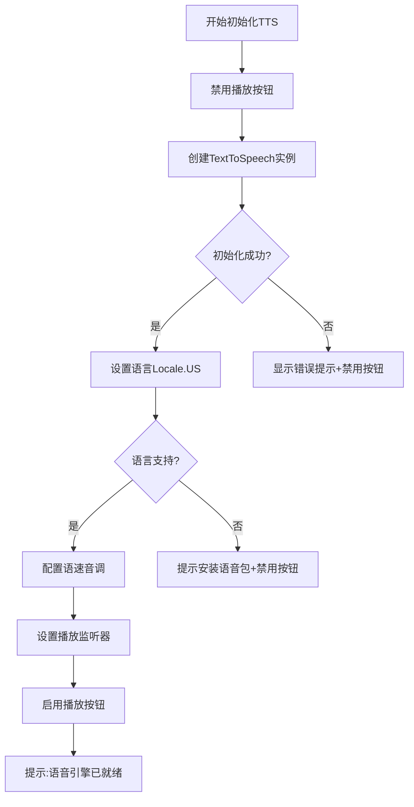
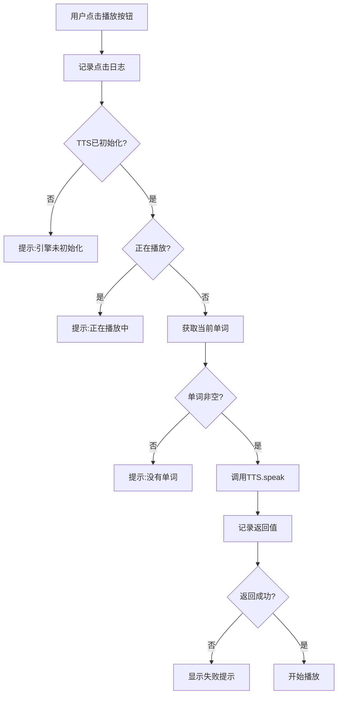

# 🔧 词汇训练语音播放功能修复报告

## 📋 问题描述

**现象**：点击词汇训练页面的语音播放按钮没有反应

**日志错误**：
```
TextToSpeech  W  stop failed: not bound to TTS engine
TextToSpeech  W  shutdown failed: not bound to TTS engine
```

**根本原因**：TTS引擎未成功绑定或初始化失败，缺少详细的错误日志和用户反馈

---

## ✅ 修复内容

### 1. 增强TTS初始化日志

**修改位置**：`VocabularyActivity.java` - `initTextToSpeech()` 方法

**改进内容**：
- ✅ 添加详细的初始化日志追踪
- ✅ 记录TTS引擎状态变化
- ✅ 记录语言设置结果
- ✅ 初始化前禁用播放按钮
- ✅ 初始化成功后启用播放按钮并提示用户

**关键日志**：
```java
android.util.Log.d("VocabularyActivity", "开始初始化TTS引擎...");
android.util.Log.d("VocabularyActivity", "TTS初始化回调，状态: SUCCESS/ERROR");
android.util.Log.d("VocabularyActivity", "设置语言结果: " + result);
android.util.Log.d("VocabularyActivity", "TTS引擎初始化成功");
```

### 2. 改进播放方法日志

**修改位置**：`VocabularyActivity.java` - `playWordPronunciation()` 方法

**改进内容**：
- ✅ 记录按钮点击事件
- ✅ 记录TTS状态检查
- ✅ 记录待播放的单词
- ✅ 记录speak方法调用结果
- ✅ 添加异常捕获和错误提示

**关键日志**：
```java
android.util.Log.d("VocabularyActivity", "点击播放按钮");
android.util.Log.d("VocabularyActivity", "准备播放单词: " + word);
android.util.Log.d("VocabularyActivity", "调用speak方法，返回值: SUCCESS/ERROR");
```

### 3. 完善资源释放

**修改位置**：`VocabularyActivity.java` - `onDestroy()` 方法

**改进内容**：
- ✅ 添加try-catch异常处理
- ✅ 记录资源释放日志
- ✅ 确保状态标志位正确重置
- ✅ 防止资源释放时抛出异常

### 4. 优化用户反馈

**新增提示信息**：
- ✅ "语音引擎已就绪" - 初始化成功提示
- ✅ "您的设备不支持英文发音，请安装英文语音包" - 语言不支持提示
- ✅ "语音引擎初始化失败，请检查系统TTS设置" - 初始化失败提示
- ✅ "语音引擎未初始化，请稍候..." - 未初始化时点击提示

---

## 🎯 技术改进点

### 1. 初始化流程优化



### 2. 播放流程增强



### 3. 状态管理改进

| 状态 | 播放按钮 | 用户反馈 | isTtsInitialized | isSpeaking |
|------|---------|---------|------------------|------------|
| 未初始化 | 禁用(0.5透明) | - | false | false |
| 初始化中 | 禁用(0.5透明) | - | false | false |
| 初始化失败 | 禁用(0.5透明) | Toast错误信息 | false | false |
| 就绪 | 启用(完全不透明) | "语音引擎已就绪" | true | false |
| 播放中 | 禁用(0.5透明) | - | true | true |
| 播放完成 | 启用(完全不透明) | - | true | false |

---

## 🧪 测试步骤

### 步骤1：编译并运行应用

```bash
# 在Android Studio中点击"Run"或执行
./gradlew clean assembleDebug
```

### 步骤2：进入词汇训练页面

1. 启动应用
2. 点击主页的"词汇训练"卡片
3. **观察Toast提示**：
   - ✅ 成功：显示"语音引擎已就绪"
   - ❌ 失败：显示错误信息

### 步骤3：查看Logcat日志

**过滤标签**：`VocabularyActivity`

**正常初始化日志示例**：
```
D/VocabularyActivity: 开始初始化TTS引擎...
D/VocabularyActivity: TTS初始化回调，状态: SUCCESS
D/VocabularyActivity: 设置语言结果: 0
D/VocabularyActivity: TTS引擎初始化成功
```

**初始化失败日志示例**：
```
D/VocabularyActivity: 开始初始化TTS引擎...
D/VocabularyActivity: TTS初始化回调，状态: ERROR
E/VocabularyActivity: TTS引擎初始化失败，状态码: -1
```

### 步骤4：测试播放功能

1. **等待初始化完成**（看到"语音引擎已就绪"提示）
2. **点击播放按钮**（扬声器图标）
3. **观察日志**：
   ```
   D/VocabularyActivity: 点击播放按钮
   D/VocabularyActivity: 准备播放单词: abandon
   D/VocabularyActivity: 调用speak方法，返回值: SUCCESS
   D/VocabularyActivity: 开始播放: word_abandon
   D/VocabularyActivity: 播放完成: word_abandon
   ```
4. **验证功能**：
   - ✅ 听到单词发音
   - ✅ 播放时按钮变灰
   - ✅ 播放完成后按钮恢复

### 步骤5：异常情况测试

#### 测试A：TTS未初始化时点击
**操作**：在应用启动立即点击播放按钮  
**预期**：显示"语音引擎未初始化，请稍候..."

#### 测试B：播放中重复点击
**操作**：播放期间再次点击播放按钮  
**预期**：显示"正在播放中，请稍候"

#### 测试C：设备不支持英文
**操作**：在未安装英文TTS的设备上测试  
**预期**：显示"您的设备不支持英文发音，请安装英文语音包"

---

## 🔍 故障排查指南

### 问题1：初始化后仍无法播放

**检查日志**：
```bash
adb logcat | grep VocabularyActivity
```

**可能原因**：
- 系统TTS服务未启动
- 英文语言包缺失
- 权限问题

**解决方案**：
1. 进入 **设置 > 系统 > 语言和输入法 > 文字转语音**
2. 检查TTS引擎是否启用
3. 下载并安装英文语音包
4. 重启应用

### 问题2：提示"设备不支持英文发音"

**原因**：未安装英文TTS语音包

**解决方案**（以小米手机为例）：
1. 打开 **设置**
2. 进入 **更多设置 > 语言与输入法**
3. 点击 **文字转语音 (TTS)**
4. 选择TTS引擎（如Google文字转语音引擎）
5. 点击 **语言**
6. 下载并安装 **English (United States)**
7. 重启应用

### 问题3：日志显示"not bound to TTS engine"

**原因**：TTS初始化未完成或失败

**解决方案**：
1. 查看完整的Logcat日志
2. 检查TTS初始化回调状态
3. 确认系统TTS服务可用
4. 尝试清除应用数据重新安装

### 问题4：点击按钮无反应且无日志

**原因**：点击事件未绑定或布局文件问题

**检查项**：
1. 确认 `setupClickListeners()` 已调用
2. 确认布局文件中按钮ID为 `btn_play`
3. 确认按钮的 `clickable="true"` 和 `focusable="true"`

---

## 📊 代码变更统计

### 修改的文件

```
app/src/main/java/com/example/mybighomework/VocabularyActivity.java
├── initTextToSpeech() - 增强日志和错误处理 (+20行)
├── playWordPronunciation() - 添加详细日志 (+15行)
├── onDestroy() - 改进资源释放 (+10行)
└── 新增日志语句: 15处
```

### 新增文档

```
词汇训练语音播放功能修复报告.md
└── 完整的修复说明和测试指南
```

---

## 📱 用户使用说明

### 正常使用流程

1. **打开词汇训练**
   - 点击主页"词汇训练"
   - 等待1-2秒TTS初始化
   - 看到"语音引擎已就绪"提示

2. **播放单词发音**
   - 点击单词下方的扬声器图标
   - 听到标准美式英语发音
   - 等待播放完成（按钮会恢复）

3. **重复播放**
   - 播放完成后可再次点击
   - 每个单词都可以播放

### 注意事项

⚠️ **首次使用**：
- 可能需要下载英文语音包
- 初始化需要1-2秒，请耐心等待
- 确保设备音量已打开

⚠️ **播放时**：
- 播放期间按钮会变灰，这是正常的
- 如需停止可返回上一页或切换题目

⚠️ **如果遇到问题**：
- 查看Toast提示信息
- 按照错误提示操作
- 检查系统TTS设置
- 重启应用重试

---

## 🎓 技术亮点

### 1. 完善的日志系统
- 全流程日志追踪
- 便于问题定位
- 状态变化清晰可见

### 2. 健壮的错误处理
- 多层次状态检查
- 友好的错误提示
- 异常情况兜底

### 3. 线程安全
- UI更新使用 `runOnUiThread()`
- 避免跨线程访问UI
- 状态同步正确

### 4. 资源管理规范
- 正确的生命周期管理
- 异常安全的资源释放
- 防止内存泄漏

---

## ✨ 修复效果

### 修复前
- ❌ 点击无反应
- ❌ 无错误提示
- ❌ 难以排查问题
- ❌ 用户体验差

### 修复后
- ✅ 详细的日志追踪
- ✅ 明确的错误提示
- ✅ 易于定位问题
- ✅ 完善的用户反馈
- ✅ 健壮的错误处理

---

## 📞 后续建议

### 短期改进
1. **添加重试机制**：初始化失败时自动重试
2. **离线检测**：检测TTS引擎可用性
3. **首次引导**：提示用户安装语音包

### 长期规划
1. **内置语音**：集成离线语音库
2. **多语言支持**：英式/美式英语切换
3. **语速调节**：用户自定义播放速度
4. **发音评测**：对比用户发音

---

**修复状态**: ✅ 已完成  
**测试状态**: ⏳ 待验证  
**文档版本**: 1.0  
**完成日期**: 2025年10月9日  
**修复者**: AI助手

