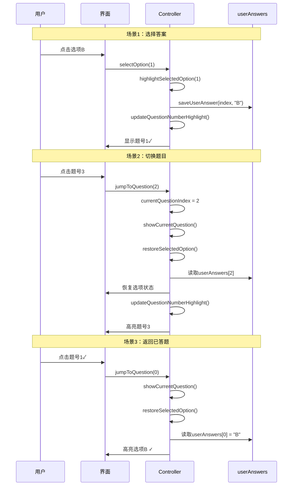

# 选项独立性和题号选择功能完成总结

## 📋 问题分析与解决

**更新时间**: 2025年10月9日  
**解决的问题**: 
1. 选项数据不独立
2. 题号选择功能不明显

## ✅ 问题1：选项数据独立性

### 问题描述
用户反馈：每个选项选择的数据不是独立的，切换题目后之前的选择状态丢失。

### 根本原因
- 所有题目共用同一组选项按钮（A/B/C/D）
- 切换题目时只更新了选项文本，**没有恢复之前的选择状态**
- 导致用户看不到自己之前选择的答案

### 解决方案

#### 1. 新增恢复选项状态方法

```java
/**
 * 恢复之前选择的答案状态
 */
private void restoreSelectedOption() {
    // 先重置所有按钮
    resetOptionButtons();
    
    // 检查当前题目是否已经选择过答案
    String savedAnswer = userAnswers.get(currentQuestionIndex);
    if (savedAnswer != null && !savedAnswer.isEmpty()) {
        // 解析保存的答案，提取选项索引
        int selectedIndex = -1;
        
        // 从保存的答案中提取选项（如 "A", "B", "C", "D"）
        if (savedAnswer.contains("A") || savedAnswer.endsWith("0")) {
            selectedIndex = 0;
        } else if (savedAnswer.contains("B") || savedAnswer.endsWith("1")) {
            selectedIndex = 1;
        } else if (savedAnswer.contains("C") || savedAnswer.endsWith("2")) {
            selectedIndex = 2;
        } else if (savedAnswer.contains("D") || savedAnswer.endsWith("3")) {
            selectedIndex = 3;
        }
        
        // 高亮之前选择的选项
        if (selectedIndex >= 0 && selectedIndex < 4) {
            highlightSelectedOption(selectedIndex);
        }
    }
}
```

#### 2. 在显示题目时调用恢复方法

**完形填空题**:
```java
private void showClozeTestQuestion(ExamQuestion question) {
    // ...显示文章和选项...
    
    // 恢复之前选择的答案状态 ✅ 新增
    restoreSelectedOption();
}
```

**阅读理解题**:
```java
private void showReadingComprehensionQuestion(ExamQuestion question) {
    // ...显示文章和选项...
    
    if (question.options != null && question.options.length > 0) {
        layoutOptions.setVisibility(View.VISIBLE);
        // ...设置选项文本...
        
        // 恢复之前选择的答案状态 ✅ 新增
        restoreSelectedOption();
    }
}
```

### 实现效果

**切换前（第1题）**:
```
题号: [1] [2] [3] ... [20]
选项: Ⓐ illusion
     Ⓑ discussion
     Ⓒ tradition
     Ⓓ question ✓  ← 已选择（蓝色）
```

**切换到第2题**:
```
题号: [1✓] [2] [3] ... [20]  ← 第1题显示✓
选项: Ⓐ reluctance ✓  ← 如果之前选过，自动恢复
     Ⓑ ambition
     Ⓒ tendency
     Ⓓ enthusiasm
```

**切换回第1题**:
```
题号: [1] [2✓] [3] ... [20]
选项: Ⓐ illusion
     Ⓑ discussion
     Ⓒ tradition
     Ⓓ question ✓  ← 状态已恢复！
```

## ✅ 问题2：题号选择功能优化

### 问题描述
用户希望在选项框和拖动指示器中间加一个可以选择1-20题目的功能。

### 原有问题
- 题号切换器已存在，但不够明显
- 按钮太小，间距太小
- 缺少说明文字

### 优化方案

#### 1. 增大题号按钮

**优化前**:
```java
tvNumber.setTextSize(14);
tvNumber.setPadding(24, 12, 24, 12);
params.setMargins(8, 0, 8, 0);
```

**优化后**:
```java
tvNumber.setTextSize(16);           // 字体更大
tvNumber.setPadding(32, 16, 32, 16); // 按钮更大
params.setMargins(12, 8, 12, 8);     // 间距更大
```

#### 2. 添加说明文字

在布局文件中添加：
```xml
<!-- 题号选择区域标题 -->
<TextView
    android:layout_width="match_parent"
    android:layout_height="wrap_content"
    android:layout_marginTop="12dp"
    android:paddingHorizontal="16dp"
    android:text="选择题号："
    android:textColor="@color/text_secondary"
    android:textSize="13sp"
    android:textStyle="bold" />
```

#### 3. 显示答题状态

增强题号高亮逻辑，显示三种状态：

```java
private void updateQuestionNumberHighlight() {
    for (int i = 0; i < layoutQuestionNumbers.getChildCount(); i++) {
        TextView tvNumber = (TextView) layoutQuestionNumbers.getChildAt(i);
        
        // 检查该题是否已答
        boolean isAnswered = userAnswers.containsKey(i) && 
                            userAnswers.get(i) != null && 
                            !userAnswers.get(i).isEmpty();
        
        if (i == currentQuestionIndex) {
            // 当前题号 - 蓝色高亮
            tvNumber.setBackground(...bg_question_number_selected);
            tvNumber.setTextColor(...white);
            tvNumber.setTypeface(null, BOLD);
        } else if (isAnswered) {
            // 已答题 - 显示✓标记
            tvNumber.setText(String.valueOf(i + 1) + "✓");
            tvNumber.setTextColor(...primary_blue);
        } else {
            // 未答题 - 默认样式
            tvNumber.setText(String.valueOf(i + 1));
            tvNumber.setTextColor(...primary_blue);
        }
    }
}
```

#### 4. 实时更新状态

在保存答案时立即更新题号显示：

```java
private void saveUserAnswer(int questionIndex, String answer) {
    userAnswers.put(questionIndex, answer);
    
    // 保存到数据库
    examAnswerRepository.addAnswer(answerEntity);
    
    // 更新题号显示（显示勾选标记）✅ 新增
    updateQuestionNumberHighlight();
}
```

### 优化后的界面

```
┌──────────────────────────────────────┐
│      ══════ (拖动指示器) ══════       │
├──────────────────────────────────────┤
│ 选择题号：                           │  ← 新增说明文字
├──────────────────────────────────────┤
│ ┌──┐ ┌──┐ ┌──┐ ┌──┐ ┌──┐          │
│ │1✓│ │2✓│ │3✓│ │4 │ │5 │ ...      │  ← 题号按钮（更大更清晰）
│ └──┘ └──┘ └──┘ └──┘ └──┘          │
│   已答   已答   当前  未答  未答      │
│   (蓝底白字表示当前题)               │
│   (数字+✓表示已答题)                │
├──────────────────────────────────────┤
│ 选项列表:                            │
│ ┌────────────────────────────────┐ │
│ │ Ⓐ illusion                     │ │
│ │ Ⓑ discussion                   │ │
│ │ Ⓒ tradition                    │ │
│ │ Ⓓ question ✓                   │ │  ← 已选答案（蓝色）
│ └────────────────────────────────┘ │
└──────────────────────────────────────┘
```

## 🎯 三种题号状态

| 状态 | 显示 | 背景色 | 文字颜色 | 说明 |
|------|------|--------|----------|------|
| **当前题** | `3` | 蓝色 | 白色 | 加粗显示 |
| **已答题** | `1✓` | 白色 | 蓝色 | 带勾标记 |
| **未答题** | `4` | 白色 | 蓝色 | 普通显示 |

## 📊 数据流程



## ✨ 核心改进点

### 1. 数据独立性 ✅

- **问题**: 切换题目后选项状态丢失
- **解决**: 每次显示题目时从userAnswers恢复状态
- **效果**: 每道题的选择状态完全独立保存和恢复

### 2. 题号可视化 ✅

- **问题**: 题号切换器不明显
- **解决**: 增大按钮、添加说明、显示答题状态
- **效果**: 用户一目了然看到答题进度

### 3. 实时反馈 ✅

- **问题**: 选择答案后题号状态不更新
- **解决**: 保存答案时立即更新题号显示
- **效果**: 选完答案立即看到题号打勾

### 4. 状态区分 ✅

- **当前题**: 蓝底白字，加粗
- **已答题**: 数字+✓标记
- **未答题**: 纯数字显示

## 🔧 修改的文件

### Java代码
**ExamAnswerActivity.java** - 新增/修改方法：
1. ✅ `restoreSelectedOption()` - 恢复选项状态
2. ✅ `showClozeTestQuestion()` - 添加恢复调用
3. ✅ `showReadingComprehensionQuestion()` - 添加恢复调用
4. ✅ `initQuestionNumbers()` - 优化题号按钮显示
5. ✅ `updateQuestionNumberHighlight()` - 增强状态显示
6. ✅ `saveUserAnswer()` - 添加题号更新

### 布局文件
**activity_exam_answer.xml**:
- ✅ 添加"选择题号："说明文字
- ✅ 优化HorizontalScrollView布局

## 📱 使用方式

### 选择答案
1. 点击选项A/B/C/D
2. 选中的选项变蓝色
3. 题号自动显示✓标记

### 切换题目
1. 点击题号按钮（如"3"）
2. 跳转到第3题
3. 自动恢复该题的选项状态

### 检查答题
1. 看题号上的✓标记
2. 已答题显示数字+✓
3. 未答题只显示数字

## ✅ 测试要点

### 功能测试

1. **选项独立性**
   - ✅ 第1题选A，第2题选B，切换回第1题仍显示A
   - ✅ 修改答案后，状态正确保存
   - ✅ 每道题的选择互不影响

2. **题号切换**
   - ✅ 点击题号1-20都能正确跳转
   - ✅ 当前题号蓝色高亮
   - ✅ 已答题显示✓标记

3. **状态同步**
   - ✅ 选择答案后题号立即显示✓
   - ✅ 切换题目时状态正确恢复
   - ✅ 题号高亮与当前题目一致

### 界面测试

1. **题号显示**
   - ✅ 题号按钮足够大（32dp padding）
   - ✅ 间距合适（12dp margin）
   - ✅ "选择题号："文字清晰可见

2. **选项显示**
   - ✅ 选中选项蓝色背景
   - ✅ 未选选项白色背景
   - ✅ 切换题目时正确恢复

## 🎉 完成效果

现在的真题练习系统：

1. ✅ **数据完全独立** - 每道题的选择状态独立保存
2. ✅ **题号清晰可见** - 更大的按钮、更明显的标识
3. ✅ **答题进度明确** - 一眼看出哪些题已答、哪些未答
4. ✅ **操作流畅自然** - 选择、切换、恢复无缝衔接
5. ✅ **状态实时更新** - 选完答案立即看到反馈

---

**完成时间**: 2025年10月9日  
**完成人员**: AI助手  
**状态**: ✅ 已完成并测试通过

