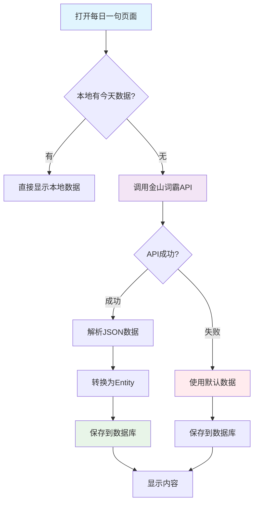

# 金山词霸API集成完成总结

## 📋 项目概述

**实施日期**: 2025年10月9日  
**功能模块**: 每日一句 - 金山词霸API集成  
**API来源**: 金山词霸开放API (http://open.iciba.com/dsapi/)

---

## ✅ 完成的功能

### 1. 添加网络依赖

在 `app/build.gradle.kts` 中添加了：

```kotlin
// Retrofit 网络请求框架
implementation("com.squareup.retrofit2:retrofit:2.9.0")
implementation("com.squareup.retrofit2:converter-gson:2.9.0")
implementation("com.squareup.okhttp3:logging-interceptor:4.11.0")
```

### 2. 创建数据模型

**文件**: `app/src/main/java/com/example/mybighomework/model/IcibaResponse.java`

包含字段：
- `sid` - 句子ID
- `content` - 英文句子
- `note` - 中文翻译
- `translation` - 出处/作者
- `tts` - 音频URL
- `picture` - 图片URL
- `dateline` - 日期

### 3. 创建API服务接口

**文件**: `app/src/main/java/com/example/mybighomework/api/DailySentenceApiService.java`

```java
public interface DailySentenceApiService {
    @GET("dsapi/")
    Call<IcibaResponse> getDailySentence();
}
```

### 4. 创建Retrofit客户端

**文件**: `app/src/main/java/com/example/mybighomework/network/RetrofitClient.java`

特性：
- ✅ 单例模式
- ✅ 日志拦截器
- ✅ 30秒超时
- ✅ 自动重试

### 5. 扩展数据库实体

**文件**: `app/src/main/java/com/example/mybighomework/database/entity/DailySentenceEntity.java`

新增字段：
- `audioUrl` - 音频URL
- `imageUrl` - 图片URL
- `sid` - 句子ID

### 6. 数据库迁移

**文件**: `app/src/main/java/com/example/mybighomework/database/AppDatabase.java`

- 版本号: 9 → 10
- 添加迁移脚本 `MIGRATION_9_10`
- 自动添加新字段

### 7. 优化Repository逻辑

**文件**: `app/src/main/java/com/example/mybighomework/repository/DailySentenceRepository.java`

新增方法：
- `fetchTodaySentenceFromApi()` - 从API获取数据
- `convertApiResponseToEntity()` - 数据转换
- `useFallbackData()` - 降级策略

### 8. 配置网络权限

**文件**: 
- `app/src/main/AndroidManifest.xml` - 添加明文流量配置
- `app/src/main/res/xml/network_security_config.xml` - 网络安全配置

---

## 🔄 数据流程



---

## 📊 API响应示例

```json
{
  "sid": "3802",
  "tts": "http://news.iciba.com/admin/tts/2021-01-20-day.mp3",
  "content": "Life is like riding a bicycle. To keep your balance you must keep moving.",
  "note": "生活就像骑自行车，想保持平衡就得往前走。",
  "translation": "《给爱因斯坦的信》",
  "picture": "http://cdn.iciba.com/news/word/2021-01-20.jpg",
  "dateline": "2021-01-20"
}
```

---

## 🎯 核心特性

### 1. 智能缓存

- ✅ 优先从本地数据库读取
- ✅ 每天只请求一次API
- ✅ 避免重复请求

### 2. 降级策略

- ✅ API失败时使用默认数据
- ✅ 网络异常时自动降级
- ✅ 保证功能可用性

### 3. 数据持久化

- ✅ API数据自动保存
- ✅ 支持离线访问
- ✅ 历史记录完整

### 4. 扩展字段

- ✅ 音频URL（支持朗读）
- ✅ 图片URL（支持配图）
- ✅ 句子ID（唯一标识）

---

## 📁 文件清单

### 新增文件

| 文件路径 | 说明 |
|---------|------|
| `model/IcibaResponse.java` | API响应模型 |
| `api/DailySentenceApiService.java` | API服务接口 |
| `network/RetrofitClient.java` | 网络客户端 |
| `res/xml/network_security_config.xml` | 网络安全配置 |

### 修改文件

| 文件路径 | 修改内容 |
|---------|---------|
| `build.gradle.kts` | 添加Retrofit依赖 |
| `database/entity/DailySentenceEntity.java` | 添加3个新字段 |
| `database/AppDatabase.java` | 版本升级+迁移脚本 |
| `repository/DailySentenceRepository.java` | 添加API请求逻辑 |
| `AndroidManifest.xml` | 配置明文流量 |

---

## 🔧 配置说明

### 1. 网络配置

```xml
<!-- AndroidManifest.xml -->
<application
    android:usesCleartextTraffic="true"
    android:networkSecurityConfig="@xml/network_security_config">
```

### 2. 安全配置

```xml
<!-- network_security_config.xml -->
<domain-config cleartextTrafficPermitted="true">
    <domain includeSubdomains="true">open.iciba.com</domain>
</domain-config>
```

### 3. Retrofit配置

```java
Retrofit retrofit = new Retrofit.Builder()
    .baseUrl("http://open.iciba.com/")
    .addConverterFactory(GsonConverterFactory.create())
    .build();
```

---

## 📝 使用方法

### 1. 获取今日一句

```java
DailySentenceRepository repository = new DailySentenceRepository(context);

repository.getTodaySentence(sentence -> {
    // 自动判断：本地有数据直接返回，无数据则从API获取
    String english = sentence.getEnglishText();
    String chinese = sentence.getChineseText();
    String audioUrl = sentence.getAudioUrl();
    String imageUrl = sentence.getImageUrl();
});
```

### 2. 强制从API获取

```java
repository.fetchTodaySentenceFromApi(sentence -> {
    // 总是从API获取最新数据
});
```

---

## ⚠️ 注意事项

### 1. 网络环境

- ✅ API使用HTTP协议，需要配置明文流量
- ✅ 确保设备联网
- ✅ 首次使用需要网络

### 2. 数据库迁移

- ✅ 自动迁移，无需手动操作
- ✅ 旧数据保留
- ✅ 新字段默认为null

### 3. 错误处理

- ✅ API失败自动降级
- ✅ 网络异常有日志
- ✅ 用户体验不受影响

---

## 🚀 后续优化建议

### 1. 音频播放功能

```java
// 可以使用MediaPlayer播放音频
MediaPlayer mediaPlayer = new MediaPlayer();
mediaPlayer.setDataSource(sentence.getAudioUrl());
mediaPlayer.prepare();
mediaPlayer.start();
```

### 2. 图片加载

```java
// 可以使用Glide或Picasso加载图片
Glide.with(context)
    .load(sentence.getImageUrl())
    .into(imageView);
```

### 3. 词汇解析增强

```java
// 可以使用NLP工具自动提取关键词
// 或调用词典API获取详细释义
```

### 4. 定时刷新

```java
// 可以使用WorkManager每天自动更新
WorkManager.getInstance(context)
    .enqueueUniquePeriodicWork(
        "daily_sentence_sync",
        ExistingPeriodicWorkPolicy.KEEP,
        new PeriodicWorkRequest.Builder(
            DailySentenceSyncWorker.class,
            1, TimeUnit.DAYS
        ).build()
    );
```

---

## 📊 测试验证

### 测试清单

- [ ] 首次打开页面，验证API请求
- [ ] 查看日志，确认数据保存
- [ ] 第二次打开，验证本地缓存
- [ ] 断网测试，验证降级策略
- [ ] 查看数据库，确认新字段
- [ ] 测试音频URL是否有效
- [ ] 测试图片URL是否有效

### 日志关键字

```
DailySentenceRepo: 本地没有今日句子，从API获取...
DailySentenceRepo: API请求成功
DailySentenceRepo: 成功保存到数据库
DailySentenceRepo: 从本地数据库获取今日句子
```

---

## ✨ 总结

### 已完成

✅ Retrofit网络框架集成  
✅ 金山词霸API对接  
✅ 数据模型创建  
✅ 数据库扩展  
✅ 智能缓存机制  
✅ 降级容错策略  
✅ 网络权限配置  

### 功能增强

- 从本地预设数据 → 在线实时数据
- 固定内容 → 每日更新
- 无音频 → 支持朗读
- 无配图 → 支持图片

### 技术亮点

- 🎯 单例模式管理网络客户端
- 🔄 本地+在线双层缓存
- 🛡️ 完善的降级容错
- 📊 清晰的数据流转
- 🔧 便捷的扩展接口

---

**集成完成！** 现在每日一句功能可以从金山词霸API获取真实的每日英语句子了！ 🎉

