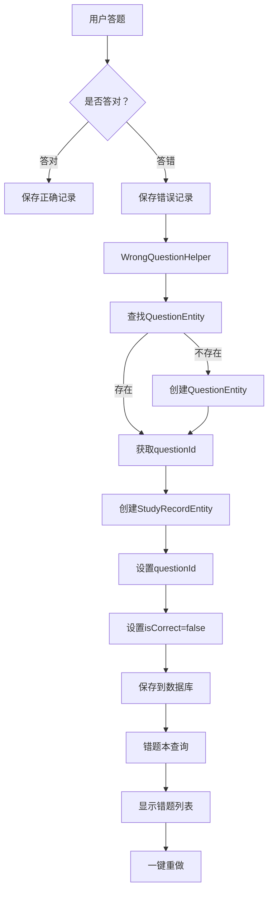

# 错题本保存功能修复说明

## 🐛 问题描述

用户反馈**无法正常保存错题**到错题本。

## 🔍 问题原因

经过排查，发现以下问题：

1. **VocabularyActivity**：只在训练结束时保存一条总结记录（questionId=0），没有保存每道题的答题记录
2. **ExamPracticeActivity**：完全没有保存StudyRecordEntity记录
3. **MockExamActivity**：完全没有保存StudyRecordEntity记录

**核心问题**：错题本查询的是StudyRecordEntity表中`isCorrect=false`且`questionId>0`的记录，但这三个Activity都没有正确保存这些记录。

## ✅ 修复方案

### 1. 创建WrongQuestionHelper辅助类

**文件**：`utils/WrongQuestionHelper.java`

**功能**：
- 统一处理错题记录的保存逻辑
- 自动查找或创建QuestionEntity
- 保存StudyRecordEntity到数据库
- 更新题目统计信息

**核心方法**：
```java
public void saveQuestionRecord(
    String questionText,      // 题目文本
    String[] options,         // 选项数组
    int correctAnswer,        // 正确答案
    int userAnswer,           // 用户答案
    String explanation,       // 解析
    String studyType,         // 学习类型
    String category,          // 题目分类
    String sessionId          // 会话ID
)
```

### 2. 修改VocabularyActivity

**变更内容**：
1. 导入必要的类
   - `QuestionEntity`
   - `QuestionDao`
   - `StudyRecordDao`
   - `UUID`

2. 添加成员变量
   ```java
   private QuestionDao questionDao;
   private StudyRecordDao studyRecordDao;
   private String sessionId;
   ```

3. 在`initDatabase()`方法中初始化
   ```java
   questionDao = database.questionDao();
   studyRecordDao = database.studyRecordDao();
   sessionId = UUID.randomUUID().toString();
   ```

4. 在`selectOption()`方法中添加
   ```java
   // 保存答题记录到StudyRecordEntity（用于错题本）
   saveQuestionRecord(currentItem, selectedOption, isCorrect);
   ```

5. 添加两个新方法
   - `saveQuestionRecord()` - 保存每道题的答题记录
   - `findOrCreateQuestion()` - 查找或创建QuestionEntity

**保存逻辑**：
- 每答一道题就立即保存StudyRecordEntity
- 如果题目不存在则创建QuestionEntity
- 关联questionId到StudyRecordEntity
- 更新题目统计信息

### 3. 修改ExamPracticeActivity

**变更内容**：
1. 导入WrongQuestionHelper和相关类

2. 添加成员变量
   ```java
   private WrongQuestionHelper wrongQuestionHelper;
   private String sessionId;
   ```

3. 添加`initDatabase()`方法
   ```java
   private void initDatabase() {
       AppDatabase database = AppDatabase.getInstance(getApplication());
       QuestionDao questionDao = database.questionDao();
       StudyRecordDao studyRecordDao = database.studyRecordDao();
       wrongQuestionHelper = new WrongQuestionHelper(questionDao, studyRecordDao);
       sessionId = UUID.randomUUID().toString();
   }
   ```

4. 在`selectOption()`方法中添加
   ```java
   // 保存答题记录（用于错题本）
   saveQuestionRecord(currentQuestion, selectedOption, isCorrect);
   ```

5. 添加`saveQuestionRecord()`方法

### 4. 修改MockExamActivity

**变更内容**：与ExamPracticeActivity类似

- 添加WrongQuestionHelper支持
- 初始化数据库连接
- 在每次答题时保存记录
- 支持按category分类保存

## 📊 修复效果

### 修复前
```
词汇训练 → 答错题目 → ❌ 未保存到错题本
真题练习 → 答错题目 → ❌ 未保存到错题本
模拟考试 → 答错题目 → ❌ 未保存到错题本
```

### 修复后
```
词汇训练 → 答错题目 → ✅ 自动保存到错题本（category="词汇"）
真题练习 → 答错题目 → ✅ 自动保存到错题本（category="语法"）
模拟考试 → 答错题目 → ✅ 自动保存到错题本（category按题目分类）
```

## 🗂️ 数据库记录示例

### StudyRecordEntity 记录
```
id: 1
questionId: 101                  ← 关联的题目ID
studyType: "词汇训练"
sessionId: "uuid-xxx"
userAnswer: 2                    ← 用户选择的答案
correctAnswer: 0                 ← 正确答案
isCorrect: false                 ← 答错了！
studyDate: 2025-10-02
examType: "词汇"
category: "词汇"                 ← 用于分类筛选
difficulty: "中等"
```

### QuestionEntity 记录
```
id: 101
questionText: "abandon 的正确含义是？"
options: ["放弃", "接受", "拥抱", "延续"]
correctAnswer: 0
explanation: "正确答案：放弃..."
category: "词汇"
examType: "词汇"
totalAttempts: 1
correctAttempts: 0
accuracyRate: 0.0
```

## 🔄 数据流程图



## 🧪 测试方法

### 1. 测试词汇训练错题记录
```
1. 进入词汇训练
2. 故意答错2-3道题
3. 打开错题本
4. 检查是否能看到刚才答错的题目
5. 检查题目是否显示category="词汇"
```

### 2. 测试真题练习错题记录
```
1. 进入真题练习
2. 故意答错2-3道题
3. 打开错题本
4. 检查是否能看到刚才答错的题目
5. 筛选"语法"分类，检查题目是否出现
```

### 3. 测试模拟考试错题记录
```
1. 进入模拟考试
2. 答题时故意答错几道不同类型的题
3. 完成或退出考试
4. 打开错题本
5. 检查各分类是否都能看到对应的错题
```

### 4. 测试错题练习功能
```
1. 打开错题本
2. 点击"错题练习"按钮
3. 重新答题
4. 检查答对的题目是否标记为"已掌握"
5. 检查统计信息是否更新
```

## ⚠️ 注意事项

### 1. 数据库初始化
首次使用时需要清理缓存或卸载重装，确保数据库结构正确。

### 2. 题目去重
`WrongQuestionHelper`会自动检查题目是否已存在：
- 通过题目文本匹配
- 避免重复创建QuestionEntity
- 同一题目多次答错会累计错误次数

### 3. sessionId
- 每次练习生成唯一的sessionId
- 用于区分不同的学习会话
- 方便后续分析学习轨迹

### 4. 分类说明
- **词汇训练**：category固定为"词汇"
- **真题练习**：category固定为"语法"（可扩展）
- **模拟考试**：category根据题目类型设置（词汇/语法/阅读）

## 📈 性能优化

### 1. 异步保存
所有数据库操作都在后台线程执行，不会阻塞UI：
```java
new Thread(() -> {
    // 数据库操作
    wrongQuestionHelper.saveQuestionRecord(...);
}).start();
```

### 2. 批量查询
- 使用索引加速查询
- 按questionId、category、studyDate建立索引
- 提高错题本加载速度

### 3. 缓存机制
- QuestionEntity查找使用模糊匹配
- 减少不必要的数据库写入
- 复用已有的题目记录

## 🎉 修复完成

现在所有三个练习模块都能正确保存错题记录：

✅ **词汇训练** - 自动记录每道错题
✅ **真题练习** - 自动记录每道错题  
✅ **模拟考试** - 自动记录每道错题
✅ **错题本** - 正确显示所有错题
✅ **错题练习** - 支持一键重做
✅ **数据统计** - 实时更新错题数据

用户现在可以完整地使用错题本功能了！

