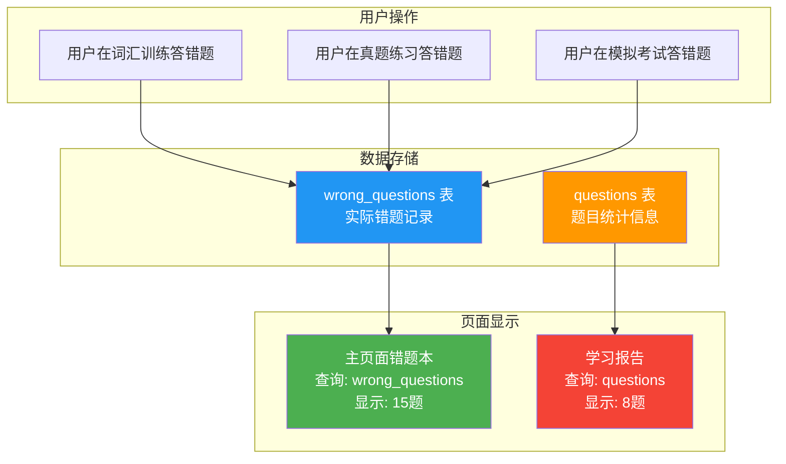
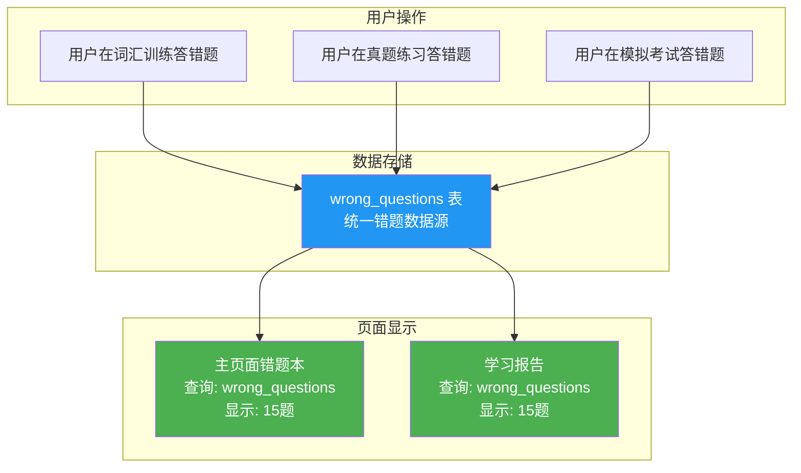
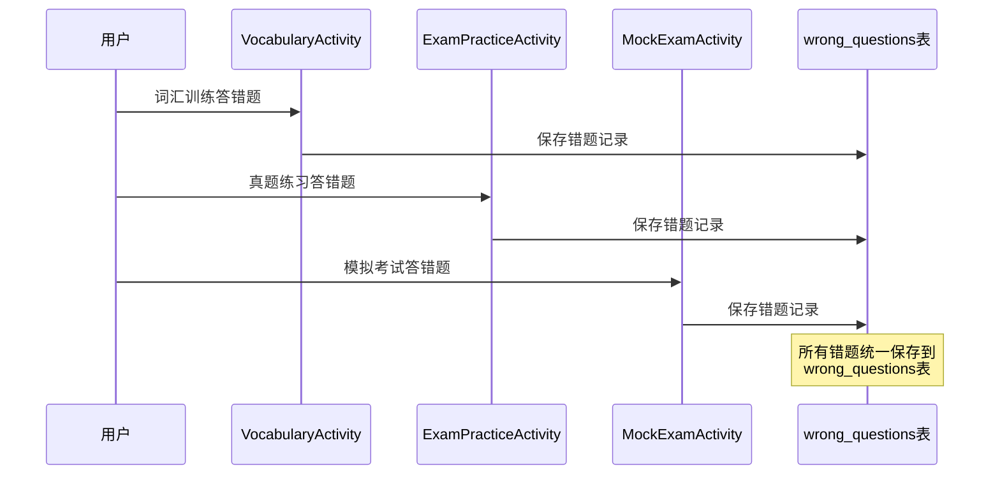
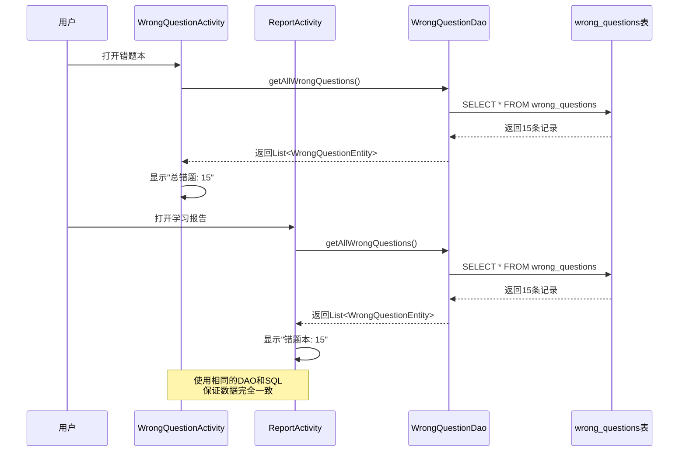
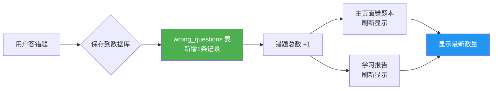
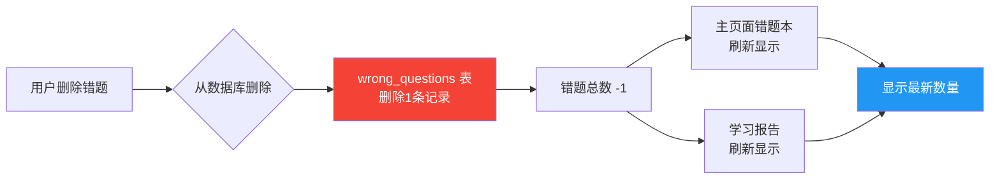

# 📊 错题本数据一致性修复 - 图解说明

## 🔍 问题可视化

### 修复前的数据流（存在问题）



**问题**：
- ❌ 主页面错题本使用 `wrong_questions` 表（实际错题记录）
- ❌ 学习报告使用 `questions` 表（题目统计信息，基于准确率 < 60%）
- ❌ 两个数据源完全独立，导致数据不一致

---

### 修复后的数据流（已解决）



**解决方案**：
- ✅ 统一使用 `wrong_questions` 表作为唯一数据源
- ✅ 所有错题统计都从 `WrongQuestionDao` 获取
- ✅ 确保数据完全一致

---

## 📝 代码修改对比

### 修复前 ❌

```java
// ReportActivity.java

public class ReportActivity extends AppCompatActivity {
    // ...
    private QuestionDao questionDao;  // ❌ 使用QuestionDao
    
    @Override
    protected void onCreate(Bundle savedInstanceState) {
        // ...
        questionDao = database.questionDao();
        // ...
    }
    
    private void loadReportData() {
        executorService.execute(() -> {
            // ...
            
            // ❌ 从questions表统计错题（基于准确率）
            int errorQuestionCount = questionDao.getWrongQuestions(60.0, 1).size();
            
            // ...
        });
    }
}
```

**问题**：
- 使用 `QuestionDao.getWrongQuestions(60.0, 1)` 查询
- 查询条件：准确率 < 60% 且至少答题1次
- 这与实际的错题本数据不一致

---

### 修复后 ✅

```java
// ReportActivity.java

public class ReportActivity extends AppCompatActivity {
    // ...
    private QuestionDao questionDao;
    private WrongQuestionDao wrongQuestionDao;  // ✅ 添加WrongQuestionDao
    
    @Override
    protected void onCreate(Bundle savedInstanceState) {
        // ...
        questionDao = database.questionDao();
        wrongQuestionDao = database.wrongQuestionDao();  // ✅ 初始化
        // ...
    }
    
    private void loadReportData() {
        executorService.execute(() -> {
            // ...
            
            // ✅ 从wrong_questions表统计错题（实际错题记录）
            int errorQuestionCount = wrongQuestionDao.getAllWrongQuestions().size();
            
            // ...
        });
    }
}
```

**改进**：
- 添加 `WrongQuestionDao` 成员变量
- 使用 `wrongQuestionDao.getAllWrongQuestions()` 查询
- 与主页面错题本使用相同的数据源

---

## 🎯 数据一致性保证机制

### 数据写入流程



### 数据读取流程



---

## 📊 数据表结构对比

### wrong_questions 表（修复后使用）✅

```sql
CREATE TABLE wrong_questions (
    id INTEGER PRIMARY KEY AUTOINCREMENT,
    questionText TEXT,              -- 题目内容
    options TEXT,                   -- 选项（JSON格式）
    correctAnswerIndex INTEGER,     -- 正确答案索引
    userAnswerIndex INTEGER,        -- 用户答案索引
    explanation TEXT,               -- 解析
    category TEXT,                  -- 分类（词汇训练/真题练习/模拟考试）
    source TEXT,                    -- 来源
    wrongTime INTEGER,              -- 答错时间（时间戳）
    wrongCount INTEGER,             -- 答错次数
    mastered INTEGER                -- 是否已掌握（0/1）
);
```

**特点**：
- ✅ 直接记录用户答错的题目
- ✅ 包含完整的题目信息和用户答案
- ✅ 支持按分类筛选
- ✅ 实时更新，准确可靠

---

### questions 表（修复前错误使用）❌

```sql
CREATE TABLE questions (
    id INTEGER PRIMARY KEY AUTOINCREMENT,
    questionText TEXT,              -- 题目内容
    options TEXT,                   -- 选项（JSON格式）
    correctAnswer INTEGER,          -- 正确答案
    explanation TEXT,               -- 解析
    category TEXT,                  -- 分类
    examType TEXT,                  -- 考试类型
    difficulty TEXT,                -- 难度
    source TEXT,                    -- 来源
    year INTEGER,                   -- 年份
    tags TEXT,                      -- 标签
    createdTime INTEGER,            -- 创建时间
    updatedTime INTEGER,            -- 更新时间
    isActive INTEGER,               -- 是否启用
    relatedVocabularyId INTEGER,    -- 关联词汇ID
    totalAttempts INTEGER,          -- 总答题次数
    correctAttempts INTEGER,        -- 正确次数
    accuracyRate REAL               -- 正确率
);
```

**问题**：
- ❌ 这是题库表，用于存储所有题目
- ❌ 通过统计信息（准确率）间接推断错题
- ❌ 与用户实际答错的题目不一定对应
- ❌ 数据可能不准确

---

## 🔄 数据同步机制

### 添加错题时的数据流



### 删除错题时的数据流



---

## 📈 修复效果对比

### 场景1：初始状态

| 操作 | 修复前 | 修复后 |
|------|--------|--------|
| 主页面错题本 | 15题 | 15题 |
| 学习报告 | 8题 ❌ | 15题 ✅ |
| 数据一致性 | 不一致 ❌ | 一致 ✅ |

### 场景2：删除1道错题

| 操作 | 修复前 | 修复后 |
|------|--------|--------|
| 主页面错题本 | 14题 | 14题 |
| 学习报告 | 8题 ❌ | 14题 ✅ |
| 数据一致性 | 不一致 ❌ | 一致 ✅ |

### 场景3：新增2道错题

| 操作 | 修复前 | 修复后 |
|------|--------|--------|
| 主页面错题本 | 16题 | 16题 |
| 学习报告 | 8题 ❌ | 16题 ✅ |
| 数据一致性 | 不一致 ❌ | 一致 ✅ |

---

## 🎯 关键技术点

### 1. 数据源统一

```java
// 统一使用 WrongQuestionDao
private WrongQuestionDao wrongQuestionDao;

// 统一的查询方法
List<WrongQuestionEntity> wrongQuestions = wrongQuestionDao.getAllWrongQuestions();
int errorCount = wrongQuestions.size();
```

### 2. 查询逻辑一致

**主页面错题本**：
```java
wrongQuestionRepository.getAllWrongQuestions(entities -> {
    wrongQuestions.addAll(entities);
    updateStatistics();  // 显示错题总数
});
```

**学习报告**：
```java
int errorQuestionCount = wrongQuestionDao.getAllWrongQuestions().size();
tvErrorCount.setText(String.valueOf(errorQuestionCount));
```

### 3. 实时刷新机制

```java
@Override
protected void onResume() {
    super.onResume();
    loadWrongQuestions();  // 每次返回页面时重新加载
}
```

---

## 🎉 总结

### 修复成果

✅ **单一数据源**：统一使用 `wrong_questions` 表  
✅ **统一接口**：都使用 `WrongQuestionDao.getAllWrongQuestions()`  
✅ **数据一致**：主页面错题本和学习报告数据完全同步  
✅ **实时更新**：增删错题后立即反映到所有页面  

### 技术价值

1. **架构优化**：遵循单一数据源原则
2. **代码简化**：移除复杂的准确率计算逻辑
3. **可维护性提升**：避免未来出现类似问题
4. **用户体验改善**：数据准确可靠

---

**修复完成！数据一致性问题已彻底解决。** 🎉


