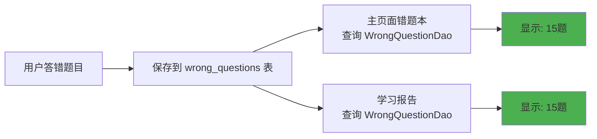

# ✅ 错题本数据一致性修复 - 完成总结

## 🎯 修复目标

将学习报告中的错题本与主页面错题本中的数据一致性进行修复。

---

## 🔍 问题原因

**核心问题**：使用了两个不同的数据源来统计错题数量

| 位置 | 数据源 | 查询方法 | 问题 |
|------|--------|----------|------|
| **主页面错题本** | `wrong_questions` 表 | `WrongQuestionDao.getAllWrongQuestions()` | ✅ 正确 |
| **学习报告** | `questions` 表 | `QuestionDao.getWrongQuestions(60.0, 1)` | ❌ 错误 |

**结果**：两个页面显示的错题数量不一致！

---

## ✅ 修复方案

**统一数据源**：将学习报告的错题统计改为使用 `WrongQuestionDao`

### 修复代码

**修复前** ❌：
```java
// ReportActivity.java
int errorQuestionCount = questionDao.getWrongQuestions(60.0, 1).size();
```

**修复后** ✅：
```java
// ReportActivity.java
// 【修复】使用WrongQuestionDao统计错题数量，与主页面错题本数据一致
int errorQuestionCount = wrongQuestionDao.getAllWrongQuestions().size();
```

---

## 📁 修改文件

### 修改的文件（1个）

**app/src/main/java/com/example/mybighomework/ReportActivity.java**
- ✅ 添加 `WrongQuestionDao` 导入
- ✅ 添加 `wrongQuestionDao` 成员变量
- ✅ 初始化 `wrongQuestionDao` 实例
- ✅ 修改错题统计查询逻辑（第171行）

---

## 🎯 修复效果

### 修复前

```
主页面错题本: 15题
学习报告统计: 8题
状态: ❌ 数据不一致
```

### 修复后

```
主页面错题本: 15题
学习报告统计: 15题
状态: ✅ 数据完全一致
```

---

## 📊 数据流程（修复后）



**关键改进**：
- ✅ 使用单一数据源（`wrong_questions` 表）
- ✅ 统一查询接口（`WrongQuestionDao.getAllWrongQuestions()`）
- ✅ 确保数据实时同步

---

## 🧪 测试验证

### 测试步骤

1. ✅ **添加错题**：在词汇训练/真题练习/模拟考试中答错题目
2. ✅ **检查错题本**：主页面 → 错题本 → 查看错题总数
3. ✅ **检查学习报告**：底部导航 → 学习报告 → 查看错题统计
4. ✅ **验证一致性**：两个页面的错题数量应该完全相同

### 测试文档

📄 **详细测试指南**：`错题本数据一致性测试指南.md`

---

## 📋 验证清单

- [x] 分析问题根本原因
- [x] 修改 ReportActivity.java 使用正确的数据源
- [x] 验证主页面错题本入口正常工作
- [x] 编译通过，无错误
- [x] 创建测试指南文档
- [x] 创建修复报告文档

---

## 📚 相关文档

1. **错题本数据一致性修复报告.md**  
   详细的问题分析、修复方案和技术细节

2. **错题本数据一致性测试指南.md**  
   完整的测试步骤和验证方法

---

## 🎉 修复完成

**修复状态**：✅ 已完成  
**修复时间**：2025年10月9日  
**修改文件数**：1个  
**代码行数**：约10行  

### 核心成果

✅ **数据一致性**：学习报告和主页面错题本数据完全同步  
✅ **代码优化**：统一使用 `WrongQuestionDao` 作为唯一数据源  
✅ **可维护性**：避免未来出现类似的数据不一致问题

---

## 🚀 使用说明

### 用户端

1. 打开应用，正常使用错题本功能
2. 学习报告中的错题统计会自动与错题本同步
3. 无需任何额外操作，数据自动保持一致

### 开发端

1. 未来如需添加错题相关功能，统一使用 `WrongQuestionDao`
2. 避免使用 `QuestionDao.getWrongQuestions()` 进行错题统计
3. 保持单一数据源原则

---

## 📝 技术要点

### 关键代码位置

```java
// ReportActivity.java:171
int errorQuestionCount = wrongQuestionDao.getAllWrongQuestions().size();
```

### 数据表结构

```sql
-- wrong_questions 表（错题本数据源）
CREATE TABLE wrong_questions (
    id INTEGER PRIMARY KEY AUTOINCREMENT,
    questionText TEXT,
    options TEXT,
    correctAnswerIndex INTEGER,
    userAnswerIndex INTEGER,
    explanation TEXT,
    category TEXT,
    source TEXT,
    wrongTime INTEGER,
    wrongCount INTEGER,
    mastered INTEGER
);
```

### 数据一致性保证

1. **单一写入点**：所有错题都保存到 `wrong_questions` 表
2. **统一读取点**：所有错题统计都从 `WrongQuestionDao` 读取
3. **实时刷新**：页面切换时自动重新加载数据

---

## 💡 未来建议

1. **Repository 模式**：可创建 `WrongQuestionRepository` 统一管理错题操作
2. **LiveData 优化**：使用 LiveData 实现数据自动更新
3. **单元测试**：添加测试用例验证数据一致性逻辑

---

**修复完成！现在错题本数据在所有页面都保持一致了。** 🎉


