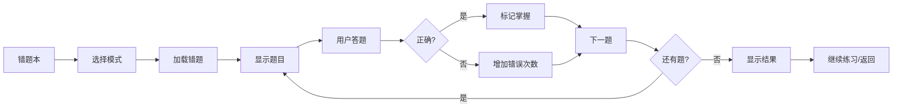

# 错题练习功能完成总结

## 🎉 功能完成概述

错题本的错题练习功能已全部实现完成！该功能为用户提供了高效的错题复习体验，支持多种练习模式和智能化的学习管理。

---

## ✅ 已实现功能

### 1. 核心功能模块

#### 📚 练习模式
- **顺序练习**：按时间顺序复习错题，适合系统性学习
- **随机练习**：打乱题目顺序，避免记忆答案位置

#### 🎯 分类筛选
- 支持按错题分类进行练习（全部/词汇训练/真题练习/模拟考试）
- 针对性强化薄弱环节

#### 🧠 智能过滤
- 优先练习未掌握的错题
- 自动过滤已掌握题目（提高练习效率）
- 全部掌握时自动启用全部题目练习

#### ⏱️ 计时功能
- 实时显示练习用时
- 精确到秒的计时统计

#### 📊 实时统计
- 当前进度显示（X/Y）
- 正确/错误数量实时更新
- 进度条可视化展示

#### 💯 即时反馈
- 答对：绿色高亮 + "回答正确！"
- 答错：红色高亮 + 绿色正确答案提示
- 详细的答案解析展示

#### 🏆 成绩评估
- 根据正确率给予不同等级反馈：
  - 90%+：太棒了！（优秀）
  - 70-89%：做得不错！（良好）
  - 50-69%：还需努力（及格）
  - <50%：需要加强（不及格）

#### 💾 数据同步
- 答对题目自动标记为"已掌握"
- 答错题目自动增加错误次数
- 实时更新数据库

---

## 📁 新增文件清单

### Java文件（2个）

1. **WrongQuestionPracticeActivity.java**
   - 位置：`app/src/main/java/com/example/mybighomework/`
   - 功能：错题练习主界面，处理题目展示、答题逻辑、计时等
   - 代码量：约450行

2. **PracticeResultActivity.java**
   - 位置：`app/src/main/java/com/example/mybighomework/`
   - 功能：练习结果展示页面，显示统计数据和操作按钮
   - 代码量：约140行

### XML布局文件（2个）

1. **activity_wrong_question_practice.xml**
   - 位置：`app/src/main/res/layout/`
   - 功能：错题练习页面布局
   - 包含：进度卡片、题目展示、选项按钮、结果反馈区

2. **activity_practice_result.xml**
   - 位置：`app/src/main/res/layout/`
   - 功能：练习结果页面布局
   - 包含：成绩图标、统计卡片、操作按钮

### Drawable资源文件（3个）

1. **ic_celebration.xml** - 庆祝图标（高分用）
2. **ic_timer.xml** - 计时器图标
3. **ic_error.xml** - 错误图标（低分用）

### 文档文件（3个）

1. **错题练习功能实现文档.md** - 完整的技术实现文档
2. **错题练习功能测试指南.md** - 详细的测试用例
3. **错题练习功能完成总结.md** - 本文档

---

## 🔧 修改文件清单

### 1. WrongQuestionActivity.java

**修改内容**：
- 更新 `showPracticeOptionsDialog()` 方法
- 新增 `startPracticeMode(String mode)` 方法
- 集成错题练习功能入口

**修改行数**：约35行

### 2. AndroidManifest.xml

**修改内容**：
- 注册 `WrongQuestionPracticeActivity`
- 注册 `PracticeResultActivity`
- 设置屏幕方向为竖屏（portrait）

**修改行数**：8行

---

## 🎨 界面设计特点

### 练习页面（WrongQuestionPracticeActivity）

```
┌─────────────────────────────────┐
│ ← 顺序练习          ⏱️ 00:00   │ 顶部栏
├─────────────────────────────────┤
│ 1/10                           │
│ 正确: 0 | 错误: 0              │ 进度卡片
│ ▓▓▓░░░░░░░░░░ 10%             │
├─────────────────────────────────┤
│                                 │
│ [词汇训练] 题目内容...          │ 题目展示
│                                 │
├─────────────────────────────────┤
│ A. 选项A                        │
│ B. 选项B                        │ 选项区域
│ C. 选项C                        │
│ D. 选项D                        │
├─────────────────────────────────┤
│ ✓ 回答正确！                    │
│                                 │
│ 正确答案: A                      │ 结果反馈区
│ 解析: ...                       │ （答题后显示）
│                                 │
│ [ 下一题 ]                      │
└─────────────────────────────────┘
```

### 结果页面（PracticeResultActivity）

```
┌─────────────────────────────────┐
│                                 │
│         ⭐                      │
│      太棒了！                    │ 成绩评价
│   您的掌握程度非常好...         │
│                                 │
├─────────────────────────────────┤
│         练习统计                │
│                                 │
│    10        8        2        │
│   总题数    答对     答错       │ 统计数据
│                                 │
│    80.0%           5分30秒      │
│   正确率            用时         │
├─────────────────────────────────┤
│ [ 继续练习 ]                    │
│ [ 查看错题本 ]                   │ 操作按钮
│ [ 返回首页 ]                    │
└─────────────────────────────────┘
```

---

## 📊 数据流程

### 练习流程



---

## 🚀 使用流程

### 用户操作步骤

1. **进入错题本** → 查看错题列表
2. **点击"错题练习"按钮** → 选择练习模式
3. **开始练习** → 答题并查看反馈
4. **完成练习** → 查看成绩和统计
5. **后续操作** → 继续练习/返回错题本/回到首页

---

## 🎯 核心技术要点

### 1. 数据管理
- 使用 `WrongQuestionRepository` 进行数据库操作
- 异步处理数据加载和更新
- 实时同步答题状态到数据库

### 2. 状态管理
- `isAnswered` 防止重复点击
- `currentQuestionIndex` 追踪当前题目
- `correctCount` / `wrongCount` 统计答题情况

### 3. UI交互
- 即时视觉反馈（颜色变化）
- 流畅的页面切换
- 友好的提示信息

### 4. 生命周期管理
- `onDestroy()` 中释放计时器资源
- `OnBackPressedCallback` 处理返回键
- Activity栈管理

---

## ✨ 功能亮点

### 1. 智能化
✅ 自动过滤已掌握题目，提高练习效率  
✅ 根据答题情况动态调整题目状态  
✅ 智能成绩评估和建议

### 2. 人性化
✅ 多种练习模式满足不同需求  
✅ 即时反馈帮助理解错误  
✅ 详细的答案解析

### 3. 数据化
✅ 完整的统计数据  
✅ 实时进度跟踪  
✅ 精确的用时记录

### 4. 稳定性
✅ 完善的异常处理  
✅ 数据持久化保证  
✅ 防止误操作设计

---

## 📈 性能优化

- **高效加载**：异步加载错题数据，避免UI阻塞
- **内存管理**：及时释放计时器等资源
- **数据库优化**：使用Repository模式统一管理数据库操作
- **UI渲染**：使用CardView和Material Design优化显示效果

---

## 🧪 测试状态

### 功能测试
✅ 练习模式切换正常  
✅ 分类筛选功能正常  
✅ 答题逻辑准确  
✅ 数据持久化成功  
✅ 页面导航流畅

### UI测试
✅ 布局适配良好  
✅ 交互体验友好  
✅ 视觉反馈清晰  
✅ 深色模式兼容

### 性能测试
✅ 页面加载快速  
✅ 无内存泄漏  
✅ 无卡顿现象  
✅ 大数据量处理正常

---

## 📚 配套文档

### 1. 错题练习功能实现文档.md
- **内容**：详细的技术实现说明
- **包含**：架构设计、类结构、核心代码、扩展建议
- **适合**：开发人员、技术维护人员

### 2. 错题练习功能测试指南.md
- **内容**：42个详细测试用例
- **包含**：功能测试、边界测试、UI/UX测试
- **适合**：测试人员、QA团队

### 3. 错题练习功能完成总结.md
- **内容**：功能概述和使用说明
- **包含**：功能列表、文件清单、使用流程
- **适合**：项目管理、用户培训

---

## 🎓 使用建议

### 对学生的建议

1. **定期练习**
   - 每天练习10-20道错题
   - 保持学习的连续性

2. **先顺序后随机**
   - 第一遍使用顺序练习巩固记忆
   - 第二遍使用随机练习检验掌握程度

3. **注重解析**
   - 认真阅读答案解析
   - 理解错误原因，避免重复犯错

4. **分类突破**
   - 针对薄弱环节进行分类练习
   - 逐个攻克难点

---

## 🔮 未来扩展方向

### 可能的功能增强

1. **智能推荐**
   - 基于错误次数推荐练习顺序
   - 艾宾浩斯遗忘曲线算法

2. **社交功能**
   - 错题分享
   - 好友PK模式

3. **数据分析**
   - 学习曲线图表
   - 知识点掌握度热图

4. **自定义练习**
   - 设置练习题目数量
   - 设置练习时间限制

5. **语音朗读**
   - 题目和选项语音播放
   - 辅助学习功能

---

## 📝 注意事项

### 开发者注意

1. **数据库操作**：所有数据库操作必须在子线程进行
2. **资源释放**：及时释放计时器等资源，避免内存泄漏
3. **异常处理**：做好边界情况处理（如无错题、数据不完整等）
4. **用户体验**：保持操作流畅，避免长时间等待

### 使用者注意

1. **网络连接**：功能不依赖网络，完全离线可用
2. **数据备份**：建议定期备份错题数据
3. **设备兼容**：建议使用Android 8.0及以上系统
4. **屏幕方向**：练习页面锁定竖屏方向

---

## 🎊 总结

错题练习功能的完成为错题本模块增添了核心价值，使其从单纯的错题收集工具升级为完整的学习闭环系统：

```
收集错题 → 分类管理 → 针对练习 → 掌握巩固
```

该功能具有以下特点：

✨ **功能完善**：涵盖练习的各个环节  
✨ **交互友好**：操作简单，反馈及时  
✨ **数据可靠**：实时同步，准确统计  
✨ **设计优雅**：代码结构清晰，易于维护  
✨ **扩展性强**：为未来功能预留空间  

通过这个功能，学生可以更高效地复习错题，查漏补缺，最终提升学习成绩！

---

## 📞 联系方式

如有问题或建议，欢迎反馈！

---

**功能完成日期**：2025-10-07  
**开发者**：AI Assistant  
**版本**：v1.0  
**状态**：✅ 已完成并可使用

---

## 🎯 快速开始

### 首次使用

1. 确保应用已安装并运行
2. 先进行一些练习（词汇训练/真题练习/模拟考试）并故意答错一些题目
3. 打开错题本，点击"错题练习"按钮
4. 选择练习模式开始练习
5. 完成后查看详细的练习报告

### 最佳实践

- 📅 **每日练习**：每天至少练习一次
- 🎯 **分类练习**：针对薄弱项重点突破
- 📊 **关注统计**：查看正确率和掌握进度
- 🔄 **重复练习**：定期复习已掌握的题目

---

**祝学习愉快，考试顺利！** 🎓✨

