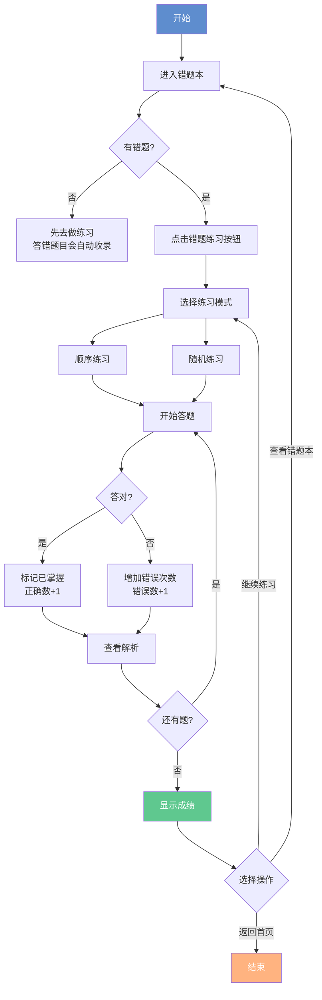

# 错题练习功能 - 快速使用指南 📖

## 🎯 功能简介

错题练习功能帮助你高效复习错题，提高学习效果。支持**顺序练习**和**随机练习**两种模式，还能按分类筛选错题进行针对性训练。

---

## 🚀 5步快速上手

### 步骤1️⃣：收集错题

```
进行练习 → 答错题目 → 自动收录到错题本
```

**支持的练习类型**：
- 📚 词汇训练
- 📝 真题练习  
- 📋 模拟考试

💡 **提示**：答错的题目会自动保存，无需手动操作！

---

### 步骤2️⃣：进入错题本

```
主页 → 点击"错题本"图标 → 查看错题列表
```

**你会看到**：
- 错题总数统计
- 已掌握题目数量
- 正确率显示
- 错题列表（可按分类筛选）

---

### 步骤3️⃣：开始练习

```
点击"错题练习"按钮 → 选择练习模式
```

**练习模式选择**：

| 模式 | 说明 | 适用场景 |
|-----|------|---------|
| 📋 顺序练习 | 按时间顺序练习 | 第一次复习，系统梳理 |
| 🔀 随机练习 | 打乱顺序练习 | 巩固记忆，检验掌握度 |

---

### 步骤4️⃣：答题练习

```
阅读题目 → 选择答案 → 查看反馈 → 下一题
```

**即时反馈**：
- ✅ **答对**：绿色显示，增加"已掌握"标记
- ❌ **答错**：红色显示，绿色标注正确答案，增加错误次数
- 📖 **解析**：查看详细的答案解析

**实时统计**：
- 当前进度（如 5/10）
- 正确/错误数量
- 用时记录（分:秒）

---

### 步骤5️⃣：查看成绩

```
完成练习 → 自动跳转结果页 → 查看统计和评价
```

**成绩评级**：

| 正确率 | 评级 | 图标 | 评价 |
|-------|------|------|------|
| ≥ 90% | ⭐ 优秀 | 🌟 | 太棒了！继续保持！ |
| 70-89% | 👍 良好 | ✅ | 做得不错！继续努力！ |
| 50-69% | 📝 及格 | ℹ️ | 还需努力，建议再次练习 |
| < 50% | 📛 不及格 | ⚠️ | 需要加强，重点复习 |

**统计数据**：
- 总题数、答对数、答错数
- 正确率百分比
- 练习用时

---

## 💡 高级技巧

### 技巧1：分类筛选练习

**步骤**：
1. 在错题本页面点击分类按钮（词汇训练/真题练习/模拟考试）
2. 点击"错题练习"
3. 只练习当前分类的错题

**适用场景**：
- 📚 只复习词汇类错题
- 📝 针对性强化语法知识
- 📋 专项突破阅读理解

---

### 技巧2：智能过滤

**系统会自动**：
- ✅ 优先显示**未掌握**的错题
- ✅ 过滤已标记为"已掌握"的题目
- ✅ 如果全部掌握，则练习所有错题

**好处**：提高练习效率，专注薄弱环节！

---

### 技巧3：重复练习

**建议**：
- 🔄 第1遍：顺序练习（巩固记忆）
- 🔀 第2遍：随机练习（检验掌握）
- 📊 第3遍：按错误次数多的题目重点练习

**目标**：直到所有题目都标记为"已掌握"！

---

## 📊 使用流程图



---

## 🎨 界面预览

### 错题本主页
```
┌─────────────────────────────────┐
│ ← 错题本                     🗑️ │
├─────────────────────────────────┤
│  20        5        25.0%       │
│ 错题总数  已掌握   正确率        │
├─────────────────────────────────┤
│ [全部] [词汇] [语法] [阅读]     │
├─────────────────────────────────┤
│ 📝 题目1...                     │
│ 📝 题目2...                     │
│ 📝 题目3...                     │
├─────────────────────────────────┤
│ [错题练习] [导出错题]            │
└─────────────────────────────────┘
```

### 练习页面
```
┌─────────────────────────────────┐
│ ← 顺序练习          ⏱️ 02:15   │
├─────────────────────────────────┤
│ 5/10   正确: 3 | 错误: 2        │
│ ▓▓▓▓▓░░░░░ 50%                 │
├─────────────────────────────────┤
│ [词汇训练] 下列哪个单词表示...  │
├─────────────────────────────────┤
│ A. abandon                      │
│ B. ability                      │
│ C. absence                      │
│ D. abstract                     │
├─────────────────────────────────┤
│ ✅ 回答正确！                    │
│ 正确答案: A                      │
│ 解析: abandon表示放弃...        │
│ [ 下一题 ]                      │
└─────────────────────────────────┘
```

### 结果页面
```
┌─────────────────────────────────┐
│           ⭐                    │
│         太棒了！                │
│   您的掌握程度非常好！          │
├─────────────────────────────────┤
│         练习统计                │
│                                 │
│   10       8       2      80%   │
│  总题数   答对    答错   正确率  │
│                                 │
│   ⏱️ 5分30秒                    │
├─────────────────────────────────┤
│      [ 继续练习 ]               │
│      [ 查看错题本 ]             │
│      [ 返回首页 ]               │
└─────────────────────────────────┘
```

---

## ❓ 常见问题

### Q1: 为什么我点击"错题练习"没反应？

**A**: 可能是因为：
- ❌ 当前筛选条件下没有错题
- ❌ 错题本是空的

**解决方法**：
1. 点击"全部"按钮查看所有错题
2. 先去做一些练习，答错题目会自动收录

---

### Q2: 答对的题目会消失吗？

**A**: 不会！
- ✅ 答对的题目会被标记为"已掌握"
- ✅ 仍然保留在错题本中
- ✅ 下次练习时会自动过滤（优先练习未掌握的）

---

### Q3: 如何查看已掌握的题目？

**A**: 
- 在错题本主页可以看到"已掌握"数量统计
- 题目列表中已掌握的题目会有特殊标记
- 如果想再次练习，系统会在所有题目都掌握时自动启用全部题目

---

### Q4: 可以暂停练习吗？

**A**: 
- 可以点击返回键退出练习
- ⚠️ 系统会提示"当前进度将会丢失"
- 建议完成当前轮次的练习以保存进度

---

### Q5: 练习记录会保存吗？

**A**: 
- ✅ 每次答题的结果都会实时保存到数据库
- ✅ 错题的掌握状态会更新
- ✅ 错误次数会累计记录

---

## 📅 学习建议

### 每日学习计划

**初级阶段**（错题较多）：
- 🌅 早上：练习10-15道错题
- 🌙 晚上：复习当天答错的题目
- 📊 每周：查看掌握进度

**巩固阶段**（错题较少）：
- 🔄 每天：练习5-10道未掌握题目
- 📝 定期：用随机模式检验记忆
- 🎯 目标：所有题目达到"已掌握"

---

## 🎯 练习策略

### 策略一：分类突破

```
第1周：专注词汇类错题
第2周：专注语法类错题  
第3周：专注阅读类错题
第4周：混合随机练习
```

### 策略二：递进式练习

```
第1遍：顺序练习，熟悉题目
第2遍：随机练习，检验记忆
第3遍：重点练习错误次数多的
```

### 策略三：正确率目标

```
目标1：达到60%正确率
目标2：达到80%正确率
目标3：达到95%正确率
最终目标：所有题目标记"已掌握"
```

---

## 🏆 成就系统

虽然当前版本还没有成就系统，但你可以给自己设定目标：

- 🥉 **铜牌**：连续练习7天
- 🥈 **银牌**：错题正确率达到80%
- 🥇 **金牌**：所有错题标记为"已掌握"
- 💎 **钻石**：连续30天坚持练习

---

## 💪 激励语录

> "错题是最好的老师，每一次错误都是成长的机会！"

> "重复是记忆之母，坚持练习就能看到进步！"

> "今天多掌握一道题，明天考试就多一分把握！"

---

## 📞 需要帮助？

如果在使用过程中遇到问题：

1. 📖 查看本文档的常见问题部分
2. 📝 查看《错题练习功能实现文档.md》了解技术细节
3. 🧪 查看《错题练习功能测试指南.md》了解测试用例
4. 📧 联系技术支持

---

## ✨ 温馨提示

- 💡 建议在WiFi环境下使用，虽然功能不需要网络
- 🔋 长时间练习注意手机电量
- 👀 注意保护视力，每练习30分钟休息一下
- 📱 建议使用竖屏模式以获得最佳体验

---

## 🎓 学习小贴士

1. **专注当下**：练习时关闭其他通知，专注于学习
2. **理解为主**：不要死记答案，重点理解解析
3. **定期复习**：已掌握的题目也要定期回顾
4. **查漏补缺**：针对薄弱环节重点突破
5. **坚持练习**：每天坚持，积少成多

---

## 🎉 开始你的错题练习之旅吧！

记住：每一道错题都是进步的阶梯，加油！💪

---

**版本**：v1.0  
**更新日期**：2025-10-07  
**适用平台**：Android 8.0+

---

**祝你学习愉快，考试顺利！** 🎓✨📚

