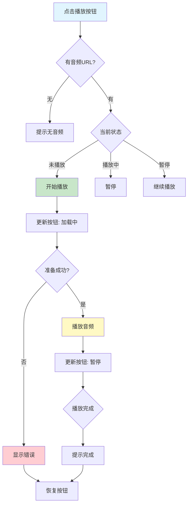

# 音频播放功能实现总结

## 📋 项目概述

**实施日期**: 2025年10月9日  
**功能模块**: 每日一句 - 音频播放功能  
**音频来源**: 金山词霸API提供的TTS音频

---

## ✅ 完成的功能

### 1. 创建音频播放管理器

**文件**: `app/src/main/java/com/example/mybighomework/utils/AudioPlayerManager.java`

核心功能：
- ✅ 播放/暂停/停止控制
- ✅ 播放状态管理
- ✅ 进度更新回调
- ✅ 错误处理
- ✅ 自动资源释放

### 2. 集成到每日一句页面

**文件**: `app/src/main/java/com/example/mybighomework/DailySentenceActivity.java`

新增功能：
- ✅ 点击播放按钮播放音频
- ✅ 实时更新按钮状态
- ✅ 播放/暂停/加载状态显示
- ✅ Toast提示信息
- ✅ 生命周期管理

---

## 🎯 功能特性

### 1. 智能播放控制

```java
// 点击播放按钮：
- 第一次点击 → 开始播放
- 播放中点击 → 暂停
- 暂停时点击 → 继续播放
- 切换句子 → 自动停止并播放新音频
```

### 2. 按钮状态显示

| 状态 | 按钮文字 | 按钮状态 |
|------|---------|---------|
| 初始 | ▶ 播放 | 可点击 |
| 加载中 | 加载中... | 不可点击 |
| 播放中 | ⏸ 暂停 | 可点击 |
| 暂停 | ▶ 播放 | 可点击 |
| 完成 | ▶ 播放 | 可点击 |

### 3. 错误处理

```java
场景1: 无音频URL
→ Toast提示："该句子暂无音频"

场景2: 网络加载失败
→ Toast提示："播放失败，请检查网络"

场景3: 音频格式错误
→ Toast提示："播放异常"

场景4: 播放完成
→ Toast提示："播放完成"
```

### 4. 生命周期管理

```java
onPause() → 自动暂停播放
onDestroy() → 释放音频资源
```

---

## 🔄 工作流程



---

## 💻 核心代码

### 1. AudioPlayerManager 类

```java
public class AudioPlayerManager {
    private MediaPlayer mediaPlayer;
    
    // 播放音频
    public void play(String url) {
        // 智能判断：播放/暂停/切换
        if (isPlaying() && url.equals(currentUrl)) {
            pause();  // 暂停当前
        } else if (mediaPlayer != null && url.equals(currentUrl)) {
            resume(); // 继续播放
        } else {
            // 播放新音频
            prepareAndPlay(url);
        }
    }
    
    // 状态监听
    public interface PlaybackStateListener {
        void onPlaying();
        void onPaused();
        void onLoading();
        void onError(String error);
        void onCompletion();
        void onProgress(int current, int duration);
    }
}
```

### 2. DailySentenceActivity 集成

```java
// 初始化音频管理器
audioPlayerManager = new AudioPlayerManager();

// 设置状态监听
audioPlayerManager.setPlaybackStateListener(new PlaybackStateListener() {
    @Override
    public void onPlaying() {
        btnPlayAudio.setText("⏸ 暂停");
    }
    
    @Override
    public void onLoading() {
        btnPlayAudio.setText("加载中...");
        btnPlayAudio.setEnabled(false);
    }
    
    @Override
    public void onError(String error) {
        Toast.makeText(this, error, Toast.LENGTH_SHORT).show();
    }
});

// 播放按钮点击
btnPlayAudio.setOnClickListener(v -> {
    String audioUrl = currentSentence.getAudioUrl();
    if (audioUrl != null) {
        audioPlayerManager.play(audioUrl);
    } else {
        Toast.makeText(this, "该句子暂无音频", Toast.LENGTH_SHORT).show();
    }
});

// 生命周期管理
@Override
protected void onPause() {
    if (audioPlayerManager.isPlaying()) {
        audioPlayerManager.pause();
    }
}

@Override
protected void onDestroy() {
    audioPlayerManager.release();
}
```

---

## 🎨 UI效果

### 播放按钮状态变化

```
初始状态:
┌────────────┐
│  ▶ 播放    │
└────────────┘

点击后:
┌────────────┐
│ 加载中...  │  (灰色，不可点击)
└────────────┘

播放中:
┌────────────┐
│  ⏸ 暂停    │
└────────────┘

暂停后:
┌────────────┐
│  ▶ 播放    │
└────────────┘
```

---

## 📊 技术实现

### 1. MediaPlayer 使用

```java
// 创建MediaPlayer
MediaPlayer mediaPlayer = new MediaPlayer();

// 设置音频属性
AudioAttributes audioAttributes = new AudioAttributes.Builder()
    .setContentType(AudioAttributes.CONTENT_TYPE_MUSIC)
    .setUsage(AudioAttributes.USAGE_MEDIA)
    .build();
mediaPlayer.setAudioAttributes(audioAttributes);

// 设置数据源（支持网络URL）
mediaPlayer.setDataSource("http://news.iciba.com/admin/tts/xxx.mp3");

// 异步准备
mediaPlayer.prepareAsync();

// 准备完成监听
mediaPlayer.setOnPreparedListener(mp -> {
    mp.start(); // 开始播放
});

// 播放完成监听
mediaPlayer.setOnCompletionListener(mp -> {
    // 播放结束处理
});

// 错误监听
mediaPlayer.setOnErrorListener((mp, what, extra) -> {
    // 错误处理
    return true;
});
```

### 2. 进度更新

```java
private void startProgressUpdate() {
    new Thread(() -> {
        while (mediaPlayer.isPlaying()) {
            int current = mediaPlayer.getCurrentPosition();
            int duration = mediaPlayer.getDuration();
            notifyProgress(current, duration);
            Thread.sleep(500); // 每500ms更新一次
        }
    }).start();
}
```

### 3. 资源释放

```java
public void release() {
    if (mediaPlayer != null) {
        if (mediaPlayer.isPlaying()) {
            mediaPlayer.stop();
        }
        mediaPlayer.reset();
        mediaPlayer.release();
        mediaPlayer = null;
    }
}
```

---

## 🧪 测试验证

### 测试场景

#### 场景1: 正常播放

**步骤**:
1. 打开每日一句页面
2. 点击"播放"按钮
3. 观察按钮状态变化

**预期**:
- 按钮显示"加载中..."（灰色）
- 1-2秒后显示"⏸ 暂停"
- 能听到英文朗读
- 播放完成后提示"播放完成"

#### 场景2: 暂停/继续

**步骤**:
1. 播放中点击"暂停"按钮
2. 再次点击"播放"按钮

**预期**:
- 第一次点击：音频暂停，按钮变为"▶ 播放"
- 第二次点击：继续播放，按钮变为"⏸ 暂停"

#### 场景3: 切换句子

**步骤**:
1. 播放当前句子
2. 切换到历史记录中的其他句子
3. 点击播放

**预期**:
- 停止当前播放
- 开始播放新句子

#### 场景4: 网络异常

**步骤**:
1. 断开网络
2. 点击播放按钮

**预期**:
- Toast提示："播放失败，请检查网络"
- 按钮恢复为"▶ 播放"

#### 场景5: 生命周期

**步骤**:
1. 播放音频
2. 按Home键切到后台
3. 再次打开应用

**预期**:
- 切到后台时自动暂停
- 恢复应用时按钮显示"▶ 播放"

---

## 📝 音频URL示例

金山词霸API返回的音频URL格式：

```
http://news.iciba.com/admin/tts/2025-10-09-day.mp3
```

特点：
- HTTP协议（已配置明文流量）
- MP3格式
- 文件大小约50-200KB
- 时长约5-15秒

---

## ⚠️ 注意事项

### 1. 网络权限

已在`AndroidManifest.xml`中配置：
```xml
<uses-permission android:name="android.permission.INTERNET" />
```

### 2. 明文流量

已配置HTTP支持：
```xml
android:usesCleartextTraffic="true"
```

### 3. 音频焦点

当前实现未处理音频焦点，后续可优化：
```java
// 可选：请求音频焦点
AudioManager audioManager = (AudioManager) getSystemService(AUDIO_SERVICE);
int result = audioManager.requestAudioFocus(...);
```

### 4. 后台播放

当前切到后台会自动暂停，如需后台播放需要：
- 使用Foreground Service
- 添加通知栏控制
- 处理音频焦点

---

## 🚀 后续优化建议

### 1. 进度条显示

```xml
<!-- 添加进度条 -->
<SeekBar
    android:id="@+id/seekbar_audio"
    android:layout_width="match_parent"
    android:layout_height="wrap_content" />

<TextView
    android:id="@+id/tv_audio_time"
    android:text="00:00 / 00:15" />
```

```java
// 更新进度条
@Override
public void onProgress(int current, int duration) {
    seekBar.setMax(duration);
    seekBar.setProgress(current);
    tvTime.setText(formatTime(current) + " / " + formatTime(duration));
}
```

### 2. 播放速度控制

```java
// Android 6.0+ 支持
if (Build.VERSION.SDK_INT >= Build.VERSION_CODES.M) {
    PlaybackParams params = new PlaybackParams();
    params.setSpeed(1.5f); // 1.5倍速
    mediaPlayer.setPlaybackParams(params);
}
```

### 3. 离线缓存

```java
// 下载音频到本地
DownloadManager downloadManager = (DownloadManager) getSystemService(DOWNLOAD_SERVICE);
Uri uri = Uri.parse(audioUrl);
DownloadManager.Request request = new DownloadManager.Request(uri);
request.setDestinationInExternalFilesDir(this, Environment.DIRECTORY_MUSIC, "daily_sentence.mp3");
downloadManager.enqueue(request);
```

### 4. 循环播放

```java
mediaPlayer.setLooping(true); // 循环播放
```

### 5. 音频可视化

```java
// 使用Visualizer显示波形
Visualizer visualizer = new Visualizer(mediaPlayer.getAudioSessionId());
visualizer.setEnabled(true);
```

---

## 📁 文件清单

### 新增文件

| 文件路径 | 说明 |
|---------|------|
| `utils/AudioPlayerManager.java` | 音频播放管理器 |
| `音频播放功能实现总结.md` | 本文档 |

### 修改文件

| 文件路径 | 修改内容 |
|---------|---------|
| `DailySentenceActivity.java` | 集成音频播放功能 |

---

## 🎯 功能对比

| 功能 | 实现前 | 实现后 |
|-----|-------|-------|
| 播放音频 | ❌ 仅提示 | ✅ 真实播放 |
| 暂停/继续 | ❌ 无 | ✅ 支持 |
| 状态显示 | ❌ 固定文字 | ✅ 动态更新 |
| 错误处理 | ❌ 无 | ✅ Toast提示 |
| 生命周期 | ❌ 无 | ✅ 自动管理 |
| 进度显示 | ❌ 无 | ✅ 回调支持 |

---

## ✨ 总结

### 已实现功能

✅ 音频播放管理器（AudioPlayerManager）  
✅ 播放/暂停/停止控制  
✅ 动态按钮状态更新  
✅ 完善的错误处理  
✅ 生命周期管理  
✅ 进度回调接口  
✅ Toast用户提示  

### 技术亮点

- 🎯 智能播放控制（播放/暂停/切换）
- 🔄 实时状态更新
- 🛡️ 完善的错误处理
- 📱 生命周期自动管理
- 🎨 友好的用户体验
- 🔧 易于扩展的接口

### 用户体验提升

- **操作直观**: 点击播放，再次点击暂停
- **状态清晰**: 按钮文字实时反馈状态
- **错误友好**: 异常情况有明确提示
- **性能优化**: 自动释放资源，不占用内存

---

**音频播放功能集成完成！** 🎉

现在用户可以点击播放按钮听取金山词霸提供的标准英语朗读，提升学习体验！

